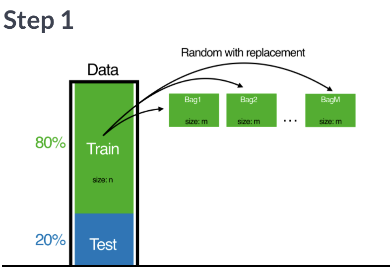
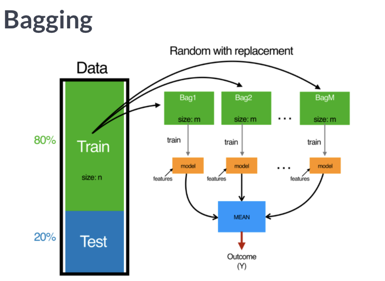

```{r setup4, include=FALSE}
# Set global knitr chunk options
knitr::opts_chunk$set(
  fig.align = "center",
  # fig.height = 4.5,
  error = FALSE,
  message = FALSE, 
  warning = FALSE, 
  collapse = TRUE,
  cache = TRUE
)
```

# Classification trees
## Overview

Tree-based models 
- Interpretability + Ease-of-use + Accuracy
- Make decisions + Numeric predictions

## Build a clasification tree

Let's get started and build our first classification tree. _A classification tree_ is a decision tree that performs a classification (vs regression) task.

You will train a decision tree model to understand which loan applications are at higher risk of default using a subset of the [German Credit Dataset](https://archive.ics.uci.edu/ml/datasets/Statlog+%28German+Credit+Data%29). The response variable, called "default", indicates whether the loan went into a default or not, which means this is a binary classification problem (there are just two classes).

You will use the rpart package to fit the decision tree and the rpart.plot package to visualize the tree.

```{r}
library(rpart)
library(rpart.plot)

# Look at the data
credit <- read.csv("credit.csv")
creditub <- credit
str(creditsub)

# Create the model
credit_model <- rpart(formula = default ~ ., 
                      data = creditsub, 
                      method = "class")

# Display the results
rpart.plot(x = credit_model, yesno = 2, type = 0, extra = 0)

```

## Overview of the modeling process

```{r}
# Total number of rows in the restaurant data frame
n <- nrow(creditsub)

# Number of rows for the training set
n_train <- round(0.80*n)

# set a random seed for reproducibility
set.seed(123)

# Create a vector of indices which is an 80% random sample 
train_indices <- sample(1:n, n_train)

# Subset the data frame to training indices only
restaurant_train <- creditsub[train_indices, ]

# Exclude the training indices to create the test set
restaurant_test <- creditsub[-train_indices, ]
```

To train a classification tree in R, you will must specify the formula, the data and the method.

```{r}
# train the model to predict the binary response 
credit_model <- rpart(formula = default ~ ., 
                      data = creditsub, 
                      method = "class")

```

## Train/test split

For this exercise, you will randomly split the German credit dataset into two pieces: a training set (80%) called `credit_train`

```{r}
# Total number of rows in the credit data frame
n <- nrow(credit)

# Number of rows for the training set (80% of the dataset)
n_train <- round(.8 * n) 

# Create a vector of indices which is an 80% random sample
set.seed(123)
train_indices <- sample(1:n, n_train)

# Subset the credit data frame to training indices only
credit_train <- credit[train_indices, ]  
  
# Exclude the training indices to create the test set
credit_test <- credit[-train_indices, ]  
```

## Train a classification tree model

In this exercise, you will train a model on the newly created training set and print the model object to get a sense of the results.

```{r}
# Train the model (to predict 'default')
credit_model <- rpart(formula = default~., 
                      data = credit_train, 
                      method = "class")

# Look at the model output                      
print(credit_model)
```

## Evaluate model performance 

$$
Accuracy = /frac {n of correct predictions} {n of total data points}
$$

```{r}
library(caret)
# calculate the confusion matrix for the test set
class_pred <- predict(object = credit_model,
                      newdata = credit_test,
                      type = "class")

caret::confusionMatrix(data = class_pred,
                       reference = credit_test$default)
```

## Compute confusion matrix

As discussed in the previous video, there are a number of different metrics by which you can measure the performance of a classification model. In this exercise, we will evaluate the performance of the model using test set classification error. A confusion matrix is a convenient way to examine the per-class error rates for all classes at once.

The c`onfusionMatrix()` function from the caret package prints both the confusion matrix and a number of other useful classification metrics such as "Accuracy" (fraction of correctly classified instances).

The caret package has been loaded for you.

```{r}
# Generate predicted classes using the model object
class_prediction <- predict(object = credit_model,  
                        newdata = credit_test,   
                        type = "class")  
                            
# Calculate the confusion matrix for the test set
confusionMatrix(data = class_prediction,       
                reference = credit_test$default)  
```

## Splitting criterion in trees 

A classificatino tree uses a split condition to predict class labels based on one or more 
input variables. The classification process starts from the root node of the tree and each node, the process will check whether the input value should recursively continue to the right or left sub-branch according to the split condition.

The process stops when meeting any leaf or terminal nodes. The idea behind classification trees is to split the data into subsets where each subset belongs to only one class. This is accomplished by dividing the input space into pure regions, that is - regions with samples from only one class. 

With real data, completely pure regions may not be possible, so the decision tree will do the best it can to create regions that are as pure as possible. 

Boundaries separating these regions are called decsion boundaries, and the decision tree model makes classification decisions based on these decision boundaries. The goal is to partition data at a node into subsets that are as pure as possible.

Theefore, we need a way to measure the purity of a split, in order to compare different ways to partition a set of data. It works out better mathematically if we measure the impurity rather than the purity. Thus, the impurity measure of a node specifies how mixed the resulting subsets are. 

Since we want the resulting subsets to have homogeneous class labels, not mixed class labels, we want the split that minimizes the impurity measure. 

- Gini index: higher value equals less pure
- Misclassification rate

## Compare models with a different splitting criterion

Train two models that use a different splitting criterion and use the validation set to choose a "best" model from this group. To do this you'll use the parms argument of the rpart() function. This argument takes a named list that contains values of different parameters you can use to change how the model is trained. Set the parameter split to control the splitting criterion.

```{r}
# Train a gini-based model
credit_model1 <- rpart(formula = default ~ ., 
                       data = credit_train, 
                       method = "class",
                       parms = list(split = "gini"))

# Train an information-based model
credit_model2 <- rpart(formula = default ~ ., 
                       data = credit_train, 
                       method = "class",
                       parms = list(split = "information"))

# Generate predictions on the validation set using the gini model
pred1 <- predict(object = credit_model1, 
             newdata = credit_test,
             type = "class")    

# Generate predictions on the validation set using the information model
pred2 <- predict(object = credit_model2, 
             newdata = credit_test,
             type = "class")

# Compare classification error
ce(actual = credit_test$default, 
   predicted = pred1)
ce(actual = credit_test$default, 
   predicted = pred2)  
```

## Introduction to regression trees

## Split the data

Split the data
These examples will use a subset of the Student Performance Dataset from UCI ML Dataset Repository.

The goal of this exercise is to predict a student's final Mathematics grade based on the following variables: sex, age, address, studytime (weekly study time), schoolsup (extra educational support), famsup (family educational support), paid (extra paid classes within the course subject) and absences.

The response is final_grade (numeric: from 0 to 20, output target).

After initial exploration, split the data into training, validation, and test sets. In this chapter, we will introduce the idea of a validation set, which can be used to select a "best" model from a set of competing models.

In Chapter 1, we demonstrated a simple way to split the data into two pieces using the sample() function. In this exercise, we will take a slightly different approach to splitting the data that allows us to split the data into more than two parts (here, we want three: train, validation, test). We still use the sample() function, but instead of sampling the indices themselves, we will assign each row to either the training, validation or test sets according to a probability distribution.

The dataset grade is already in your workspace.

```{r}
# Look at the data
str(grade)

# Set seed and create assignment
set.seed(1)
assignment <- sample(1:3, size = nrow(grade), prob = c(.7, .15, .15), replace = TRUE)

# Create a train, validation and tests from the original data frame 
grade_train <- grade[assignment == 1, ]    # subset grade to training indices only
grade_valid <- grade[assignment == 2, ]  # subset grade to validation indices only
grade_test <- grade[assignment == 3, ]   # subset grade to test indices only
```

## Train a regression tree model 

In this exercise, we will use the `grade_train` dataset to fit a regression tree using `rpart()` and visualize it using `rpart.plot()`. A regression tree plot looks identical to a classification tree plot, with the exception that there will be numeric values in the leaf nodes instead of predicted classes.

This is very similar to what we did previously in Chapter 1. When fitting a classification tree, we use method = "class", however, when fitting a regression tree, we need to set method = "anova". By default, the `rpart()` function will make an intelligent guess as to what the method value should be based on the data type of your response column, but it's recommened that you explictly set the method for reproducibility reasons (since the auto-guesser may change in the future).

The `grade_train` training set is loaded into the workspace.

```{r}
# Train the model
grade_model <- rpart(formula = final_grade ~ ., 
                     data = grade_train, 
                     method = "anova")

# Look at the model output                      
print(grade_model)

# Plot the tree model
rpart.plot(x = grade_model, yesno = 2, type = 0, extra = 0)
```

## Performance metrics for regression

1) Mean Absolute Error (MAE)
$$
MAE = \frac{1}{n} \Sigma|actual - predicted|
$$

2) Root Mean Square Error (RMSE)
$$
RMSE = \sqrt{\frac{1}{n}\Sigma(actual - predicted)^2}
$$

Both MAE and RMSE express average model prediction erro in units of the variable interest. Both metrics are indifferent to the direction of errors and lower values are better. The key difference between the two is that RMSE punishes large errors more harshly than MAE. 

This means the RMSE should be more useful when large errors are particularly undesirable. 

```{r eval=FALSE}
pred <- predict(object = model,
                newdata = testset)

library(Metrics)
# Compute the RMSE
rmse(
  actual = test$response, 
  predicted = pred
)
```

## Evaluate a regression tree model 

Predict the final grade for all students in the test set. The grade is on a 0-20 scale. Evaluate the model based on test set RMSE (Root Mean Squared Error). RMSE tells us approximately how far away our predictions are from the true values.

```{r}
# Generate predictions on a test set
pred <- predict(object = grade_model,   # model object 
                newdata = grade_test)  # test dataset

# Compute the RMSE
rmse(actual = grade_test$final_grade, 
     predicted = pred)
```

## What are the hyperparameters for a decision tree? 

There are sevral knobs that we can turn that affect how the tree is grown, and in many cases, tuning these knobs - or model hyperparameters will result in a performing model. 

The rpart function has a special control parameter, called `control`. 

```{r}
?rpart.control
```

- minsplit: minimum number of data points required to attempt a split (default 20)
- cp: complexity parameter (default 0.1)
- maxdepth: depth of a decision tree, which limits the maximum number of nodes between a leaf node and the root node (default 30)

Complexity parameter serves as a penalty term to control tree size, and is always monotonic with the number of splits. The smaller value of CP, the more complex will be the tree (the greater the number of spilits)

The rpart function computes the 10-fold cross-validated error of the model over various values for CP and stores the results in a table inside the model.

Across the different values of CP using the `plotcp()` function, we can see right away what the optimal value for CP is. To retrieve the optimal value, we simply find the row 
for which xerror is minimized and grab the corresponding CP value. 

Once you have the optimal value, you can tune (or trim) the model using the `prune()` function. The `prune()` function returns the optimized model. 

```{r}
plotcp(grade_model)

print(model$cptable)

# Prune the model to optimized cp value
model_opt <- prune(tree = model,
                   cp = cp_opt)
```

## Tuning the model 
Tune the model using the `prune()` function by finding the best CP value (CP stands for "Complexity Parameter"). 

```{r}
# Plot the "CP Table"
plotcp(grade_model)

# Print the "CP Table"
print(grade_model$cptable)

# Retrieve optimal cp value based on cross-validated error
opt_index <- which.min(grade_model$cptable[, "xerror"])
cp_opt <- grade_model$cptable[opt_index, "CP"]

# Prune the model (to optimized cp value)
grade_model_opt <- prune(tree = grade_model, 
                         cp = cp_opt)
                          
# Plot the optimized model
rpart.plot(x = grade_model_opt, yesno = 2, type = 0, extra = 0)
```

## Grid search for model selection

Training a default model is good, but training a sequence of models with various hyprparameter settings with the goal of finding the best one is a typical task in any ML pipeline. 

This process is called "model selection" or "hyperparameter selection" because the end goal is to select the best model from the set to use in some ML application.  One of the most common technuques for performing model selection is called grid search. 

### Grid sarch

- What is a model hyperparameter?
- What is a grid? 
- What is the goal of a grid search? 
- How is the best model chosen? 

Model hyperparameters are the knobs that you tweak to get slightly different models. For example, max depth is the maximum depth allowed in a decision tree. 

The grid refers to the set of hyperparameter combinations that you will iterate over durign the grid search. 

The goal of the grid search is to evaluate a large number of parameter settings, by training models on each combination of hyperparameter values, to find the combination that produces the best model.

The first step is to choose an appropriate performance metric for your task - examples are classification error, AUC or root mean squared error. The performance of each model in the grid is computed by cross-validation or evaluation on a hold-out validation set. 

The model with the best performacne, as evaluated by this metric is selected as the winner. For example, if the hyperparameter of a decision tree is the minimum number of observations that must exist in a node in order for a split to be attempted, then the grid could be 5, 10, 20 30 etc. 

Some guesswork is necessary to specify the minimum and maximum values. So sometimes, people run a small grid, see if the optimum lies at either endpoint, and then expand the grid in that direction. 

Manual grid search
1) Define a list of possible values for minsplit and maxdepth
2) A data frame is created, containing all combinations using the expand.grid

```{r eval=FALE}
# Establish a list of possible options

splits <- seq(1,30,5)
depths <- seq(5,40,10)

# create a data frame containing all combinations
hyper_grid <- 
  expand.grid(
    minsplit = split,
    maxdepth = depths
  )

```

## Generate a grid of hyperparameter values

Use `expand.grid()` to generate a grid of maxdepth and minsplit values.

```{r}
# Establish a list of possible values for minsplit and maxdepth
minsplit <- seq(1, 4, 1)
maxdepth <- seq(1, 6, 1)

# Create a data frame containing all combinations 
hyper_grid <- expand.grid(minsplit = minsplit, maxdepth = maxdepth)

# Check out the grid
head(hyper_grid)

# Print the number of grid combinations
nrow(hyper_grid)
```

## Generate a grid of models

In this exercise, we will write a simple loop to train a "grid" of models and store the models in a list called `grade_models`. R users who are familiar with the `apply` functions in R could think about how this loop could be easily converted into a function applied to a list as an extra-credit thought experiment.

```{r}
# Number of potential models in the grid
num_models <- nrow(hyper_grid)

# Create an empty list to store models
grade_models <- list()

# Write a loop over the rows of hyper_grid to train the grid of models
for (i in 1:num_models) {

    # Get minsplit, maxdepth values at row i
    minsplit <- hyper_grid$minsplit[i]
    maxdepth <- hyper_grid$maxdepth[i]

    # Train a model and store in the list
    grade_models[[i]] <- rpart(formula = final_grade ~ ., 
                               data = grade_train, 
                               method = "anova",
                               minsplit = minsplit,
                               maxdepth = maxdepth)
}
```

## Evaluate the grid

Earlier in the chapter we split the dataset into three parts: training, validation and test.

A dataset that is not used in training is sometimes referred to as a "holdout" set. A holdout set is used to estimate model performance and although both validation and test sets are considered to be holdout data, there is a key difference:

- Just like a test set, a validation set is used to evaluate the performance of a model. The difference is that a validation set is specifically used to compare the performance of a group of models with the goal of choosing a "best model" from the group. All the models in a group are evaluated on the same validation set and the model with the best performance is considered to be the winner.
- Once you have the best model, a final estimate of performance is computed on the test set.
- A test set should only ever be used to estimate model performance and should not be used in model selection. Typically if you use a test set more than once, you are probably doing something wrong.

```{r}
# Number of potential models in the grid
num_models <- length(grade_models)

# Create an empty vector to store RMSE values
rmse_values <- c()

# Write a loop over the models to compute validation RMSE
for (i in 1:num_models) {

    # Retrieve the i^th model from the list
    model <- grade_models[[i]]
    
    # Generate predictions on grade_valid 
    pred <- predict(object = model,
                    newdata = grade_valid)
    
    # Compute validation RMSE and add to the 
    rmse_values[i] <- rmse(actual = grade_valid$final_grade, 
                           predicted = pred)
}

# Identify the model with smallest validation set RMSE
best_model <- grade_models[[which.min(rmse_values)]]

# Print the model paramters of the best model
best_model$control

# Compute test set RMSE on best_model
pred <- predict(object = best_model,
                newdata = grade_test)
rmse(actual = grade_test$final_grade, 
     predicted = pred)
```

# Bagged Trees
## Introduction to bagged trees 

One of the main drawbacks of a decision tree is their high variance. Often a small change in the data can result in va very different series of splits, which can also make model intepretation somewhat precautious. 

Bagging, and in particular, bagged trees, averages many trees to reduce this variance. Combining several moels into one is what is called an ensemble model and averaging is one of the easiest ways to create an ensemble from a collection of models. 

In addition to reducing variance, it can also help avoid overfitting. 

Bagging is an ensemble method and the term "bagging" is shorthand for bootstrap aggregation. Bagging uses bootstrap sampling and agrregates the individual models by averaging. 

Bootstrap means sampling rows at random from the training dataset, with replacement. When we draw samples with replacement, that means it is possible that you will draw a single training example more than once. 

This results in a modified version of the training set where some rows are represented multiple times and some rows are absent. This let's you generate new data that is similar to the data you started with. 

By doing this, we can fit many different, but similar models. 

- Step 1: You draw B samples with replacement from the original training set where B is a number less than or equal to the N, number of total samples in the training set.

```{r}

```

- Step 2: Train a decision tree on the newly created bootstrapped sample. 

```{r}
knitr::include_graphics("Bootstrapping_step2.png")
```

Repeate step 1 through 2 for as many times as you like - that could be 20 times, 100 times or 1000. Typically, the more trees, the better the model. 

Suppose we use 1000 trees for the model construction. In this case, each model has different featurs, and to generate a prediction using a bagged tree model, you need to generate predictions from each of the 1000 trees and then simply average the prediction together to get a final prediction.

```{r}

```

The bagged, or ensemble prediction is the average prediction across the bootstrapped trees. Bagging can dramatically reduce the variance of unstable models such as trees, leading to improved prediction.

This means averaging reduces variance and leaves bias unchanged. 

```{r eval=FALSE}
library(ipred)
bagging(formula = response ~., data = dat)
```

## Train a bagged tree model

Let's start by training a bagged tree model. You'll be using the `bagging()` function from the ipred package. The number of bagged trees can be specified using the `nbagg` parameter, but here we will use the default (25).

If we want to estimate the model's accuracy using the "out-of-bag" (OOB) samples, we can set the the `coob` parameter to `TRUE`. The OOB samples are the training obsevations that were not selected into the bootstrapped sample (used in training). Since these observations were not used in training, we can use them instead to evaluate the accuracy of the model (done automatically inside the `bagging()` function).

```{r}
# Bagging is a randomized model, so let's set a seed (123) for reproducibility
set.seed(123)

# Train a bagged model
credit_model <- bagging(formula = default ~ ., 
                        data = credit_train,
                        coob = TRUE)

# Print the model
print(credit_model)
```

## Evaluating the bagged tree performance 

We have to pass the model object, the test dataset and what type you want your prediction to be. In this example, we set the argument type to be class since we want the function to returns a vector of class predictions. 

If you want to take a peak in the predictions, you can print the class prediction and you will see that indeed classification labels were returned. After making predictions, it is time to evaluate the model performance. We can use the `confusionMatrix()` from the `caret` package. 

It's always good to take a look at the output using the `print()` function.

```{r}
# Generate predicted classes using the model object
class_prediction <- predict(object = credit_model,    
                            newdata = credit_test,  
                            type = "class")  # return classification labels

# Print the predicted classes
print(class_prediction)
credit_test
# Calculate the confusion matrix for the test set
confusionMatrix(data = class_prediction,       
                reference = credit_test$default)  
```

## PRedict on a test set and compute AUC

In binary classification problems, we can predict numeric values instead of class labels. In fact, class labels are created only after you use the model to predict a raw, numeric, predicted value for a test point.

The predicted label is generated by applying a threshold to the predicted value, such that all tests points with predicted value greater than that threshold get a predicted label of "1" and, points below that threshold get a predicted label of "0".

In this exercise, generate predicted values (rather than class labels) on the test set and evaluate performance based on [AUC (Area Under the ROC Curve)](https://en.wikipedia.org/wiki/Receiver_operating_characteristic#Area_under_the_curve). The AUC is a common metric for evaluating the discriminatory ability of a binary classification model.

```{r}
# Generate predictions on the test set
pred <- predict(object = credit_model,
                newdata = credit_test,
                type = "prob")

# `pred` is a matrix
class(pred)
                
# Look at the pred format
head(pred)
                
# Compute the AUC (`actual` must be a binary (or 1/0 numeric) vector)
auc(actual = ifelse(credit_test$default == "yes", 1, 0), 
    predicted = pred[,"yes"])      

library(tidymodels)

# yardstick::roc_curve()
bind_cols(
  actual = ifelse(credit_test$default == "yes", 1, 0), 
    predicted = pred[,"yes"]
) %>%
  mutate(actual = as.factor(actual)) %>% 
  roc_curve(truth = actual, predicted)

# yardstick::roc_auc()
bind_cols(
  actual = ifelse(credit_test$default == "yes", 1, 0), 
    predicted = pred[,"yes"]
) %>%
  mutate(actual = as.factor(actual)) %>% 
  roc_auc(truth = actual, predicted)

```

## Using caret for cross-validating models

Although using a single training and test set is a quick way to get an estimate of your model's performance, it is susceptible to variations in the data. Variability in your data can stem both from the size of your training set - smaller datasets have more variability - and also from natural variability in the true population that you are sampling from. 

### K-fold cross validation 

1) Partition the rows of the dataset into K subset of equal sizes. 

For example, dataset size = 200 rows, k = 10 (number of corss validation folds)
In each iteration, you pick one of the k subsets as your test set and the remaining k minus 1 subsets are aggregated and used as the training set. 

2) Train the model on the training set and evaluate the performance
Then you train your machine learning algorthim on that training set, and evaluate the model's performance on the test set. You can use any metric to evaluate the performance, so as an example, let's say you compute the test set AUC. 

3) CV estimate of AUC
We average those 10 estimates together to get what is called the corss-validated estimate of AUC.
- 10 estimates of test set AUC
- the average is the cross-validated estimate of AUC

Since we end up training k models instead of one, its obvious that CV takes k times as long to evaluate your models this way. It depends on what's more valuable to your use-case: time or accuracy of your model performance estimates. 

caret:: `train()` and `trainControl()`

```{r eval=FALSE}
# Specify the training cofiguration
ctrl <- trainControl(
  method = "cv",
  number = 5,
  classProbs = TRUE,
  summaryFunction = twoClassSummary()
)

# For reproducibility set a seed
set.seed(123)
credit_model <- train(
  default ~ ., 
  data = credit_train,
  method = "treebag",
  metric = "ROC",
  trControl = ctrl
)
```

## Cross-validate a bagged tree model in caret

Use `caret::train()` with the `treebag` method to train a model and evaluate the model using cross-validated AUC. The __caret__ package allows the user to easily cross-validate any model across any relevant performance metric. In this case, we will use 5-fold cross validation and evaluate cross-validated AUC (Area Under the ROC Curve).

```{r}
# Specify the training configuration
ctrl <- trainControl(method = "cv",     # Cross-validation
                     number = 5,      # 5 folds
                     classProbs = TRUE,                  # For AUC
                     summaryFunction = twoClassSummary)  # For AUC

# Cross validate the credit model using "treebag" method; 
# Track AUC (Area under the ROC curve)
set.seed(1)  # for reproducibility
credit_caret_model <- train(default ~ .,
                            data = credit_train, 
                            method = "treebag",
                            metric = "ROC",
                            trControl = ctrl)

# Look at the model object
print(credit_caret_model)

# Inspect the contents of the model list 
names(credit_caret_model)

# Print the CV AUC
credit_caret_model$results[,"ROC"]
```

## Generate predictions from the caret model


