Tidyverse and Tidymodels packages
================
Koji Mizumura
December 22nd,2018 - 2019-04-12

  - [Broom](#broom)
      - [[Broom by blog post by David
        Robinson](http://varianceexplained.org/r/broom-intro/)](#broom-by-blog-post-by-david-robinson)
      - [Three key components](#three-key-components)
          - [Example: linear regression](#example-linear-regression)
          - [Using tidiers for visualization with
            ggplot2](#using-tidiers-for-visualization-with-ggplot2)
      - [Visualizing Imer model random
        effects](#visualizing-imer-model-random-effects)
          - [Part1: subj\_intercepts\_mod](#part1-subj_intercepts_mod)
          - [Part2: subjA\_intercepts\_mod](#part2-subja_intercepts_mod)
      - [[broom and
        dplyr](https://broom.tidyverse.org/articles/broom_and_dplyr.html)](#broom-and-dplyr)
      - [[Tidy
        bootstrapping](https://cran.r-project.org/web/packages/broom/vignettes/bootstrapping.html)](#tidy-bootstrapping)
      - [[kmeans with dplyr and
        broom](https://cran.r-project.org/web/packages/broom/vignettes/kmeans.html)](#kmeans-with-dplyr-and-broom)
          - [Tidy k-means clustering](#tidy-k-means-clustering)
          - [broom and dplyr for exploratory
            clustering](#broom-and-dplyr-for-exploratory-clustering)
      - [Rererence](#rererence)
  - [`rsample`](#rsample)
      - [Nested resampling](#nested-resampling)
      - [Recipes with rsample](#recipes-with-rsample)
          - [An example recipe](#an-example-recipe)
          - [Working with Rsamples](#working-with-rsamples)
      - [[Grid search tuning of Keras
        Models](https://github.com/tidymodels/rsample/blob/master/vignettes/Applications/Keras.Rmd).](#grid-search-tuning-of-keras-models.)
      - [[Time
        series](https://github.com/tidymodels/rsample/blob/master/vignettes/Applications/Time_Series.Rmd)](#time-series)
      - [Survival analysis](#survival-analysis)
      - [Reference](#reference)
  - [[`recipes`](https://github.com/tidymodels/recipes)](#recipes)
      - [Introduction](#introduction)
      - [[Simple
        example](https://github.com/tidymodels/recipes/blob/master/vignettes/Simple_Example.Rmd)](#simple-example)
          - [An example](#an-example)
          - [An initial recipe](#an-initial-recipe)
          - [Preprocessing steps](#preprocessing-steps)
          - [Checks](#checks)
      - [[Selecting
        variables](https://github.com/tidymodels/recipes/blob/master/vignettes/Selecting_Variables.Rmd)](#selecting-variables)
      - [Custom steps](#custom-steps)
      - [[Dummy
        steps](https://github.com/tidymodels/recipes/blob/master/vignettes/Custom_Steps.Rmd)](#dummy-steps)
          - [A new step definition](#a-new-step-definition)
          - [Create the initial function](#create-the-initial-function)
          - [Initialization of new
            objects](#initialization-of-new-objects)
          - [Define the estimation
            procedure](#define-the-estimation-procedure)
          - [Create the bake method](#create-the-bake-method)
          - [Running the example](#running-the-example)
          - [Custom check operations](#custom-check-operations)
      - [Subsampling for class
        imbalance](#subsampling-for-class-imbalance)
      - [Multivariate analysis using Partial Least
        Squares](#multivariate-analysis-using-partial-least-squares)
  - [[Parsnip](https://tidymodels.github.io/parsnip/)](#parsnip)
      - [introduction](#introduction-1)
          - [Model list](#model-list)
      - [[Regression
        example](https://github.com/tidymodels/parsnip/blob/master/vignettes/articles/Regression.Rmd)](#regression-example)
          - [Random Forests](#random-forests)

# Broom

## [Broom by blog post by David Robinson](http://varianceexplained.org/r/broom-intro/)

The concept of “tidy data” offers a powerful framework for data
manipulation, analysis and visualization. Popular packages like `dplyr`,
`tidyr` and `ggplot2` take greate advantage of this framework. Please
explore several recent posts by others.

But there is an important step in a tidy data workflow that so far has
been missing: the **output** of R statistical modeling functions isn’t
tidy, meaning it’s difficult to manipulate and recombine in downstream
analyses and visualizations. Hadley’s paper makes a convincing statement
of this problem.

> While model inputs usually require tidy inputs, such attention to
> detail doesn’t carry over to model outputs. Outputs such as
> predictions and estimated coefficients aren’t always tidy. This makes
> it more difficult to combine results from multiple models. For
> example, in R, the default representation of model coefficients is not
> tidy because it does not have an explicit variable that records the
> variable name for each estimate, they are instead recorded as row
> names. In R, row names must be unique, so combining coefficients from
> many models (e.g., from bootstrap resamples, or subgroups) requires
> workarounds to avoid losing important information. This knocks you out
> of the flow of analysis and makes it harder to combine the results
> from multiple models. I’m not currently aware of any packages that
> resolve this problem.

In this [new paper](https://arxiv.org/abs/1412.3565) I introduce the
broom package available on CRAN, which bridges the gap from untidy
outputs of predictions and estimations to the tidy data we want to work
with. It takes the messy output of built-in statistical functions in R,
such as `lm`, `nls`, `kmeans`, or `t.test` as well as popular
third-party packages, like `gam`, `glmnet`, `survival` or `lme4`, and
turns them into tidy data frames. This allows the results to be handed
to other tidy packages for downstream analysis: they can be recombined
using dplyr or visualized using ggplot2.

## Three key components

1.  `tidy()`: summarize information about fit components
2.  `glance()`: report goodness of fit measures
3.  `augment()`: add information about observations to a dataset

### Example: linear regression

As a simple example, consider alinear regression on the built-in
`mtcars` dataset:

``` r
fit <- lm(mpg~wt+qsec, data=mtcars)
summary(fit)
## 
## Call:
## lm(formula = mpg ~ wt + qsec, data = mtcars)
## 
## Residuals:
##     Min      1Q  Median      3Q     Max 
## -4.3962 -2.1431 -0.2129  1.4915  5.7486 
## 
## Coefficients:
##             Estimate Std. Error t value Pr(>|t|)    
## (Intercept)  19.7462     5.2521   3.760 0.000765 ***
## wt           -5.0480     0.4840 -10.430 2.52e-11 ***
## qsec          0.9292     0.2650   3.506 0.001500 ** 
## ---
## Signif. codes:  0 '***' 0.001 '**' 0.01 '*' 0.05 '.' 0.1 ' ' 1
## 
## Residual standard error: 2.596 on 29 degrees of freedom
## Multiple R-squared:  0.8264, Adjusted R-squared:  0.8144 
## F-statistic: 69.03 on 2 and 29 DF,  p-value: 9.395e-12
```

This summary shows many kinds of statistics describing the regression:
coefficient estimates and p-values, information about the residuals, and
model statistics like \(R^2\) and the F-statistics. But, this format
isn’t convenient if you want to combine and compare multiple models,
or plot it using ggplot2: you need to turn it into a data frame.

The broom package provides three tidying methods for turning the
contents of this object into a data frame, depending on the level of
statistics you’re interested in. If you want statistics about each of
the coefficients fit by the model, use the `tidy()` method:

``` r
broom::tidy(fit)
## # A tibble: 3 x 5
##   term        estimate std.error statistic  p.value
##   <chr>          <dbl>     <dbl>     <dbl>    <dbl>
## 1 (Intercept)   19.7       5.25       3.76 7.65e- 4
## 2 wt            -5.05      0.484    -10.4  2.52e-11
## 3 qsec           0.929     0.265      3.51 1.50e- 3
```

Note that the rownames are now added as a column, `term`, meaning that
the data can be combined with other models. Note also that the columns
have been given names like `std_error` and `p.value` that are more
easily accessed than `std_error` and `Pr(>|t|)`. This is true of all
data frames broom returns: they’re designed so they can be processed in
additional steps.

If you are interested in extracting **per-observation information**,
such as fitted values and residuals, use the `argument` method, which
adds these to the original data.

``` r
fit %>% 
  broom::augment()
## # A tibble: 32 x 11
##    .rownames   mpg    wt  qsec .fitted .se.fit  .resid   .hat .sigma
##  * <chr>     <dbl> <dbl> <dbl>   <dbl>   <dbl>   <dbl>  <dbl>  <dbl>
##  1 Mazda RX4  21    2.62  16.5    21.8   0.683 -0.815  0.0693   2.64
##  2 Mazda RX~  21    2.88  17.0    21.0   0.547 -0.0482 0.0444   2.64
##  3 Datsun 7~  22.8  2.32  18.6    25.3   0.640 -2.53   0.0607   2.60
##  4 Hornet 4~  21.4  3.22  19.4    21.6   0.623 -0.181  0.0576   2.64
##  5 Hornet S~  18.7  3.44  17.0    18.2   0.512  0.504  0.0389   2.64
##  6 Valiant    18.1  3.46  20.2    21.1   0.803 -2.97   0.0957   2.58
##  7 Duster 3~  14.3  3.57  15.8    16.4   0.701 -2.14   0.0729   2.61
##  8 Merc 240D  24.4  3.19  20      22.2   0.730  2.17   0.0791   2.61
##  9 Merc 230   22.8  3.15  22.9    25.1   1.41  -2.32   0.295    2.59
## 10 Merc 280   19.2  3.44  18.3    19.4   0.491 -0.185  0.0358   2.64
## # ... with 22 more rows, and 2 more variables: .cooksd <dbl>,
## #   .std.resid <dbl>
```

Finally, `glance()` computes per-model statistics such as \(R^2\),
`AIC`, `BIC`:

``` r
fit %>% 
  glance()
## # A tibble: 1 x 11
##   r.squared adj.r.squared sigma statistic  p.value    df logLik   AIC   BIC
## *     <dbl>         <dbl> <dbl>     <dbl>    <dbl> <int>  <dbl> <dbl> <dbl>
## 1     0.826         0.814  2.60      69.0 9.39e-12     3  -74.4  157.  163.
## # ... with 2 more variables: deviance <dbl>, df.residual <int>
```

The `tidy` method makes it easy to construct coefficient plots using
**ggplot2**:

``` r

library(ggplot2)

td <- fit %>% 
  broom::tidy(conf.int=TRUE)

td %>% head()
## # A tibble: 3 x 7
##   term        estimate std.error statistic  p.value conf.low conf.high
##   <chr>          <dbl>     <dbl>     <dbl>    <dbl>    <dbl>     <dbl>
## 1 (Intercept)   19.7       5.25       3.76 7.65e- 4    9.00      30.5 
## 2 wt            -5.05      0.484    -10.4  2.52e-11   -6.04      -4.06
## 3 qsec           0.929     0.265      3.51 1.50e- 3    0.387      1.47

ggplot(td, aes(estimate, term, color = term)) +
    geom_point() +
    geom_errorbarh(aes(xmin = conf.low, xmax = conf.high)) +
    geom_vline(xintercept = 0)
```

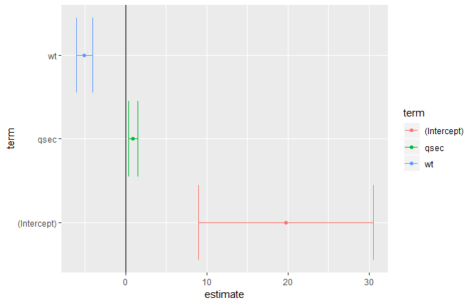

When combined with dplyr’s `group_by` and `do`, **broom** also lets you
perform regression within groups, such as within automatic and manual
cars separately;

``` r
library(dplyr)

mtcars %>% 
  group_by(am) %>% 
  do(broom::tidy(lm(mpg ~ wt, .)))
## # A tibble: 4 x 6
## # Groups:   am [2]
##      am term        estimate std.error statistic       p.value
##   <dbl> <chr>          <dbl>     <dbl>     <dbl>         <dbl>
## 1     0 (Intercept)    31.4      2.95      10.7  0.00000000601
## 2     0 wt             -3.79     0.767     -4.94 0.000125     
## 3     1 (Intercept)    46.3      3.12      14.8  0.0000000128 
## 4     1 wt             -9.08     1.26      -7.23 0.0000169
```

This is useful for performing regressions or other analyses within each
gene, country, or any other kind of division in your tidy dataset.

### Using tidiers for visualization with ggplot2

The broom package provides tidying methods for many otherp packages as
well. These tidiers serve to connect various statistical models
seamlessly with packages like `dplyr` and `ggplot2` . For instance, we
could create a LASSO regression with the `glmenet` package.

``` r
library(glmnet)
set.seed(03-19-2015)

# generate data with 5 real variables and 45 null, on 100 observations

nobs <- 100
nvar <- 50
real <- 5
x <- matrix(rnorm(nobs*nvar), nobs)
beta <- c(rnorm(real, 0,1), rep(0, nvar - real))
y <- c(t(beta) %*% t(x)) + rnorm(nvar, sd=3)

glmnet_fit <- cv.glmnet(x,y)
```

Then, we tidy it with broom and plot it using `ggplot2`:

``` r

tidied_cv <- glmnet_fit %>% broom::tidy()
glance_cv <- glmnet_fit %>% broom::tidy()

tidied_cv %>% ggplot(aes(lambda, estimate))+
  geom_line(color="red")+
  geom_ribbon(aes(ymin = conf.low, ymax = conf.high, alpha = .2))+
  scale_x_log10()
```


``` r
  # geom_vline(xintercept = glance_cv$lambda.min) +
  # geom_vline(xintercept = glance_cv$lambda.1se, lty = 2)
```

By plotting with ggplot2, rather than relying on glmnet’s built in
plotting methods, we gain access to all the tools and framework of the
package. This allows us to customize or add attributes, or even to
cmplare multiple LASSO cross-validations in the same plot.

The same is true of the
[survivial](https://cran.r-project.org/web/packages/survival/index.html)
package.

``` r

library(survival)

surv_fit <- survfit(coxph(Surv(time, status) ~ age + sex, lung))
td <- broom::tidy(surv_fit)
ggplot(td, aes(time, estimate))+ geom_line()+
  geom_ribbon(aes(ymin=conf.low, ymax=conf.high),alpha=.2)
```

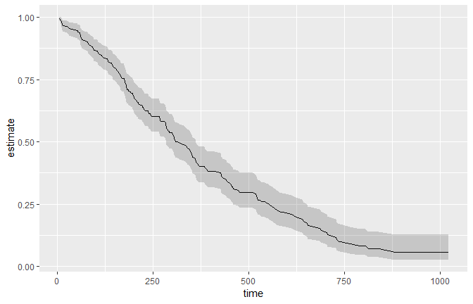

Others have explored how `broom` can help visualize [random effects
estimated with
lme4](https://rstudio-pubs-static.s3.amazonaws.com/38628_54b19baf70b64eb5936a3f1f84beb7da.html).
Other packages for which tidiers are implemented include gam, zoo, lfe,
and multcomp.

The vignettes for the broom package offer other useful examples,
including one on [combining broom and
dplyr](https://cran.r-project.org/web/packages/broom/vignettes/broom_and_dplyr.html),
a demonstration of [bootstrapping with
broom](https://cran.r-project.org/web/packages/broom/vignettes/bootstrapping.html),
and a simulation of [k-means
clustering](https://cran.r-project.org/web/packages/broom/vignettes/kmeans.html).
The broom manuscript offers still more examples.

Tidying model outputs is not an exact science, and it is based on a
judgment of the kinds of values a data scientist typically wants out of
a tidy analysis (for instance, estimates, test statistics, and
p-values). It is my hope that data scientists will propose and
contribute their own features feature requests are welcome\!) to help
expand the universe of tidy analysis tools.

## Visualizing Imer model random effects

I will be exploring the differences between three models:

``` r
library(lme4)
subj_intercepts_mod <- lmer(rt ~ A + (1|Subject))
subjA_intercepts_mod <- lmer(rt ~ 1 + (1|Subject:A))
subj_slopes_mod <- lmer(rt ~ A + (A|Subject))
```

Granted, the second model is rarely encounted in practice. More common
would be a nested structure (see this [crossvalidated
post](https://stats.stackexchange.com/questions/121504/how-many-random-effects-to-specify-in-lmer))

``` r
lmer(rt ~ 1 + (1|Subject) + (1|Subject:A))
## the above random effects structure is often written as `(1|Subject/A)` the 
## same way `y ~ A + B + A:B` is usually written as `y ~ A * B`.
```

Even though the non-nested `(1|)`

I will work with a modified version of the sleepstudy dataset from
`lme4`.

``` r
library(lme4)
library(ggplot2)
library(reshape2)
library(dplyr)
library(broom)
library(stringr)
```

``` r
head(sleepstudy)
##   Reaction Days Subject
## 1 249.5600    0     308
## 2 258.7047    1     308
## 3 250.8006    2     308
## 4 321.4398    3     308
## 5 356.8519    4     308
## 6 414.6901    5     308

example <- sleepstudy %>% 
  mutate(A = ifelse(Days<5, -0.5, 0.5)) %>% 
  select(Subject, A, Reaction)

example %>% head(n=11)
##    Subject    A Reaction
## 1      308 -0.5 249.5600
## 2      308 -0.5 258.7047
## 3      308 -0.5 250.8006
## 4      308 -0.5 321.4398
## 5      308 -0.5 356.8519
## 6      308  0.5 414.6901
## 7      308  0.5 382.2038
## 8      308  0.5 290.1486
## 9      308  0.5 430.5853
## 10     308  0.5 466.3535
## 11     309 -0.5 222.7339
```

Let’s plot means using `ggplot` and `stat_summary` functions.

``` r
base_plot <- ggplot(example, aes(x=A, y=Reaction))+
  stat_summary(aes(fill=factor(A)), fun.y=mean, geom="bar")+
  scale_fill_manual(values=c("#66c2a5", "#8da0cb"))+ #colorbrewer2.rog
  theme(legend.position = "above")

base_plot
```

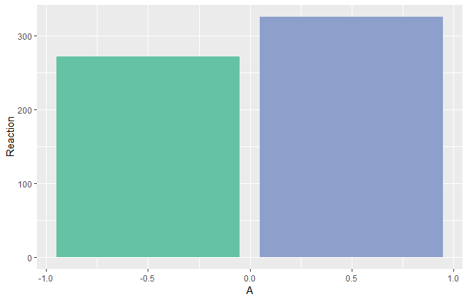

### Part1: subj\_intercepts\_mod

First, I will fit an `lmer` model that allows the intercept to vary
across subjects.

``` r
subj_intercepts_mod <- lmer(Reaction ~ A + (1|Subject), data=example)
# broom::tidy turns fixef(subj_intercepts_mod)` into a data.frame

fixed_params <- subj_intercepts_mod %>% 
  broom::tidy(effects="fixed") %>% 
  select(term, estimate)

fixed_params
## # A tibble: 2 x 2
##   term        estimate
##   <chr>          <dbl>
## 1 (Intercept)    299. 
## 2 A               53.8
```

Although its sometimes helpful to think about model parameters (and you
can draw them easily with `ggplot::geom_abline()`), I find it more
beneficial in a simple design like this to deal in estimates. I will
write a little function to speed up this conversion that seems like
overkill now but it will come in handy
later.

``` r
# converts parameters of a `Reaction ~ (Intercept) + A` model into estimates,
# assumes A is a 0-centered, unit-weighted, dichotomous variable

convert_parameters_to_estimates <- function(tidy_frame,id_var="."){
  tidy_frame %>% 
    dcast(as.formula(paste(id_var, "term", sep="~")), value.var = "estimate") %>% 
    mutate(`-0.5` = `(Intercept)` - A/2, `0.5` = `(Intercept)` + A/2) %>%
    select(-`(Intercept)`, -A) %>%
    melt(idvars = id_var, measure.vars = c("-0.5", "0.5"),
         variable.name = "A", value.name = "Reaction") %>%
    mutate(A = as.numeric(as.character(A)))
}

fixed_estimates <- convert_parameters_to_estimates(fixed_params)[,c("A","Reaction")]

fixed_estimates
##      A Reaction
## 1 -0.5 271.6302
## 2  0.5 325.3856
```

``` r
#sanity check
example %>% 
  group_by(A) %>% 
  summarise(Reaction = mean(Reaction)) %>% 
  merge(., fixed_estimates, by="A", suffixes = c("_mean", "_model"))
##      A Reaction_mean Reaction_model
## 1 -0.5      271.6302       271.6302
## 2  0.5      325.3856       325.3856
```

It is possible to turn parameters from the model into estimates that
make sense; now let’s do the same thing with random effects. How will
the model’s random effect parameters, when converted to estimates,
compare to the average for each subject that we can calculate by hand?

``` r
random_params <- broom::tidy(subj_intercepts_mod, effect = "random")
random_estimates <- convert_parameters_to_estimates(random_params, id_var = "level")

fixed_slopes_plot <- base_plot + 
  geom_point(data = random_estimates, shape = 17, size = 3) +
  geom_line(aes(group = level), data = random_estimates)
fixed_slopes_plot
```

``` r
fixed_slopes_plot +
  stat_summary(aes(group = Subject), fun.y = mean,  # means from raw data
               geom = "point", shape = 19, size = 4, color = "#fc8d62", alpha = 0.6)
```

Of course, the reason the two sets of points don’t line up is because we
are only allowing the subject’s overall Reaction to vary, not the
subject’s overall Reaction in each condition. Applying the same slope to
each subject, this is the best we can do to account for variance.

``` r
base_plot+
  geom_line(aes(group = level), data = random_estimates)+
  ## calculate mean Reaction by subject using `stat_summary`
  stat_summary(aes(x=0.0, y=Reaction, group=level), data = random_estimates, fun.y = mean, geom = "point", shape = 17, size = 3) +
  stat_summary(aes(x=0.0, group=Subject), fun.y = mean,
               geom = "point", shape = 19, size = 4, color = "#fc8d62", alpha = 0.6)
```

A model that allows intercepts to vary across subjects does just that:
it does a great job of estimating overall Reaction for each subject, but
it is limited in estimating the effect of `A` on Reaction.

### Part2: subjA\_intercepts\_mod

We are looking for a way to capture the fact that all of the following
by-subject lines don’t have the same slope.

``` r
subj_means_plot <- base_plot +
  stat_summary(aes(group = Subject), fun.y = mean, geom = "point", shape =19, size =4, color = "#fc8d62")+
  stat_summary(aes(group = Subject), fun.y = mean, geom = "line", size = 1.2, color = "#fc8d62")
```

One way to give the model some flexibility would be to “serve the
connection” between the measurements on the left bar from those in the
right bar.

``` r
example$SubAject <- with(example, paste(Subject, A, sep = ":"))
subjA_intercepts_mod <- lmer(Reaction ~ 1 + (1|SubAject), data = example)
```

Why make a new, hideously-named variable `SubAject`? Because if the
model can’t understand the relationship between `Subject` and `A`, I
shouldn’t be able to either\! We’ve severed the connection between
scores on the left and scores on the right, and given the model more
flexibility to estimate the effects.

Of course, nothing is
preventing

## [broom and dplyr](https://broom.tidyverse.org/articles/broom_and_dplyr.html)

While broom is useful for summarizing the result of a single analysis in
a consistent format, it is really designed for high-throughput
applications, where you must combine results from multiple analyses.
These could be subgrouped of data, analyses using different models,
bootstrap replicates, permutations, and so on. In particular, it plays
well with the `nest/unnest` functions in `tidyr` and the `map` function
in `purrr`.

For `purrr` package, please refer this [RStudio
tutorial](https://www.rstudio.com/resources/videos/happy-r-users-purrr-tutorial/).

Let’s try this on a simple dataset, the built-in `Orange`. We start by
coercing `Orange` to a `tibble`. This gives a nicer method that will
especially useful later on when we start working with list-columns.

``` r
library(broom)
library(tibble)

data("Orange")


Orange <- as_tibble(Orange)
Orange
## # A tibble: 35 x 3
##    Tree    age circumference
##  * <ord> <dbl>         <dbl>
##  1 1       118            30
##  2 1       484            58
##  3 1       664            87
##  4 1      1004           115
##  5 1      1231           120
##  6 1      1372           142
##  7 1      1582           145
##  8 2       118            33
##  9 2       484            69
## 10 2       664           111
## # ... with 25 more rows
```

This contains 35 observations of three variables: `Tree`, `age` and
`circumference`. `Tree` is a factor with five levels describing five
trees. As might be expected, age and circumference are correlated:

``` r
cor(Orange$age, Orange$circumference)
## [1] 0.9135189

ggplot2::ggplot(Orange,
                aes(age, circumference, color=Tree))+
  geom_line(size=1)+
  theme_minimal()
```

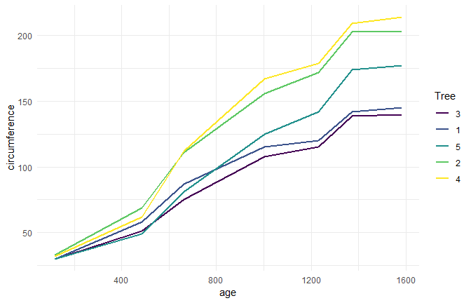

Suppose you want to test for correlations individually within each tree.
You can do this with dplyr’s `group_by`:

``` r
library(dplyr)

Orange %>% 
  group_by(Tree) %>% 
  summarise(correlations=cor(age,circumference))
## # A tibble: 5 x 2
##   Tree  correlations
##   <ord>        <dbl>
## 1 3            0.988
## 2 1            0.985
## 3 5            0.988
## 4 2            0.987
## 5 4            0.984
```

Note that the correlations are much higher than the aggregated one, and
furthermore we can now see it is similar across trees. Suppose that
instead of simply estimating a correlation, we want to perform a
hypothesis test with `cor.test`:

``` r
ct <- cor.test(Orange$age, Orange$circumference)
ct
## 
##  Pearson's product-moment correlation
## 
## data:  Orange$age and Orange$circumference
## t = 12.9, df = 33, p-value = 1.931e-14
## alternative hypothesis: true correlation is not equal to 0
## 95 percent confidence interval:
##  0.8342364 0.9557955
## sample estimates:
##       cor 
## 0.9135189
```

This contains multiple values we could want in our output. Some are
vectors of length 1, such as the p-value and the estimate, and some are
longer, such as the confidence interval. We can get this into a nicely
organized tibble using the `tidy` function:

``` r
ct %>% broom::tidy()
## # A tibble: 1 x 8
##   estimate statistic  p.value parameter conf.low conf.high method
##      <dbl>     <dbl>    <dbl>     <int>    <dbl>     <dbl> <chr> 
## 1    0.914      12.9 1.93e-14        33    0.834     0.956 Pears~
## # ... with 1 more variable: alternative <chr>
```

Often, we want to perform multiple tests or fit multiple models, each on
different part of the data. In this case, we recommend a
`nest-map-unnest` workflow. For example, suppose we want to perform
correlation tests for each different tree. We start by `nest` ing our
data based on the group of interest.

``` r
library(tidymodels)
library(tidyverse)

nested <- Orange %>% 
  nest(-Tree)

nested 
## # A tibble: 5 x 2
##   Tree  data            
##   <ord> <list>          
## 1 1     <tibble [7 x 2]>
## 2 2     <tibble [7 x 2]>
## 3 3     <tibble [7 x 2]>
## 4 4     <tibble [7 x 2]>
## 5 5     <tibble [7 x 2]>
```

Then we run a correlation test for each nested tibble using
`purrr::map`:

``` r
nested %>% 
  mutate(test = map(data, ~ cor.test(.x$age, .x$circumference)))
## # A tibble: 5 x 3
##   Tree  data             test       
##   <ord> <list>           <list>     
## 1 1     <tibble [7 x 2]> <S3: htest>
## 2 2     <tibble [7 x 2]> <S3: htest>
## 3 3     <tibble [7 x 2]> <S3: htest>
## 4 4     <tibble [7 x 2]> <S3: htest>
## 5 5     <tibble [7 x 2]> <S3: htest>

# i come up with this formula - does this work as well?
nested %>% 
  mutate(test = map(data, ~ cor.test(.$age, .$circumference)))
## # A tibble: 5 x 3
##   Tree  data             test       
##   <ord> <list>           <list>     
## 1 1     <tibble [7 x 2]> <S3: htest>
## 2 2     <tibble [7 x 2]> <S3: htest>
## 3 3     <tibble [7 x 2]> <S3: htest>
## 4 4     <tibble [7 x 2]> <S3: htest>
## 5 5     <tibble [7 x 2]> <S3: htest>
```

This results in a list-column of S3 objects. We want to tidy each of the
objects, which we can also do with `map`.

``` r
nested %>% 
  mutate(
    test   = map(data, ~ cor.test(.x$age, .x$circumference)), # S3 list-col
    tidied = map(test, broom::tidy)
  ) %>% 
  select(Tree, tidied) %>% 
  unnest()
## # A tibble: 5 x 9
##   Tree  estimate statistic p.value parameter conf.low conf.high method
##   <ord>    <dbl>     <dbl>   <dbl>     <int>    <dbl>     <dbl> <chr> 
## 1 1        0.985      13.0 4.85e-5         5    0.901     0.998 Pears~
## 2 2        0.987      13.9 3.43e-5         5    0.914     0.998 Pears~
## 3 3        0.988      14.4 2.90e-5         5    0.919     0.998 Pears~
## 4 4        0.984      12.5 5.73e-5         5    0.895     0.998 Pears~
## 5 5        0.988      14.1 3.18e-5         5    0.916     0.998 Pears~
## # ... with 1 more variable: alternative <chr>

nested2 <- nested %>% 
  mutate(
    test   = map(data, ~ cor.test(.x$age, .x$circumference)), # S3 list-col
    tidied = map(test, broom::tidy)
  )
  
nested2 %>% 
  select(Tree, tidied) %>% 
  unnest()
## # A tibble: 5 x 9
##   Tree  estimate statistic p.value parameter conf.low conf.high method
##   <ord>    <dbl>     <dbl>   <dbl>     <int>    <dbl>     <dbl> <chr> 
## 1 1        0.985      13.0 4.85e-5         5    0.901     0.998 Pears~
## 2 2        0.987      13.9 3.43e-5         5    0.914     0.998 Pears~
## 3 3        0.988      14.4 2.90e-5         5    0.919     0.998 Pears~
## 4 4        0.984      12.5 5.73e-5         5    0.895     0.998 Pears~
## 5 5        0.988      14.1 3.18e-5         5    0.916     0.998 Pears~
## # ... with 1 more variable: alternative <chr>
```

Finally, we want to unnest the tidied data frames so we can see the
results in a flat tibble. All together, this looks like:

``` r
Orange %>% 
  nest(-Tree) %>% 
  mutate(
    test = map(data, ~ cor.test(.x$age, .x$circumference)), # S3 list-col
    tidied = map(test, broom::tidy)
  ) %>% 
  unnest(tidied, .drop = TRUE)
## # A tibble: 5 x 9
##   Tree  estimate statistic p.value parameter conf.low conf.high method
##   <ord>    <dbl>     <dbl>   <dbl>     <int>    <dbl>     <dbl> <chr> 
## 1 1        0.985      13.0 4.85e-5         5    0.901     0.998 Pears~
## 2 2        0.987      13.9 3.43e-5         5    0.914     0.998 Pears~
## 3 3        0.988      14.4 2.90e-5         5    0.919     0.998 Pears~
## 4 4        0.984      12.5 5.73e-5         5    0.895     0.998 Pears~
## 5 5        0.988      14.1 3.18e-5         5    0.916     0.998 Pears~
## # ... with 1 more variable: alternative <chr>
```

Note that the `.drop` argument to tidyr::unnest is often useful. This
workflow becomes even more useful when applied to regression. Untidy
output for a regression looks like:

``` r

lm_fit <- lm(age ~ circumference, data=Orange)
summary(lm_fit)
## 
## Call:
## lm(formula = age ~ circumference, data = Orange)
## 
## Residuals:
##     Min      1Q  Median      3Q     Max 
## -317.88 -140.90  -17.20   96.54  471.16 
## 
## Coefficients:
##               Estimate Std. Error t value Pr(>|t|)    
## (Intercept)    16.6036    78.1406   0.212    0.833    
## circumference   7.8160     0.6059  12.900 1.93e-14 ***
## ---
## Signif. codes:  0 '***' 0.001 '**' 0.01 '*' 0.05 '.' 0.1 ' ' 1
## 
## Residual standard error: 203.1 on 33 degrees of freedom
## Multiple R-squared:  0.8345, Adjusted R-squared:  0.8295 
## F-statistic: 166.4 on 1 and 33 DF,  p-value: 1.931e-14

Orange %>% 
  ggplot()+
  geom_point(aes(x=circumference, y=age))+
  geom_abline(xintercept=lm_fit$coefficients[[1]], slope=lm_fit$coefficients[[2]])
```

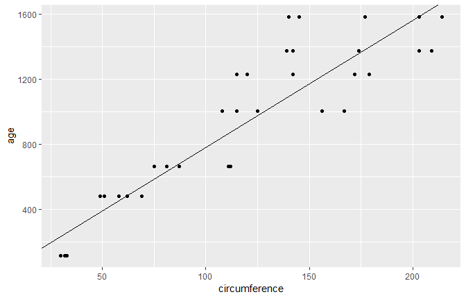

where we tidy these results, we get multiple rows of output for each
model:

``` r
broom::tidy(lm_fit)
## # A tibble: 2 x 5
##   term          estimate std.error statistic  p.value
##   <chr>            <dbl>     <dbl>     <dbl>    <dbl>
## 1 (Intercept)      16.6     78.1       0.212 8.33e- 1
## 2 circumference     7.82     0.606    12.9   1.93e-14
```

Now we can handle multiple regressions at once using exactly the same
workflow as before:

``` r
Orange %>% 
  nest(-Tree) %>% 
  mutate(
    fit    = map(data, ~ lm(age~circumference, data=.x)),
    tidied = map(fit, broom::tidy)
  ) %>% 
  unnest(tidied)
## # A tibble: 10 x 6
##    Tree  term          estimate std.error statistic   p.value
##    <ord> <chr>            <dbl>     <dbl>     <dbl>     <dbl>
##  1 1     (Intercept)    -265.      98.6      -2.68  0.0436   
##  2 1     circumference    11.9      0.919    13.0   0.0000485
##  3 2     (Intercept)    -132.      83.1      -1.59  0.172    
##  4 2     circumference     7.80     0.560    13.9   0.0000343
##  5 3     (Intercept)    -210.      85.3      -2.46  0.0574   
##  6 3     circumference    12.0      0.835    14.4   0.0000290
##  7 4     (Intercept)     -76.5     88.3      -0.867 0.426    
##  8 4     circumference     7.17     0.572    12.5   0.0000573
##  9 5     (Intercept)     -54.5     76.9      -0.709 0.510    
## 10 5     circumference     8.79     0.621    14.1   0.0000318
```

You can just as easily use multiple predictors in the regressions, as
shown here on the `mtcars` dataset. We nest the data into automatic and
manual cars (the `am` column), then peform the regression within each
nested tibble.

``` r
data("mtcars")
mtcars <- as_tibble(mtcars) # to play nicely with list-cols
mtcars
## # A tibble: 32 x 11
##      mpg   cyl  disp    hp  drat    wt  qsec    vs    am  gear  carb
##  * <dbl> <dbl> <dbl> <dbl> <dbl> <dbl> <dbl> <dbl> <dbl> <dbl> <dbl>
##  1  21       6  160    110  3.9   2.62  16.5     0     1     4     4
##  2  21       6  160    110  3.9   2.88  17.0     0     1     4     4
##  3  22.8     4  108     93  3.85  2.32  18.6     1     1     4     1
##  4  21.4     6  258    110  3.08  3.22  19.4     1     0     3     1
##  5  18.7     8  360    175  3.15  3.44  17.0     0     0     3     2
##  6  18.1     6  225    105  2.76  3.46  20.2     1     0     3     1
##  7  14.3     8  360    245  3.21  3.57  15.8     0     0     3     4
##  8  24.4     4  147.    62  3.69  3.19  20       1     0     4     2
##  9  22.8     4  141.    95  3.92  3.15  22.9     1     0     4     2
## 10  19.2     6  168.   123  3.92  3.44  18.3     1     0     4     4
## # ... with 22 more rows
```

``` r
mtcars %>% 
  nest(-am) %>% 
  mutate(
    fit    = map(data, ~ lm(wt ~ mpg + qsec + gear, data=.x)),
    tidied = map(fit, broom::tidy)
  ) %>% 
  unnest(tidied)
## # A tibble: 8 x 6
##      am term        estimate std.error statistic  p.value
##   <dbl> <chr>          <dbl>     <dbl>     <dbl>    <dbl>
## 1     1 (Intercept)   4.28      3.46      1.24   0.247   
## 2     1 mpg          -0.101     0.0294   -3.43   0.00750 
## 3     1 qsec          0.0398    0.151     0.264  0.798   
## 4     1 gear         -0.0229    0.349    -0.0656 0.949   
## 5     0 (Intercept)   4.92      1.40      3.52   0.00309 
## 6     0 mpg          -0.192     0.0443   -4.33   0.000591
## 7     0 qsec          0.0919    0.0983    0.935  0.365   
## 8     0 gear          0.147     0.368     0.398  0.696
```

What if you want not just the `tidy` output, but the `argument` and
`glance` outputs as well, while still performing each regression only
once? Since we are using list-columns, we can just fit the model once
and use multiple list-columns to store the tidied, glanced and augmented
outputs.

``` r
regressions <- mtcars %>% 
  nest(-am) %>% 
  mutate(
    fit     = map(data, ~ lm(wt ~ mpg + qsec + gear, data = .x)),
    tidied  = map(fit, broom::tidy),
    glanced = map(fit, glance),
    augumented = map(fit, augment)
  )

regressions %>% 
  unnest(tidied)
## # A tibble: 8 x 6
##      am term        estimate std.error statistic  p.value
##   <dbl> <chr>          <dbl>     <dbl>     <dbl>    <dbl>
## 1     1 (Intercept)   4.28      3.46      1.24   0.247   
## 2     1 mpg          -0.101     0.0294   -3.43   0.00750 
## 3     1 qsec          0.0398    0.151     0.264  0.798   
## 4     1 gear         -0.0229    0.349    -0.0656 0.949   
## 5     0 (Intercept)   4.92      1.40      3.52   0.00309 
## 6     0 mpg          -0.192     0.0443   -4.33   0.000591
## 7     0 qsec          0.0919    0.0983    0.935  0.365   
## 8     0 gear          0.147     0.368     0.398  0.696
```

``` r
regressions %>% 
  unnest(glanced, .drop=T)
## # A tibble: 2 x 12
##      am r.squared adj.r.squared sigma statistic p.value    df   logLik
##   <dbl>     <dbl>         <dbl> <dbl>     <dbl>   <dbl> <int>    <dbl>
## 1     1     0.833         0.778 0.291     15.0  7.59e-4     4 -5.80e-3
## 2     0     0.625         0.550 0.522      8.32 1.70e-3     4 -1.24e+1
## # ... with 4 more variables: AIC <dbl>, BIC <dbl>, deviance <dbl>,
## #   df.residual <int>
```

``` r
regressions %>% 
  unnest(augumented)
## # A tibble: 32 x 12
##       am    wt   mpg  qsec  gear .fitted .se.fit  .resid  .hat .sigma
##    <dbl> <dbl> <dbl> <dbl> <dbl>   <dbl>   <dbl>   <dbl> <dbl>  <dbl>
##  1     1  2.62  21    16.5     4    2.73   0.209 -0.107  0.517  0.304
##  2     1  2.88  21    17.0     4    2.75   0.152  0.126  0.273  0.304
##  3     1  2.32  22.8  18.6     4    2.63   0.163 -0.310  0.312  0.279
##  4     1  2.2   32.4  19.5     4    1.70   0.137  0.505  0.223  0.233
##  5     1  1.62  30.4  18.5     4    1.86   0.151 -0.244  0.269  0.292
##  6     1  1.84  33.9  19.9     4    1.56   0.156  0.274  0.286  0.286
##  7     1  1.94  27.3  18.9     4    2.19   0.113 -0.253  0.151  0.293
##  8     1  2.14  26    16.7     5    2.21   0.153 -0.0683 0.277  0.307
##  9     1  1.51  30.4  16.9     5    1.77   0.191 -0.259  0.430  0.284
## 10     1  3.17  15.8  14.5     5    3.15   0.157  0.0193 0.292  0.308
## # ... with 22 more rows, and 2 more variables: .cooksd <dbl>,
## #   .std.resid <dbl>

regressions %>% 
  unnest(augumented) %>% 
  ggplot(aes(x=wt, y=.fitted))+
  geom_point()
```

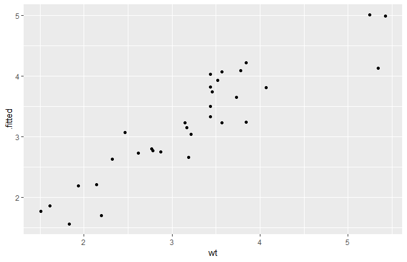

By combining the estimates and p-values across all groups into the same
tidy data frame (instead of a list of output model objects), a new class
of analyses and visualizations becomes straightforward. This includes

  - Sorting by p-value or estimate to find the most significant terms
    across all tests
  - P-value histograms
  - Volcano plots comparing p-values to effect size estimates

In each of these cases, we can easily filter, facet, or distinguish
based on the term column. In short, this makes the tools of tidy data
analysis available for the results of data analysis and models, not just
the
inputs.

## [Tidy bootstrapping](https://cran.r-project.org/web/packages/broom/vignettes/bootstrapping.html)

Another place where combining model fits in a tidy way becomes useful is
when performing bootstrapping or permutation tests. These approach have
been explored, for instance, by [Andrew MacDonald
here](http://rstudio-pubs-static.s3.amazonaws.com/19698_a4c472606e3c43e4b94720506e49bb7b.html),
and [Hadley has explored efficient support for
bootstrapping](https://github.com/hadley/dplyr/issues/269) as a
potential enhancement to dplyr. broom fits naturally with dplyr in
performing these analyses.

Bootstrapping consists of randomly sampling a dataset with replacement,
then performing the analysis individually on each bootstrapped
replicate. The variation in the resulting estimate is then a reasonable
approximation of the variance in our estimate.

Let’s say we want to fit a nonlinear model to the weight/mileage
relationship in the `mtcars` dataset.

``` r
library(ggplot2)
ggplot(mtcars, aes(mpg, wt)) + 
    geom_point()
```

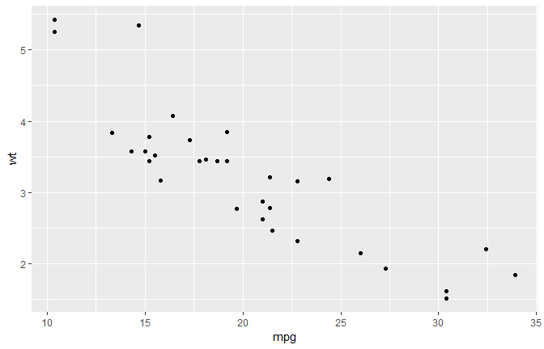

We might use the method of nonlinear least squares (via the `nls`
function) to fit a model.

``` r
nlsfit <- nls(mpg~k/wt+b,
              data = mtcars,
              start = list(k=1, b=0))

summary(nlsfit)
## 
## Formula: mpg ~ k/wt + b
## 
## Parameters:
##   Estimate Std. Error t value Pr(>|t|)    
## k   45.829      4.249  10.786 7.64e-12 ***
## b    4.386      1.536   2.855  0.00774 ** 
## ---
## Signif. codes:  0 '***' 0.001 '**' 0.01 '*' 0.05 '.' 0.1 ' ' 1
## 
## Residual standard error: 2.774 on 30 degrees of freedom
## 
## Number of iterations to convergence: 1 
## Achieved convergence tolerance: 2.877e-08

ggplot(mtcars, aes(wt,mpg))+
  geom_point()+
  geom_line(aes(y=predict(nlsfit)))
```

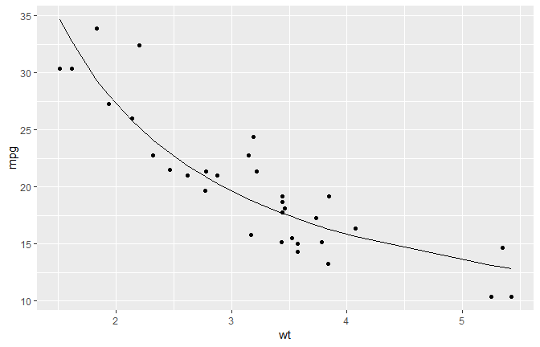

While this does provide a p-value and confidence intervals for the
parameters, these are based on model assumptions that may not hold in
real data. Bootstrapping is a popular method for providing confidence
intervals and predictions that are more robust to the nature of the
data.

We cna use the `bootstraps` function in the `rsample` package to sample
bootstrap replications. First, we construct 100 bootstrap replications
of the data, each of which as been randomly sampled with replacement.
The resulting object is an `rset`, which is a dataframe with a column of
`rsplit` objects.

an `rsplit` object has two main components: an analysis dataset and an
assessment dataset, accessible via `analysis(rsplit)` and
`asessement(rsplit)` respectively. For bootstrap samples, the analysis
dataset is the bootstrap sample itself, and the assessment dataset
consists of all the out of bag samples.

``` r
library(dplyr)
library(rsample)
library(broom)
library(purrr)
```

``` r
set.seed(27)
boots <- rsample::bootstraps(mtcars, times = 100)

boots %>% head()
## # A tibble: 6 x 2
##   splits          id          
## * <list>          <chr>       
## 1 <split [32/12]> Bootstrap001
## 2 <split [32/15]> Bootstrap002
## 3 <split [32/10]> Bootstrap003
## 4 <split [32/10]> Bootstrap004
## 5 <split [32/12]> Bootstrap005
## 6 <split [32/12]> Bootstrap006
boots$splits[[1]]
## <32/12/32>
```

We create a helper function to fit an `nls` model on each bootstrap
sample, and then use `purrr::map` to apply this to function to all the
bootstrap samples at once. Similarly, we create an column of tidy
coefficient information by unnesting.

``` r
fit_nls_on_bootstrap <- function(split) {
    nls(mpg ~ k / wt + b, analysis(split), start = list(k = 1, b = 0))
}

boot_models <- boots %>% 
    mutate(model = map(splits, fit_nls_on_bootstrap),
           coef_info = map(model, broom::tidy))

boot_coefs <- boot_models %>% 
  unnest(coef_info)
```

The unnested coefficient information contains a summary of each
replication combined in a single data frame:

``` r
boot_coefs
## # A tibble: 200 x 6
##    id           term  estimate std.error statistic  p.value
##    <chr>        <chr>    <dbl>     <dbl>     <dbl>    <dbl>
##  1 Bootstrap001 k       42.1        3.76    11.2   2.99e-12
##  2 Bootstrap001 b        5.76       1.43     4.02  3.60e- 4
##  3 Bootstrap002 k       46.3        3.72    12.4   2.26e-13
##  4 Bootstrap002 b        4.10       1.43     2.87  7.38e- 3
##  5 Bootstrap003 k       56.1        3.80    14.7   2.77e-15
##  6 Bootstrap003 b        0.935      1.31     0.713 4.82e- 1
##  7 Bootstrap004 k       43.5        3.39    12.8   1.06e-13
##  8 Bootstrap004 b        4.83       1.33     3.62  1.06e- 3
##  9 Bootstrap005 k       41.3        3.74    11.0   4.26e-12
## 10 Bootstrap005 b        5.37       1.31     4.11  2.81e- 4
## # ... with 190 more rows
```

We can then calculate confidence intervals (using what is called the
[percentile
method](https://www.uvm.edu/~dhowell/StatPages/Randomization%20Tests/ResamplingWithR/BootstMeans/bootstrapping_means.html))

``` r
alpha <- .05
boot_coefs %>% 
  group_by(term) %>% 
  summarise(
    low  = quantile(estimate, alpha /2),
    high = quantile(estimate, 1-alpha/2)
  )
## # A tibble: 2 x 3
##   term      low  high
##   <chr>   <dbl> <dbl>
## 1 b      -0.695  7.40
## 2 k      38.7   62.3
```

or we can use histograms to get a more detailed idea of the uncertainty
in each estimate:

``` r
ggplot(boot_coefs, aes(estimate))+
  geom_histogram(binwidth = 2)+
  facet_wrap(~term, scales = "free")
```

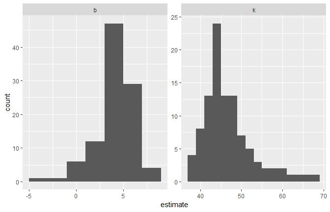

or we can use `augment` to visualize the uncertainty in the curve.

``` r
boot_aug <- boot_models %>% 
  mutate(augmented = map(model,augment)) %>% 
  unnest(augmented)

boot_aug
## # A tibble: 3,200 x 5
##    id             mpg    wt .fitted .resid
##    <chr>        <dbl> <dbl>   <dbl>  <dbl>
##  1 Bootstrap001  21.4  2.78    20.9  0.484
##  2 Bootstrap001  22.8  2.32    23.9 -1.12 
##  3 Bootstrap001  30.4  1.51    33.6 -3.20 
##  4 Bootstrap001  17.8  3.44    18.0 -0.209
##  5 Bootstrap001  24.4  3.19    19.0  5.43 
##  6 Bootstrap001  17.3  3.73    17.1  0.243
##  7 Bootstrap001  22.8  2.32    23.9 -1.12 
##  8 Bootstrap001  21    2.62    21.8 -0.841
##  9 Bootstrap001  18.7  3.44    18.0  0.691
## 10 Bootstrap001  14.3  3.57    17.6 -3.26 
## # ... with 3,190 more rows
```

``` r
ggplot(boot_aug, aes(wt, mpg))+
  geom_point()+
  geom_line(aes(y=.fitted,group=id),alpha=.2)
```

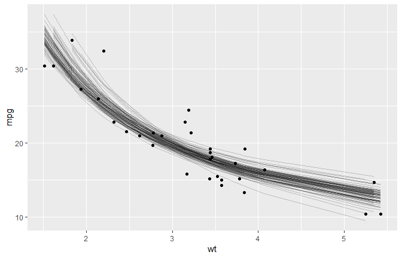

With only a few small changes, we could easily perform bootstrapping
with other kinds of predictive or hypothetical tesing models, since the
`tidy` functions work for many statistical outputs. As another example,
we could use `smooth.spline` which fits a cubic smoothing spline to
data:

``` r
fit_spline_on_bootstrap <- function(split){
  data <- analysis(split)
  smooth.spline(data$wt, data$mpg, df=4)
}

boot_splines <- boots %>% 
  mutate(spline    = map(splits, fit_spline_on_bootstrap),
         aug_train = map(spline, augment))

splines_aug <- boot_splines %>% 
  unnest(aug_train)

ggplot(splines_aug, aes(x,y,))+
  geom_point()+
  geom_line(aes(y = .fitted,group = id), alpha = .2)
```

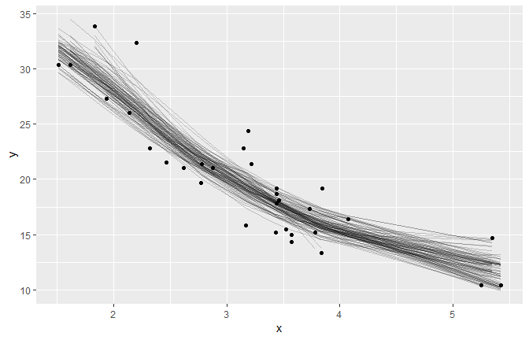

## [kmeans with dplyr and broom](https://cran.r-project.org/web/packages/broom/vignettes/kmeans.html)

### Tidy k-means clustering

K-means clustering serves as a very useful example of tidy data, and
especially the distinction between the three tidying functions: `tidy`,
`agument` and `glance`.

Let’s start by generating some random two-dimensional data with three
clusters. Data in each cluster will come from a multivariate gaussian
distribution with different means for each cluster:

``` r
library(dplyr)
library(ggplot2)
library(purrr)
library(tibble)
library(tidyr)
```

``` r
set.seed(27)

centers <- tibble(
  cluster = factor(1:3),
  num_points = c(100, 150, 50), # the number in each cluster
  x1 = c(5, 0, -3), # x1 coordinate of cluster center
  x2 = c(-1, 1, -2) # x2 coordinate of cluster center
)

labeled_points <- centers %>% 
  mutate(
    x1 = map2(num_points, x1, rnorm),
    x2 = map2(num_points, x2, rnorm)
  ) %>% 
  select(-num_points) %>% 
  unnest(x1, x2)

ggplot(labeled_points, aes(x1, x2, color=cluster))+
  geom_point()
```

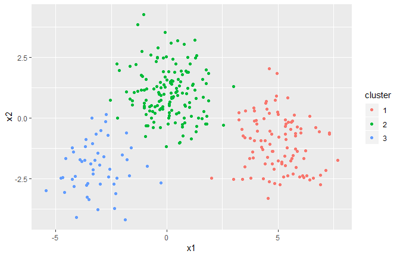

This is an ideal case for k-means clustering. We’ll use the built-in
`kmeans` function, which accepts a data frame with all numeric columns
as its prinary argument.

``` r
points <- labeled_points %>% 
  select(-cluster)

points %>% head()
## # A tibble: 6 x 2
##      x1     x2
##   <dbl>  <dbl>
## 1  6.91 -2.74 
## 2  6.14 -2.45 
## 3  4.24 -0.946
## 4  3.54  0.287
## 5  3.91  0.408
## 6  5.30 -1.58

kclust <- kmeans(points, centers = 3)
kclust
## K-means clustering with 3 clusters of sizes 51, 101, 148
## 
## Cluster means:
##            x1        x2
## 1 -3.14292460 -2.000043
## 2  5.00401249 -1.045811
## 3  0.08853475  1.045461
## 
## Clustering vector:
##   [1] 2 2 2 2 2 2 2 2 2 2 2 2 2 2 2 2 2 2 2 2 2 2 2 2 2 2 2 2 2 2 2 2 2 2 2
##  [36] 2 2 2 2 2 2 2 2 2 2 2 2 2 2 2 2 2 2 2 2 2 2 2 2 2 2 2 2 2 2 2 2 2 2 2
##  [71] 2 2 2 2 2 2 2 2 2 2 2 2 2 2 2 2 2 2 2 2 2 2 2 2 2 2 2 2 2 2 3 3 3 3 3
## [106] 3 3 3 3 3 3 3 3 3 3 3 3 3 3 3 3 3 3 3 3 3 3 3 3 3 3 3 3 3 3 3 3 3 3 3
## [141] 3 3 3 3 3 3 3 3 3 3 3 3 3 3 3 3 3 3 3 3 3 3 3 3 3 3 3 3 3 3 3 3 3 3 3
## [176] 3 3 3 3 3 3 3 3 3 3 3 3 3 3 3 3 3 3 3 3 3 3 3 2 3 3 3 3 3 3 3 3 3 3 3
## [211] 3 3 3 3 3 3 3 3 3 3 3 3 3 3 3 3 3 3 3 3 3 3 3 3 3 3 3 3 3 3 3 3 3 1 3
## [246] 3 3 3 3 3 1 1 1 1 1 1 1 1 1 1 1 1 1 1 1 1 1 1 1 1 1 1 1 1 1 1 1 1 1 1
## [281] 1 1 1 1 1 1 1 1 1 1 1 1 1 1 1 1 1 1 1 1
## 
## Within cluster sum of squares by cluster:
## [1] 108.8112 243.2092 298.9415
##  (between_SS / total_SS =  82.5 %)
## 
## Available components:
## 
## [1] "cluster"      "centers"      "totss"        "withinss"    
## [5] "tot.withinss" "betweenss"    "size"         "iter"        
## [9] "ifault"

summary(kclust)
##              Length Class  Mode   
## cluster      300    -none- numeric
## centers        6    -none- numeric
## totss          1    -none- numeric
## withinss       3    -none- numeric
## tot.withinss   1    -none- numeric
## betweenss      1    -none- numeric
## size           3    -none- numeric
## iter           1    -none- numeric
## ifault         1    -none- numeric
```

The output is a list of vectors, where each component has a different
length. There’s one of length 300: the same as our original dataset.
There are number of elements of length 3: `withiness`, `tot.withiness`
and `betweeness` and `centers` is a matrix with 3 rows. And then there
are the elements of length 1: `totss`, `tot.withiness`, `betweenss` and
`iter`.

These differing lengths have a deeper meaning when we want to tidy our
dataset: they signify that each type of component communicates a
*different kind* of information.

  - `cluster` (300 values) contains information about each *point*
  - `centers`, `withinss` and `size` (3 values) contain information
    about each *cluster*
  - `totss`, `tot.withinss`, `betweenss`, and `iter` (1 value) contain
    information about the *full clustering*

Which of these do we want to extract? There is no right answer: each of
them may be interesting to an analyst. Because they communicate entirely
different information (not to mention there is no straightfoward way to
combine them), they are extracted by separate functions. `augment` adds
the point classifications to the original dataset:

``` r
library(broom)
broom::augment(kclust, points)
## # A tibble: 300 x 3
##       x1     x2 .cluster
##    <dbl>  <dbl> <fct>   
##  1  6.91 -2.74  2       
##  2  6.14 -2.45  2       
##  3  4.24 -0.946 2       
##  4  3.54  0.287 2       
##  5  3.91  0.408 2       
##  6  5.30 -1.58  2       
##  7  5.01 -1.77  2       
##  8  6.16 -1.68  2       
##  9  7.13 -2.17  2       
## 10  5.24 -2.42  2       
## # ... with 290 more rows
```

The `tidy` function summarizes on a per-cluster level:

``` r
broom::tidy(kclust)
## # A tibble: 3 x 5
##        x1    x2  size withinss cluster
## *   <dbl> <dbl> <int>    <dbl> <fct>  
## 1 -3.14   -2.00    51     109. 1      
## 2  5.00   -1.05   101     243. 2      
## 3  0.0885  1.05   148     299. 3
```

And as it always does, the `glance` function extracts a single-row
summary:

``` r
glance(kclust)
## # A tibble: 1 x 4
##   totss tot.withinss betweenss  iter
##   <dbl>        <dbl>     <dbl> <int>
## 1 3724.         651.     3073.     2
```

### broom and dplyr for exploratory clustering

While these summaries are useful, they would not have been too difficult
to extract out from the dataset yourself. The real power comes from
combining these analyses with dplyr.

Let’s say we want to explore theeffects of different choices of `k`,
from 1 to 9, on this clustering. First, cluster the data 9 times, each
using a different value of `k`, then create columns containing the
tidied, glanced and augmented data:

``` r
kclusts <- tibble(k = 1:9) %>%
  mutate(
    kclust = map(k, ~kmeans(points, .x)),
    tidied = map(kclust, broom::tidy),
    glanced = map(kclust, glance),
    augmented = map(kclust, augment, points)
  )

kclusts
## # A tibble: 9 x 5
##       k kclust       tidied           glanced          augmented         
##   <int> <list>       <list>           <list>           <list>            
## 1     1 <S3: kmeans> <tibble [1 x 5]> <tibble [1 x 4]> <tibble [300 x 3]>
## 2     2 <S3: kmeans> <tibble [2 x 5]> <tibble [1 x 4]> <tibble [300 x 3]>
## 3     3 <S3: kmeans> <tibble [3 x 5]> <tibble [1 x 4]> <tibble [300 x 3]>
## 4     4 <S3: kmeans> <tibble [4 x 5]> <tibble [1 x 4]> <tibble [300 x 3]>
## 5     5 <S3: kmeans> <tibble [5 x 5]> <tibble [1 x 4]> <tibble [300 x 3]>
## 6     6 <S3: kmeans> <tibble [6 x 5]> <tibble [1 x 4]> <tibble [300 x 3]>
## 7     7 <S3: kmeans> <tibble [7 x 5]> <tibble [1 x 4]> <tibble [300 x 3]>
## 8     8 <S3: kmeans> <tibble [8 x 5]> <tibble [1 x 4]> <tibble [300 x 3]>
## 9     9 <S3: kmeans> <tibble [9 x 5]> <tibble [1 x 4]> <tibble [300 x 3]>
```

We can turn these into three separate datasets each representing a
different type of data: Then tidy the clusterings three ways: using
`tidy`, using `augment`, and using `glance`. Each of these goes into a
separate dataset as they represent different types of data.

``` r
clusters <- kclusts %>%
  unnest(tidied)

assignments <- kclusts %>% 
  unnest(augmented)

clusterings <- kclusts %>% 
  unnest(glanced, .drop=TRUE)
```

Now we can plot the original points, with each point colored according
to the predicted cluster.

``` r
p1 <- ggplot(assignments, aes(x1, x2))+
  geom_point(aes(color=.cluster))+
  facet_wrap(~k)

p1
```

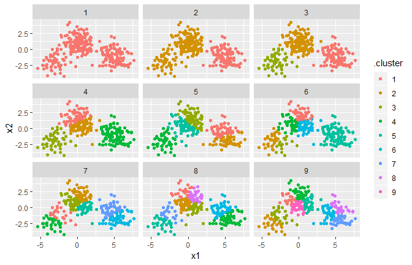

Already we get a good sense of the proper number of clusters (3), and
how the k-means algorithm functions when k is too high or too low. We
can then add the centers using the data from `tidy`:

``` r
p2 <- p1 + geom_point(data=clusters, size=3, shape="X")
p2
```


The data from `glance` fits a diffrent but equally important purpose: it
lets you view trends of some summary statistics across values of `k`. Of
particular interest is the total within sum of squares, saved in the
`tot.withinss` column.

``` r
ggplot(clusterings, aes(k, tot.withinss))+
  geom_line()
```

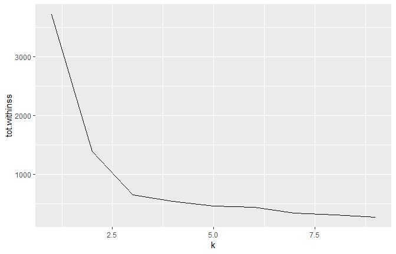

This represents the variance within clusters. It decreases as `k`
increases, but one can notice a bed (or elborw) right at k=3. This bend
indicates that additional clusters beyond the third little value. (See
[here](http://web.stanford.edu/~hastie/Papers/gap.pdf) for a more
mathematically rigorous interpretation and implementation of this
method). Thus, all three methods of tidying data provided by `broom` are
useful for summarizing clustering output.

## Rererence

[Broom Vignette](https://broom.tidyverse.org/)

# `rsample`

`rsample` contains a set of functions that can create different types of
resamples and corresponding classses for their analysis. The goal is to
have modular set of methods that can be used across different R packages
for:

  - traditional resampling techniques for estimating the sampling
    distribution of a statistic and
  - estimating model performance using a holdout set

The scope of `rsample` is to provide the basic building blocks for
creating and analyzing resamples of a data set but does not include for
modeling or calculating statistics. The “Workking with Resample Sets”
vignette gives demonstrations of how `rsample` tools can be used.

``` r
install.packages("rsample")

# for the devel version::
require(devtools)
devtools::install_github("tidymodels/rsample")
```

Note that resampled data sets created by `rsample` are directly
accessible ina resampling object but do not contain much overhead in
memory. Since the original data is not modified, R does not make an
automatic copy.

For example, creating 50 bootstraps of a data set does not create an
object that is 50-fold larger inmemory.

``` r
library(rsample)
library(mlbench)
library(pryr)

data(LetterRecognition)
object_size(LetterRecognition)
## 2.64 MB

set.seed(35222)
boots <- rsample::bootstraps(LetterRecognition, times=50)

object_size(boots)
## 6.69 MB

# object size per resample
object_size(boots)/nrow(boots)
## 134 kB

# Fold increase is <<< 50
as.numeric(object_size(boots)/object_size(LetterRecognition))
## [1] 2.529808
```

## Nested resampling

(A version of this article was originally published in the [*Applied
Predictive Modeling*
blog](http://appliedpredictivemodeling.com/blog/2017/9/2/njdc83d01pzysvvlgik02t5qnaljnd))

A typical scheme for splitting the data when developing a predictive
model is to create an initial split of the data into a training and test
set. If resampling is used, it is executed on the training set. A series
of binary splits is created. In `rsample`, we use the term *analysis
set* for the data that are used to fit the model and *assessment set* is
used to compute performance

A common method for tuning models is grid search where a candidate set
of tuning parameters is created. The full set of models for every
combination of the tuning parameter grid and the resamples is created.
Each time, the assessment data are used to measure performance and the
average value is determined for each tuning parameter.

The potential problem is, once we pick the tuning parameter associated
with the bet performance, this performance value is usually quoted as
the performance of the model. There is a serious potential for
*optimization bias* since we uses the same data to tune the model and
quote performance. This would result in an optimistinc estimate of
performance.

Nested resampling does an additional layer of resampling that separates
the tuning activities from the process used to estimate the efficacy of
the model. An *outer* resampling scheme is used and, for every split in
the outer resample, another full set of resampling splits are created on
the original analysis set. For example, if 10-fold cross-validation is
used on the outside and 5-fold cross-validation on the inside, a total
of 500 models will be fit. The parameter tuning will be conducted 10
times and thebest parameters are determined from the average of the 5
assessment sets. This process occurs 10 times.

We will simulate some regression data to illustrate the methods. The
`mlbench` function `mlbench::mlbench.friedman1` can simulate a complex
regression data structure from the [original MARS
publication](https://scholar.google.com/scholar?hl=en&q=%22Multivariate+adaptive+regression+splines%22&btnG=&as_sdt=1%2C7&as_sdtp=).
A training set size of 100 data points are generated as well as a large
set that will be used to characterize how well the resampling procedure
performed.

``` r
library(mlbench)
sim_data <- function(n){
  tmp <- mlbench.friedman1(n, sd=1)
  tmp <- cbind(tmp$x, tmp$y)
  tmp <- as.data.frame(tmp)
  names(tmp)[ncol(tmp)] <- "y"
  tmp
}

set.seed(9815)
train_dat <- sim_data(100)
large_dat <- sim_data(10^5)

train_dat %>% head()
##          V1        V2        V3        V4        V5        V6        V7
## 1 0.1945697 0.6418371 0.9530617 0.7961244 0.2175547 0.9341119 0.1990057
## 2 0.2281191 0.1046035 0.8010136 0.6872665 0.7132849 0.5495135 0.4451621
## 3 0.0237278 0.0983911 0.5911238 0.2729825 0.3486822 0.5970778 0.9879835
## 4 0.7073537 0.8550995 0.8232934 0.5859757 0.5678440 0.1095951 0.6397121
## 5 0.7844861 0.2843560 0.3885567 0.1277830 0.6481253 0.8126577 0.3983826
## 6 0.5669030 0.9980239 0.7295834 0.1901266 0.5859250 0.2845121 0.7643961
##          V8         V9       V10        y
## 1 0.2106022 0.57407261 0.1958863 16.36389
## 2 0.7320519 0.08607139 0.3788550 12.90426
## 3 0.6377623 0.56391894 0.9798512  4.12934
## 4 0.9254958 0.79069775 0.3709754 21.72215
## 5 0.5251866 0.62025157 0.1792105 11.59917
## 6 0.2775036 0.82434996 0.1619205 14.79745
train_dat %>% dim()
## [1] 100  11
```

To get started, the types of resampling methods need to be specified.
This isn’t a large data set, so 5 repeates of 10-fold cross validation
will be used as the *outer* resampling method that will be used to
generate the estimate of overall performance. To tune the model, it
would be good to have precise estimates for each of the values of the
tuning parameter so 25 iterations of the bootstrap will be used. fit
This means that there will eventually be `5 * 10 * 25 = 1250` models
that are fit to the data per tuning parameter. These will be discarded
once the performance of the model has been quantified.

``` r
library(rsample) 
results <- nested_cv(train_dat, 
                     outside = vfold_cv(repeats = 5), 
                     inside = bootstraps(times = 25))
results
## [1] "nested_cv"  "vfold_cv"   "rset"       "tbl_df"     "tbl"       
## [6] "data.frame"
## # Nested resampling:
## #  outer: 10-fold cross-validation repeated 5 times
## #  inner: Bootstrap sampling
## # A tibble: 50 x 4
##    splits          id      id2    inner_resamples  
##    <list>          <chr>   <chr>  <list>           
##  1 <split [90/10]> Repeat1 Fold01 <tibble [25 x 2]>
##  2 <split [90/10]> Repeat1 Fold02 <tibble [25 x 2]>
##  3 <split [90/10]> Repeat1 Fold03 <tibble [25 x 2]>
##  4 <split [90/10]> Repeat1 Fold04 <tibble [25 x 2]>
##  5 <split [90/10]> Repeat1 Fold05 <tibble [25 x 2]>
##  6 <split [90/10]> Repeat1 Fold06 <tibble [25 x 2]>
##  7 <split [90/10]> Repeat1 Fold07 <tibble [25 x 2]>
##  8 <split [90/10]> Repeat1 Fold08 <tibble [25 x 2]>
##  9 <split [90/10]> Repeat1 Fold09 <tibble [25 x 2]>
## 10 <split [90/10]> Repeat1 Fold10 <tibble [25 x 2]>
## # ... with 40 more rows
```

The splitting information for each resample is contained in the `split`
objects. Focusing on the second fold of the first repeat:

``` r
results$splits[[2]]
## <90/10/100>
```

`<90/10/100>` indicates the number of data in the analysis set,
assessment set, and the original data.

Each element of `inner_resamples` has its own tibble with the
bootstrapping splits.

``` r
results$inner_resamples[[5]]
## # Bootstrap sampling 
## # A tibble: 25 x 2
##    splits          id         
##    <list>          <chr>      
##  1 <split [90/37]> Bootstrap01
##  2 <split [90/31]> Bootstrap02
##  3 <split [90/28]> Bootstrap03
##  4 <split [90/37]> Bootstrap04
##  5 <split [90/32]> Bootstrap05
##  6 <split [90/34]> Bootstrap06
##  7 <split [90/32]> Bootstrap07
##  8 <split [90/30]> Bootstrap08
##  9 <split [90/35]> Bootstrap09
## 10 <split [90/41]> Bootstrap10
## # ... with 15 more rows
```

These are self-contained, meaning that the bootstrap sample is aware
that it is a sample of a specific 90% of the data:

``` r
results$inner_resamples[[5]]$splits[[1]]
## <90/37/90>
```

To start, we need to define how the model will be created and measured.
For our example, a **radial basis support vector machine** model will be
created using the function `kernlab::ksvm`. This model is generally
thought of as having *two* tuning parameters: the SVM cost value and the
kernel parameter `sigma`. For illustration, only the cost value will be
tuned and the function `kernlab::sigest` will be used to estimate
`sigma` during each model fit. This is automatically done by `ksvm`.

After the model is fit to the analysis set, the root-mean squared error
(RMSE) is computed on the assessment set. One important note: for this
model, it is critical to center and scale the predictors before
computing dot products. We don’t do this operation here because
`mlbench.friedman1` simulates all of the predictors to be standard
uniform random variables.

Our function to fit the model and compute the RMSE is:

``` r
library(kernlab)

# `object` will be an `rsplit` object from our `results` tibble
# `cost` is the tuning parameter
svm_rmse <- function(object, cost = 1) {
  y_col <- ncol(object$data)
  mod <- ksvm(y ~ ., data = analysis(object),  C = cost)
  holdout_pred <- predict(mod, assessment(object)[-y_col])
  rmse <- sqrt(mean((assessment(object)$y - holdout_pred) ^ 2, na.rm = TRUE))
  rmse
}

# In some case, we want to parameterize the function over the tuning parameter:
rmse_wrapper <- function(cost, object) svm_rmse(object, cost)
```

For the nested resampling, a model needs to be fit for each tuning
parameter and each bootstrap split. To do this, a wrapper can be
created:

``` r
library(purrr)
library(dplyr)

# `object` will be an `rsplit` object for the bootstrap samples
tune_over_cost <- function(object) {
  results <- tibble(cost = 2 ^ seq(-2, 8, by = 1))
  results$RMSE <- map_dbl(results$cost, 
                          rmse_wrapper,
                          object = object)
  results
}
```

Since this will be called across the set of outer cross-validation
splits, another wrapper is required:

``` r
# `object` is an `rsplit` object in `results$inner_resamples` 
summarize_tune_results <- function(object) {
  # Return row-bound tibble that has the 25 bootstrap results
  map_df(object$splits, tune_over_cost) %>%
    # For each value of the tuning parameter, compute the 
    # average RMSE which is the inner bootstrap estimate. 
    group_by(cost) %>%
    summarize(mean_RMSE = mean(RMSE, na.rm = TRUE),
              n = length(RMSE))
}
```

Now that those functions are defined, we can execute all the inner
resampling loops:

``` r
tuning_results <- map(results$inner_resamples, summarize_tune_results) 
```

`tuning_results` is a list of data frames for each of the 50 outer
resamples.

Let’s make a plot of the averaged results to see what the relationship
is between the RMSE and the tuning parameters for each of the inner
bootstrapping operations:

``` r

library(ggplot2)
library(scales)

pooled_inner <- tuning_results %>% bind_rows

best_cost <- function(dat) dat[which.min(dat$mean_RMSE),]

p <- ggplot(pooled_inner, aes(x=cost, y=mean_RMSE))+
  scale_x_continuous(trans="log2")+
  xlab("SVM Cost")+ylab("Inner RMSE")

for (i in 1:length(tuning_results)){
  p <- p + 
  geom_line(data=tuning_results[[i]], alpha=.2)+
  geom_point(data=best_cost(tuning_results[[i]]), pch = 16)
}

p <- p+geom_smooth(data=pooled_inner, se=FALSE)
p
```

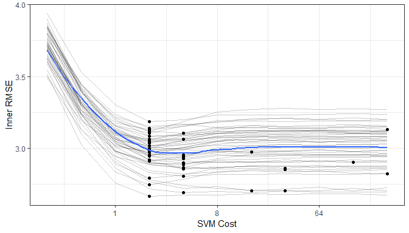

Each grey line is a separate bootstrap resampling curve created from a
different 90% of the data. The blue line is a loess smooth of all the
results pooled together.

To determine the best parameter estimate for each of the outer
resampling iterations:

``` r
cost_vals <- tuning_results %>% 
  map_df(best_cost) %>% 
  select(cost)

results <- bind_cols(results, cost_vals)
results$cost <- factor(results$cost, levels=paste(2^seq(-2,8,by=1)))

ggplot(results, aes(x=cost))+
  geom_bar()+
  xlab("SVM Cost")+
  scale_x_discrete(drop=FALSE)
```

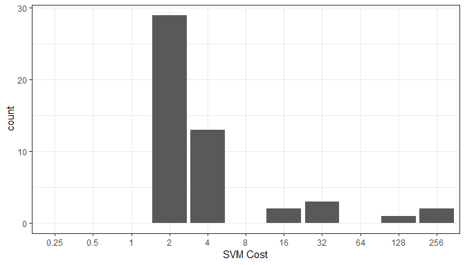

Most of the resampling produced and optimal cost values of 2.0 but the
distribution is right-skewed due to the flat trend in the resampling
profile once the cost value becomes 10 or larger.

Now that we have these estimates, we can compute the outer resampling
results for each of the 50 splits using the corresponding tuning
parameter value:

``` r
results$RMSE <- map2_dbl(results$splits, results$cost, svm_rmse)
summary(results$RMSE)
##    Min. 1st Qu.  Median    Mean 3rd Qu.    Max. 
##   1.095   2.099   2.636   2.682   3.093   4.177
```

What is the RMSE estimate for non-nested procedure when only the outer
resampling method is used? For each cost value in the tuning grid, 50
SVM models are fit and their RMSE values are averaged. The table of cost
values and mean RMSE estimates is used to determine the best cost value.
The associated RMSE is the biased estimate.

``` r

not_nested <- map(results$splits, tune_over_cost) %>% 
  bind_rows

outer_summary <- not_nested %>% 
  group_by(cost) %>% 
  summarise(outer_RMSE = mean(RMSE),
            n = length(RMSE))
outer_summary
## # A tibble: 11 x 3
##      cost outer_RMSE     n
##     <dbl>      <dbl> <int>
##  1   0.25       3.57    50
##  2   0.5        3.12    50
##  3   1          2.78    50
##  4   2          2.61    50
##  5   4          2.64    50
##  6   8          2.76    50
##  7  16          2.83    50
##  8  32          2.84    50
##  9  64          2.83    50
## 10 128          2.83    50
## 11 256          2.84    50

ggplot(outer_summary, aes(x = cost, y = outer_RMSE))+
  geom_point()+
  geom_line()+
  scale_x_continuous(trans="log2")+
  xlab("SVM cost")+ylab("RMSE")
```

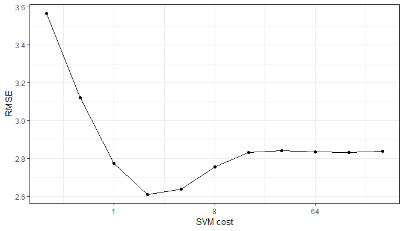

The non-nested procedure estimates the RMSE to be 2.61. Both estimates
are fairly close.

``` r

finalModel <- kernlab::ksvm(y~., data=train_dat, C = 2)
large_pred <- predict(finalModel, large_dat[, -ncol(large_dat)])
sqrt(mean((large_dat$y - large_pred)^2, na.rm=TRUE))
## [1] 2.696096
```

The nested procedure produces a closer estimate to the approximate truth
but the non-nested estimate is very similar.

## Recipes with rsample

``` r
library(rsample)
library(recipes)
library(purrr)
```

The [`recipes`](https://topepo.github.io/recipes/) package contains a
data preprocessor that can be used to avoid the potentially expensive
formula methods as well as providing a richer set of data manipulation
tools than base R can provide. This document uses version 0.1.4 of
`recipes`.

In many cases, the preprocessing steps might contain quantities that
require statistical estimation of parameters, such as

  - signal extraction using principal component analysis
  - imputation of missing values
  - transformations of individual variables (e.g., Box-Cox
    transformations)

It is critical that any complex preprocessing steps be contained
*inside* of resampling so that the model performance estimates take into
account the variability of these steps. Before discussing how `rsample`
can use recipes, let’s look at an example recipe for the Ames housing
data.

### An example recipe

For illustration, the Ames housing data will be used. There are sale
prices of homes along with various other descriptions for the property:

``` r
library(AmesHousing)
ames <- make_ames()
names(ames)
##  [1] "MS_SubClass"        "MS_Zoning"          "Lot_Frontage"      
##  [4] "Lot_Area"           "Street"             "Alley"             
##  [7] "Lot_Shape"          "Land_Contour"       "Utilities"         
## [10] "Lot_Config"         "Land_Slope"         "Neighborhood"      
## [13] "Condition_1"        "Condition_2"        "Bldg_Type"         
## [16] "House_Style"        "Overall_Qual"       "Overall_Cond"      
## [19] "Year_Built"         "Year_Remod_Add"     "Roof_Style"        
## [22] "Roof_Matl"          "Exterior_1st"       "Exterior_2nd"      
## [25] "Mas_Vnr_Type"       "Mas_Vnr_Area"       "Exter_Qual"        
## [28] "Exter_Cond"         "Foundation"         "Bsmt_Qual"         
## [31] "Bsmt_Cond"          "Bsmt_Exposure"      "BsmtFin_Type_1"    
## [34] "BsmtFin_SF_1"       "BsmtFin_Type_2"     "BsmtFin_SF_2"      
## [37] "Bsmt_Unf_SF"        "Total_Bsmt_SF"      "Heating"           
## [40] "Heating_QC"         "Central_Air"        "Electrical"        
## [43] "First_Flr_SF"       "Second_Flr_SF"      "Low_Qual_Fin_SF"   
## [46] "Gr_Liv_Area"        "Bsmt_Full_Bath"     "Bsmt_Half_Bath"    
## [49] "Full_Bath"          "Half_Bath"          "Bedroom_AbvGr"     
## [52] "Kitchen_AbvGr"      "Kitchen_Qual"       "TotRms_AbvGrd"     
## [55] "Functional"         "Fireplaces"         "Fireplace_Qu"      
## [58] "Garage_Type"        "Garage_Finish"      "Garage_Cars"       
## [61] "Garage_Area"        "Garage_Qual"        "Garage_Cond"       
## [64] "Paved_Drive"        "Wood_Deck_SF"       "Open_Porch_SF"     
## [67] "Enclosed_Porch"     "Three_season_porch" "Screen_Porch"      
## [70] "Pool_Area"          "Pool_QC"            "Fence"             
## [73] "Misc_Feature"       "Misc_Val"           "Mo_Sold"           
## [76] "Year_Sold"          "Sale_Type"          "Sale_Condition"    
## [79] "Sale_Price"         "Longitude"          "Latitude"
```

Suppose that we will again fit a simple regression model with the
formula:

``` r
log10(Sale_Price)~Neighborhood+House_Style+Year_Sold+Lot_Area 
```

The distribution of the lot size is right-skewed:

``` r
library(ggplot2)
theme_set(theme_bw())
ggplot(ames, aes(x=Lot_Area))+
  geom_histogram(binwidth = 5000, col = "red", fill = "red", alpha = .5)
```

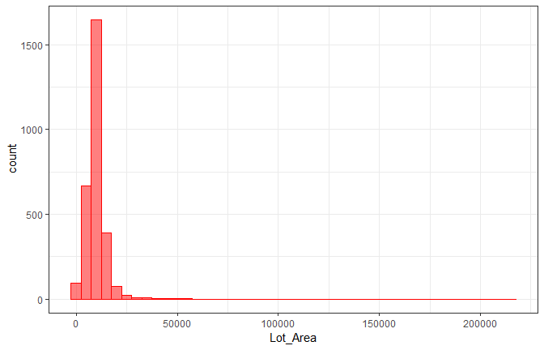

It might benefit the model if we estimate a transformation of the data
using the Box-Cox procedure. Also, note that the frequencies of the
neighborhoods can vary:

``` r
ggplot(ames, aes(x = Neighborhood))+
  geom_bar()+
  coord_flip()+
  xlab("")
```

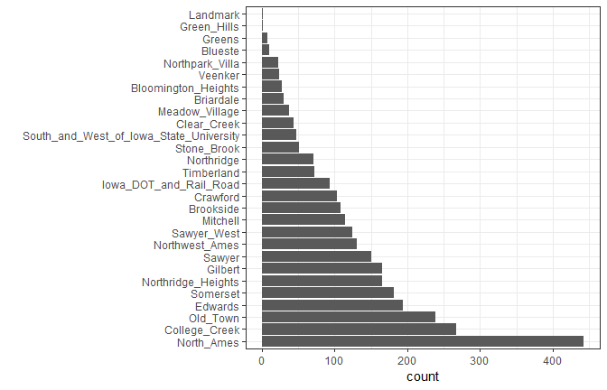

When these are resampled, some neighborhood will not be included in the
test set and this will result in a column of dummy variables with zero
entires. The same is true for the `House_Style` variable. We might want
to collapse rarely occuring values into other categories.

To define the design matrix, an initial recipe is created:

``` r
library(recipes)

rec <- recipe(Sale_Price ~ Neighborhood + House_Style + Year_Sold + Lot_Area,
              data = ames) %>% 
  # log the outcome
  step_log(Sale_Price, base = 10) %>% 
  # Collapse rarely occuring jobs into "other"
  step_other(Neighborhood, House_Style, threshold = 0.05) %>% 
  # dummy variables on the qualitative predictors
  step_dummy(all_nominal()) %>% 
  # Unskew a predictor
  step_BoxCox(Lot_Area) %>% 
  # Normalize 
  step_center(all_predictors()) %>% 
  step_scale(all_predictors())

rec
## Data Recipe
## 
## Inputs:
## 
##       role #variables
##    outcome          1
##  predictor          4
## 
## Operations:
## 
## Log transformation on Sale_Price
## Collapsing factor levels for Neighborhood, House_Style
## Dummy variables from all_nominal()
## Box-Cox transformation on Lot_Area
## Centering for all_predictors()
## Scaling for all_predictors()
```

This recreates the work that the fomula method traditionally uses with
the additional steps. While the original data object `ames` is used in
the call, it is only used to define the variables and their
characteristics so a single recipe is valid across all resampled
versions of the data. The recipe can be estimated on the analysis
component of the resample.

If we execute the recipe on the entire data set:

``` r

rec_training_set <- prep(rec, training=ames)
rec_training_set
## Data Recipe
## 
## Inputs:
## 
##       role #variables
##    outcome          1
##  predictor          4
## 
## Training data contained 2930 data points and no missing data.
## 
## Operations:
## 
## Log transformation on Sale_Price [trained]
## Collapsing factor levels for Neighborhood, House_Style [trained]
## Dummy variables from Neighborhood, House_Style [trained]
## Box-Cox transformation on Lot_Area [trained]
## Centering for Year_Sold, ... [trained]
## Scaling for Year_Sold, ... [trained]
```

To get the values of the data, the `bake` function can be used:

``` r
# By default, the selector `everything` is used to
# return all the variables. Other selectors can be used too.
rec_training_set %>% 
  bake(new_data = ames[1:20,])
## # A tibble: 20 x 14
##    Lot_Area Year_Sold Sale_Price Neighborhood_Co~ Neighborhood_Ol~
##       <dbl>     <dbl>      <dbl>            <dbl>            <dbl>
##  1    2.70       1.68       5.33           -0.317           -0.298
##  2    0.506      1.68       5.02           -0.317           -0.298
##  3    0.930      1.68       5.24           -0.317           -0.298
##  4    0.423      1.68       5.39           -0.317           -0.298
##  5    0.865      1.68       5.28           -0.317           -0.298
##  6    0.197      1.68       5.29           -0.317           -0.298
##  7   -1.16       1.68       5.33           -0.317           -0.298
##  8   -1.12       1.68       5.28           -0.317           -0.298
##  9   -0.988      1.68       5.37           -0.317           -0.298
## 10   -0.364      1.68       5.28           -0.317           -0.298
## 11    0.202      1.68       5.25           -0.317           -0.298
## 12   -0.244      1.68       5.27           -0.317           -0.298
## 13   -0.143      1.68       5.26           -0.317           -0.298
## 14    0.237      1.68       5.23           -0.317           -0.298
## 15   -0.546      1.68       5.33           -0.317           -0.298
## 16    3.95       1.68       5.73           -0.317           -0.298
## 17    0.594      1.68       5.21           -0.317           -0.298
## 18    0.465      1.68       5.60           -0.317           -0.298
## 19    1.56       1.68       5.15           -0.317           -0.298
## 20    0.764      1.68       5.32           -0.317           -0.298
## # ... with 9 more variables: Neighborhood_Edwards <dbl>,
## #   Neighborhood_Somerset <dbl>, Neighborhood_Northridge_Heights <dbl>,
## #   Neighborhood_Gilbert <dbl>, Neighborhood_Sawyer <dbl>,
## #   Neighborhood_other <dbl>, House_Style_One_Story <dbl>,
## #   House_Style_Two_Story <dbl>, House_Style_other <dbl>
```

Note that there are fewer dummy variables for `Neighborhood` and
`House_Style` than in the data. Also, the above code using `prep`
benefits from the default argument of `retain=TRUE`, which keeps the
processed version of the data set so that we don’t have to reapply the
steps to extract the processed values. For the data used to train the
recipe, we would have used:

``` r
rec_training_set %>% 
  juice() %>% 
  head()
## # A tibble: 6 x 14
##   Year_Sold Lot_Area Sale_Price Neighborhood_Co~ Neighborhood_Ol~
##       <dbl>    <dbl>      <dbl>            <dbl>            <dbl>
## 1      1.68    2.70        5.33           -0.317           -0.298
## 2      1.68    0.506       5.02           -0.317           -0.298
## 3      1.68    0.930       5.24           -0.317           -0.298
## 4      1.68    0.423       5.39           -0.317           -0.298
## 5      1.68    0.865       5.28           -0.317           -0.298
## 6      1.68    0.197       5.29           -0.317           -0.298
## # ... with 9 more variables: Neighborhood_Edwards <dbl>,
## #   Neighborhood_Somerset <dbl>, Neighborhood_Northridge_Heights <dbl>,
## #   Neighborhood_Gilbert <dbl>, Neighborhood_Sawyer <dbl>,
## #   Neighborhood_other <dbl>, House_Style_One_Story <dbl>,
## #   House_Style_Two_Story <dbl>, House_Style_other <dbl>
```

The next section will explore recipes and bootstrap resampling for
modeling:

``` r

library(rsample)
set.seed(7712)
bt_samples <- bootstraps(ames)
bt_samples
## # Bootstrap sampling 
## # A tibble: 25 x 2
##    splits              id         
##    <list>              <chr>      
##  1 <split [2.9K/1.1K]> Bootstrap01
##  2 <split [2.9K/1.1K]> Bootstrap02
##  3 <split [2.9K/1.1K]> Bootstrap03
##  4 <split [2.9K/1K]>   Bootstrap04
##  5 <split [2.9K/1.1K]> Bootstrap05
##  6 <split [2.9K/1.1K]> Bootstrap06
##  7 <split [2.9K/1.1K]> Bootstrap07
##  8 <split [2.9K/1K]>   Bootstrap08
##  9 <split [2.9K/1.1K]> Bootstrap09
## 10 <split [2.9K/1.1K]> Bootstrap10
## # ... with 15 more rows
bt_samples$splits[[1]]
## <2930/1076/2930>
```

### Working with Rsamples

We can add a recipe column to the tibble. `recipes` has a connivence
function called `prepper` that can be used to call `prep` but has the
split object as the first argument (for easier purring):

``` r
library(purrr)

bt_samples$recipes <- map(bt_samples$splits, prepper, recipe=rec)
bt_samples
## # Bootstrap sampling 
## # A tibble: 25 x 3
##    splits              id          recipes     
##    <list>              <chr>       <list>      
##  1 <split [2.9K/1.1K]> Bootstrap01 <S3: recipe>
##  2 <split [2.9K/1.1K]> Bootstrap02 <S3: recipe>
##  3 <split [2.9K/1.1K]> Bootstrap03 <S3: recipe>
##  4 <split [2.9K/1K]>   Bootstrap04 <S3: recipe>
##  5 <split [2.9K/1.1K]> Bootstrap05 <S3: recipe>
##  6 <split [2.9K/1.1K]> Bootstrap06 <S3: recipe>
##  7 <split [2.9K/1.1K]> Bootstrap07 <S3: recipe>
##  8 <split [2.9K/1K]>   Bootstrap08 <S3: recipe>
##  9 <split [2.9K/1.1K]> Bootstrap09 <S3: recipe>
## 10 <split [2.9K/1.1K]> Bootstrap10 <S3: recipe>
## # ... with 15 more rows
bt_samples$recipes[[1]]
## Data Recipe
## 
## Inputs:
## 
##       role #variables
##    outcome          1
##  predictor          4
## 
## Training data contained 2930 data points and no missing data.
## 
## Operations:
## 
## Log transformation on Sale_Price [trained]
## Collapsing factor levels for Neighborhood, House_Style [trained]
## Dummy variables from Neighborhood, House_Style [trained]
## Box-Cox transformation on Lot_Area [trained]
## Centering for Year_Sold, ... [trained]
## Scaling for Year_Sold, ... [trained]
```

Now to fit the model, the fit function only needs the recipe as input.
This is because the above code implicitly used the `retain=TRUE` option
in `prep`. Otherwise, the split objects would also be needed to `bake`
the recipe (as it will in the prediction function below).

``` r
fit_lm <- function(rec_obj, ...){
  lm(..., data = juice(rec_obj, everything()))
}

bt_samples$lm_mod <- 
  map(bt_samples$recipes,
      fit_lm,
      Sale_Price ~.
      )


bt_samples
## # Bootstrap sampling 
## # A tibble: 25 x 4
##    splits              id          recipes      lm_mod  
##    <list>              <chr>       <list>       <list>  
##  1 <split [2.9K/1.1K]> Bootstrap01 <S3: recipe> <S3: lm>
##  2 <split [2.9K/1.1K]> Bootstrap02 <S3: recipe> <S3: lm>
##  3 <split [2.9K/1.1K]> Bootstrap03 <S3: recipe> <S3: lm>
##  4 <split [2.9K/1K]>   Bootstrap04 <S3: recipe> <S3: lm>
##  5 <split [2.9K/1.1K]> Bootstrap05 <S3: recipe> <S3: lm>
##  6 <split [2.9K/1.1K]> Bootstrap06 <S3: recipe> <S3: lm>
##  7 <split [2.9K/1.1K]> Bootstrap07 <S3: recipe> <S3: lm>
##  8 <split [2.9K/1K]>   Bootstrap08 <S3: recipe> <S3: lm>
##  9 <split [2.9K/1.1K]> Bootstrap09 <S3: recipe> <S3: lm>
## 10 <split [2.9K/1.1K]> Bootstrap10 <S3: recipe> <S3: lm>
## # ... with 15 more rows
bt_samples$lm_mod[[1]] %>% broom::tidy()
## # A tibble: 15 x 5
##    term                            estimate std.error statistic   p.value
##    <chr>                              <dbl>     <dbl>     <dbl>     <dbl>
##  1 (Intercept)                      5.22      0.00230   2275.   0.       
##  2 Year_Sold                       -0.00242   0.00230     -1.05 2.92e-  1
##  3 Lot_Area                         0.0723    0.00239     30.3  2.81e-175
##  4 Neighborhood_College_Creek       0.0374    0.00281     13.3  2.91e- 39
##  5 Neighborhood_Old_Town           -0.0176    0.00285     -6.18 7.52e- 10
##  6 Neighborhood_Edwards            -0.00900   0.00270     -3.34 8.54e-  4
##  7 Neighborhood_Somerset            0.0504    0.00271     18.6  2.90e- 73
##  8 Neighborhood_Northridge_Heights  0.0734    0.00266     27.6  6.55e-149
##  9 Neighborhood_Gilbert             0.0164    0.00276      5.96 2.90e-  9
## 10 Neighborhood_Sawyer             -0.00647   0.00260     -2.48 1.30e-  2
## 11 Neighborhood_Northwest_Ames      0.0156    0.00261      5.96 2.88e-  9
## 12 Neighborhood_other               0.0416    0.00349     11.9  5.70e- 32
## 13 House_Style_One_Story            0.0162    0.00396      4.10 4.18e-  5
## 14 House_Style_Two_Story            0.0427    0.00385     11.1  4.93e- 28
## 15 House_Style_other                0.00950   0.00296      3.21 1.33e-  3
```

To get predictions, the function needs three arguments: the splits (to
get the assessment data), the recipe (to process them), and the model.
To iterate over these, the function `purrr: pmap` is used:

``` r

pred_lm <- function(split_obj, rec_obj, model_obj, ...){
  mod_data <- bake(
    rec_obj,
    new_data = assessment(split_obj),
    all_predictors(),
    all_outcomes()
  )
  
  out <- mod_data %>% select(Sale_Price)
  out$predicted <- predict(model_obj, newdata = mod_data %>% select(-Sale_Price))
  out
}

bt_samples$pred <- 
  pmap(
    list( #lst
      split_obj = bt_samples$splits,
      rec_obj = bt_samples$recipes,
      model_obj = bt_samples$lm_mod
    ),
    pred_lm
  )
bt_samples
## # Bootstrap sampling 
## # A tibble: 25 x 5
##    splits              id          recipes      lm_mod  pred              
##    <list>              <chr>       <list>       <list>  <list>            
##  1 <split [2.9K/1.1K]> Bootstrap01 <S3: recipe> <S3: l~ <tibble [1,076 x ~
##  2 <split [2.9K/1.1K]> Bootstrap02 <S3: recipe> <S3: l~ <tibble [1,105 x ~
##  3 <split [2.9K/1.1K]> Bootstrap03 <S3: recipe> <S3: l~ <tibble [1,102 x ~
##  4 <split [2.9K/1K]>   Bootstrap04 <S3: recipe> <S3: l~ <tibble [1,015 x ~
##  5 <split [2.9K/1.1K]> Bootstrap05 <S3: recipe> <S3: l~ <tibble [1,070 x ~
##  6 <split [2.9K/1.1K]> Bootstrap06 <S3: recipe> <S3: l~ <tibble [1,058 x ~
##  7 <split [2.9K/1.1K]> Bootstrap07 <S3: recipe> <S3: l~ <tibble [1,081 x ~
##  8 <split [2.9K/1K]>   Bootstrap08 <S3: recipe> <S3: l~ <tibble [1,048 x ~
##  9 <split [2.9K/1.1K]> Bootstrap09 <S3: recipe> <S3: l~ <tibble [1,090 x ~
## 10 <split [2.9K/1.1K]> Bootstrap10 <S3: recipe> <S3: l~ <tibble [1,072 x ~
## # ... with 15 more rows
```

``` r
bt_samples$pred[[1]] %>% 
  ggplot(aes(Sale_Price, predicted))+
  geom_point()+
  geom_abline(col="blue")
```

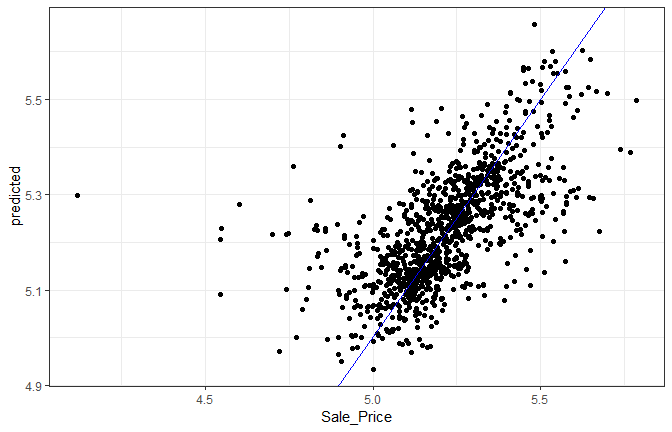

Calculating the RMSE:

``` r
library(yardstick)

results <- map_dfr(bt_samples$pred, rmse, Sale_Price, predicted)
results 
## # A tibble: 25 x 3
##    .metric .estimator .estimate
##    <chr>   <chr>          <dbl>
##  1 rmse    standard       0.135
##  2 rmse    standard       0.137
##  3 rmse    standard       0.133
##  4 rmse    standard       0.127
##  5 rmse    standard       0.130
##  6 rmse    standard       0.126
##  7 rmse    standard       0.126
##  8 rmse    standard       0.136
##  9 rmse    standard       0.131
## 10 rmse    standard       0.140
## # ... with 15 more rows
mean(results$.estimate)
## [1] 0.1297649
```

## [Grid search tuning of Keras Models](https://github.com/tidymodels/rsample/blob/master/vignettes/Applications/Keras.Rmd).

Here we demonstrate a single grid search to optimize a tuning parameter
of a [`keras`](https://keras.rstudio.com/index.html) neural network.

The AmesHousing data is used to demonstrate, and there are a number of
predictors for these data, but for simplicity, we will see how far we
can get by just using the geocodes for the properties as predictors of
price. The outcome will be modeled on the `log10` scale.

``` r
library(AmesHousing)
library(dplyr)
ames <- make_ames() %>% 
  select(Sale_Price, Longitude, Latitude)
```

To be consistent with other analysis of thes data, a training/test split
is made. However, this article focuses on the training set.

Normally, feature preprocessing should be estimated **within the
resampling process** to get generalizable estimates of performance.
Here, the two predictors are simply centered and scaled beforehand to
avoid complexity in this analysis. However, this is generally a bad idea
and the article on
[`recipe`](ttps://topepo.github.io/rsample/articles/Applications/Recipes_and_rsample.html)
describes a proper methodology for preprocessing the data.

``` r
library(rsample)
library(dplyr)
set.seed(4595)

data_split <- initial_split(ames,strata = "Sale_Price")

ames_train <- 
  training(data_split) %>% 
  mutate(
    Sale_Price = log10(Sale_Price),
    Longitude = scale(Longitude, center = TRUE),
    Latitude = scale(Latitude, center = TRUE)
  )
```

To resample the model, simple 10-fold cross-validation is done such that
the splits use the outcome as a stratification variable. On average,
there should be `rfloor(nrow(ames_train)*.1` properties in the
assessment set and this should be enough to obtain good estimate of the
model RMSE.

``` r
set.seed(2453)
cv_splits <- vfold_cv(ames_train, v = 10, strata = "Sale_Price")
```

A single layer feed-foward neural network with 10 hidden units will be
used to model these data. There are a great many tuning parameters for
these models including those for structural aspects (e.g., number of
hidden unites, activation type, number of layers), the optimization
(momentum dropout rate, etc.) and so on. For simplicity, this article
will optimize the number of training epochs (i.e., iterations);
basically this is testing for stopping.

A function is needed to compute the model on the analysis set, predict
the assessment set, and compute the holdout root mean squared error (in
`log10` units). The function below constructs the model sequentially and
takes the number of epochs as a parameter. The argument `split` will be
used to pass a single elment of `cv_splits$splits`. This object will
contain the two splits of the data for a single resample. The ellipses
(`...`) will be used to pass arbitrary arguments to `keras::fit`.

In this function, the seed is set. A few of the model components, such
as `initializer_glorot_uniform` and `layer_dropout`, use random numbers
and their specific seeds are set from the session’s seed. This helps
with reproducibility.

``` r
library(keras)
library(yardstick)
library(purrr)

mlp_rmse <- function(epoch, split, ...){
  # set the seed to get reproducible starting values and dropouts
  set.seed(4109)
  
  # cleaning the session after the computations have finished
  # clears memory used by the last trial in preparation for the next iteration
  on.exit(keras::backend()$clear_session())
  # define a single layer MLP with dropout and ReLUs
  model <- keras_model_sequential()
  model %>% 
    layer_dense(
      units = 10,
      activation = "relu",
      input_shape = 2,
      kernel_initializer = initializer_glorot_uniform()
    ) %>% 
    layer_dropout(rate = 0.4) %>% 
    layer_dense(units = 1, activation = "linear")
  
  model %>% compile(
    loss = "mean_squared_error",
    optimizer = optimizer_rmsprop(),
    metrics = "mean_squared_error"
  )
  
  # the data used for modeling (aka the analysis set)
  geocode <- 
    analysis(split) %>% 
    select(-Sale_Price) %>% 
    as.matrix()
  
  model %>% fit(
    x = geocode,
    y = analysis(split)[["Sale_Price"]],
    epochs = epoch,
    ...
  )
  
  # Now obtain the holdout set for prediction
  holdout <- assessment(split)
  pred_geocode <- 
    holdout %>% 
    select(-Sale_Price) %>% 
    as.matrix()
  
  # get predicted values and compute RMSE
  holdout %>% 
    mutate(predicted = predict(model, pred_geocode)[,1]) %>% 
    rmse(truth = Sale_Price, estimate = predicted) %>% 
    pull(.estimate)
}
```

Let\&s execute the function on the first fold of the data using a batch
size of 128 and disable the print/plotting of the optimization:

``` r

cv_splits$splits[[1]]

mlp_rmse(
  epoch = 100,
  cv_splits$splits[[1]],
  # options to keras::fit
  batch_size = 128,
  verbose = 0
)
```

## [Time series](https://github.com/tidymodels/rsample/blob/master/vignettes/Applications/Time_Series.Rmd)

“[Demo Week: Tidy Forecasting with
`sweep`](http://www.business-science.io/code-tools/2017/10/25/demo_week_sweep.html)”
is an excellent article that uses tidy methods with time series. This
article uses their analysis with `rsample` to get performance estimates
for future observations using [rolling forecast origin
resampling](https://robjhyndman.com/hyndsight/crossvalidation/).

The data are sales of alcholic beverages originally from [the Federal
Reserve Bank of St. Louis
website](https://fred.stlouisfed.org/series/S4248SM144NCEN).

``` r
library(tidymodels)
data("drinks")
str(drinks, give.att=FALSE)
## Classes 'tbl_df', 'tbl' and 'data.frame':    309 obs. of  2 variables:
##  $ date          : Date, format: "1992-01-01" "1992-02-01" ...
##  $ S4248SM144NCEN: num  3459 3458 4002 4564 4221 ...
```

Each row is a month of sales (in millions of US dolloars). Suppose that
predictions for one year ahead were needed and the model should use the
most recent data from the last 20 years. To setup this resampling
scheme:

``` r

roll_rs <- rolling_origin(
  drinks,
  initial = 12*20,
  assess = 12,
  cumulative = FALSE
)

nrow(roll_rs)
## [1] 58
roll_rs
## # Rolling origin forecast resampling 
## # A tibble: 58 x 2
##    splits           id     
##    <list>           <chr>  
##  1 <split [240/12]> Slice01
##  2 <split [240/12]> Slice02
##  3 <split [240/12]> Slice03
##  4 <split [240/12]> Slice04
##  5 <split [240/12]> Slice05
##  6 <split [240/12]> Slice06
##  7 <split [240/12]> Slice07
##  8 <split [240/12]> Slice08
##  9 <split [240/12]> Slice09
## 10 <split [240/12]> Slice10
## # ... with 48 more rows
```

Each `split` element contains the information about the resample:

``` r
roll_rs$splits[[1]]
## <240/12/309>
```

For plotting, let’s index each split by the first day of the assessment
set:

``` r

get_date <- function(x)
  min(assessment(x)$date)

start_date <- map(roll_rs$splits, get_date)
roll_rs$start_date <- do.call("c", start_date)
head(roll_rs$start_date)
## [1] "2012-01-01" "2012-02-01" "2012-03-01" "2012-04-01" "2012-05-01"
## [6] "2012-06-01"
```

This resampling scheme has 58 splits of the data so that there will be
58 ARIMA models that are fit. To create the models, the `auto.arima`
function from the `forecast` package is used. The function `analysis`
and `assessment` return the data frame, so another step converts the
data into a `ts` object called `mod_dat` using a function in the
`timetk` package.

``` r

library(forecast) # for `auto.arima`
library(timetk) # for `tk_ts` 
library(zoo) # for `as.yearmon`

fit_model <- function(x, ...){
  # suggested by Matt Dancho:
  x %>% 
    analysis() %>% 
    # since the first day changes over resamples, adjust it
    # based on the first date value in the data frame
    tk_ts(start = .$date[[1]] %>% as.yearmon(),
          freq = 12,
          silent = TRUE) %>% 
    auto.arima(...)
}
```

Each model is saved in a new column:

``` r

roll_rs$arima <- map(roll_rs$splits, fit_model)

# for example:
roll_rs$arima[[1]] %>% broom::tidy()
## # A tibble: 7 x 3
##   term  estimate std.error
##   <fct>    <dbl>     <dbl>
## 1 ar1    -0.994     0.106 
## 2 ar2    -0.502     0.0810
## 3 ma1     0.0243    0.111 
## 4 ma2    -0.414     0.125 
## 5 sar1    0.404     0.100 
## 6 sar2   -0.334     0.0759
## 7 sma1   -0.554     0.0834
```

(There are some warnings produced by these first regarding extra columns
in the data that can be ignored)

Using the model fits, performance will be measured in two ways:

  - *interpolation* error will measure how well the model fits to the
    data that were used to create the model. This is most likely
    optimistic since no holdout method is used.
  - *extrapolation* or *forecast* error evaluates the efficacy of the
    model on the data from the following year (that were not used in the
    model fit).

In each case, the mean absolute percent error (MAPE) is the statistic
used to characterize the model fits. The interpolation error can be
computed from the `Arima` object. to make things easy, the `sweep`
package’s `sw_glance` function is used:

``` r
library(sweep)

roll_rs$interpolation <- map_dbl(
  roll_rs$arima,
  function(x)
    sw_glance(x)[["MAPE"]]
)
summary(roll_rs$interpolation)
##    Min. 1st Qu.  Median    Mean 3rd Qu.    Max. 
##    2.84    2.89    2.92    2.93    2.95    3.13
```

For the extrapolation error, the model and split objects are required.
Using these:

``` r

get_extrap <- function(split, mod){
  n <- nrow(assessment(split))
  # get asessment data
  pred_dat <- assessment(split) %>% 
    mutate(
      pred = as.vector(forecast(mod, h = n)$mean),
      pct_error = ( S4248SM144NCEN - pred ) / S4248SM144NCEN * 100
    )
  mean(abs(pred_dat$pct_error))
}

roll_rs$extrapolation <- 
  map2_dbl(roll_rs$splits, roll_rs$arima, get_extrap)

summary(roll_rs$extrapolation)
##    Min. 1st Qu.  Median    Mean 3rd Qu.    Max. 
##    2.37    3.19    3.56    3.65    4.16    5.45
```

What do these error estimates look like over time?

``` r
roll_rs %>%
  select(interpolation, extrapolation, start_date) %>%
  as.data.frame %>%
  gather(error, MAPE, -start_date) %>%
  ggplot(aes(x = start_date, y = MAPE, col = error)) + 
  geom_point() + 
  geom_line() + 
  theme_bw() + 
  theme(legend.position = "top")
```

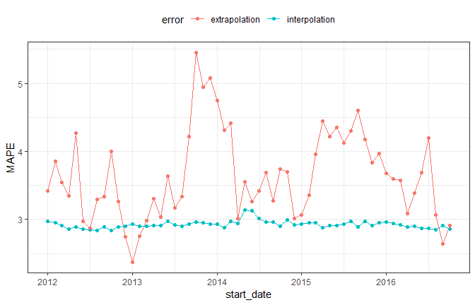

It is likely that interpolration error is an underestimate to some
degree.

It is also worth noting that `rolling_origin()` can be used over
calendar periods, rather than just over a fixed window size. This is
especially useful for irregular series where a fixed window size might
not make sense because of missing data points, or because of calender
features like different months having a different number of days.

The example below demonstrates this idea by splitting `drinks` into a
nested set of 26 years, and rolling over years rather than months. Note
that the end result accomplishes a different task than the original
example, in this case, each slice moves forward an entire year, rather
than just one month.

``` r

# The idea is to nest by the period to roll over,
# which in this case is the year.

roll_rs_annual <- drinks %>%
  mutate(year = as.POSIXlt(date)$year + 1900) %>%
  nest(-year) %>%
  rolling_origin(
    initial = 20, 
    assess = 1, 
    cumulative = FALSE
  )

analysis(roll_rs_annual$splits[[1]])
## # A tibble: 20 x 2
##     year data             
##    <dbl> <list>           
##  1  1992 <tibble [12 x 2]>
##  2  1993 <tibble [12 x 2]>
##  3  1994 <tibble [12 x 2]>
##  4  1995 <tibble [12 x 2]>
##  5  1996 <tibble [12 x 2]>
##  6  1997 <tibble [12 x 2]>
##  7  1998 <tibble [12 x 2]>
##  8  1999 <tibble [12 x 2]>
##  9  2000 <tibble [12 x 2]>
## 10  2001 <tibble [12 x 2]>
## 11  2002 <tibble [12 x 2]>
## 12  2003 <tibble [12 x 2]>
## 13  2004 <tibble [12 x 2]>
## 14  2005 <tibble [12 x 2]>
## 15  2006 <tibble [12 x 2]>
## 16  2007 <tibble [12 x 2]>
## 17  2008 <tibble [12 x 2]>
## 18  2009 <tibble [12 x 2]>
## 19  2010 <tibble [12 x 2]>
## 20  2011 <tibble [12 x 2]>
```

The workflow to access these calender slices is to use `bind_rows()` to
join each analysis set together.

``` r
mutate(
  roll_rs_annual,
  extracted_slice = map(splits, ~ bind_rows(analysis(.x)$data))
)
```

## Survival analysis

``` r

options(digits = 3)
library(survival)
library(purrr)
library(rsample)
library(dplyr)
library(tidyposterior)
library(ggplot2)
library(tidyr)
```

In this article, a parameteric analysis of censored daa is conducted and
`rsample` is used to measure the importance of predictors in the model.
The data will be used is the NCCTG lung cancer data contained in the
`survival` package:

``` r

library(survival)
str(lung)
## 'data.frame':    228 obs. of  10 variables:
##  $ inst     : num  3 3 3 5 1 12 7 11 1 7 ...
##  $ time     : num  306 455 1010 210 883 ...
##  $ status   : num  2 2 1 2 2 1 2 2 2 2 ...
##  $ age      : num  74 68 56 57 60 74 68 71 53 61 ...
##  $ sex      : num  1 1 1 1 1 1 2 2 1 1 ...
##  $ ph.ecog  : num  1 0 0 1 0 1 2 2 1 2 ...
##  $ ph.karno : num  90 90 90 90 100 50 70 60 70 70 ...
##  $ pat.karno: num  100 90 90 60 90 80 60 80 80 70 ...
##  $ meal.cal : num  1175 1225 NA 1150 NA ...
##  $ wt.loss  : num  NA 15 15 11 0 0 10 1 16 34 ...
skimr::skim(lung)
## Skim summary statistics
##  n obs: 228 
##  n variables: 10 
## 
## -- Variable type:numeric --------------------
##   variable missing complete   n   mean     sd  p0    p25   p50     p75
##        age       0      228 228  62.45   9.07  39  56     63     69   
##       inst       1      227 228  11.09   8.3    1   3     11     16   
##   meal.cal      47      181 228 928.78 402.17  96 635    975   1150   
##  pat.karno       3      225 228  79.96  14.62  30  70     80     90   
##    ph.ecog       1      227 228   0.95   0.72   0   0      1      1   
##   ph.karno       1      227 228  81.94  12.33  50  75     80     90   
##        sex       0      228 228   1.39   0.49   1   1      1      2   
##     status       0      228 228   1.72   0.45   1   1      2      2   
##       time       0      228 228 305.23 210.65   5 166.75 255.5  396.5 
##    wt.loss      14      214 228   9.83  13.14 -24   0      7     15.75
##  p100     hist
##    82 <U+2582><U+2582><U+2585><U+2587><U+2586><U+2587><U+2585><U+2581>
##    33 <U+2587><U+2582><U+2587><U+2582><U+2582><U+2582><U+2581><U+2581>
##  2600 <U+2582><U+2585><U+2587><U+2586><U+2581><U+2581><U+2581><U+2581>
##   100 <U+2581><U+2581><U+2581><U+2583><U+2586><U+2587><U+2587><U+2585>
##     3 <U+2585><U+2581><U+2587><U+2581><U+2581><U+2583><U+2581><U+2581>
##   100 <U+2581><U+2582><U+2581><U+2583><U+2587><U+2581><U+2587><U+2583>
##     2 <U+2587><U+2581><U+2581><U+2581><U+2581><U+2581><U+2581><U+2585>
##     2 <U+2583><U+2581><U+2581><U+2581><U+2581><U+2581><U+2581><U+2587>
##  1022 <U+2585><U+2587><U+2586><U+2582><U+2582><U+2582><U+2581><U+2581>
##    68 <U+2581><U+2582><U+2587><U+2583><U+2582><U+2581><U+2581><U+2581>
```

`status` is an indicator for which patients are censored (`status=1`) or
an actual event (`status=2`). The help file `?survreg` has the following
model
fit:

``` r
lung_mod <- survreg(Surv(time,status)~ ph.ecog + age + strata(sex), data = lung)

# 
summary(lung_mod)
## 
## Call:
## survreg(formula = Surv(time, status) ~ ph.ecog + age + strata(sex), 
##     data = lung)
##                Value Std. Error     z       p
## (Intercept)  6.73235    0.42396 15.88 < 2e-16
## ph.ecog     -0.32443    0.08649 -3.75 0.00018
## age         -0.00581    0.00693 -0.84 0.40193
## sex=1       -0.24408    0.07920 -3.08 0.00206
## sex=2       -0.42345    0.10669 -3.97 7.2e-05
## 
## Scale:
## sex=1 sex=2 
## 0.783 0.655 
## 
## Weibull distribution
## Loglik(model)= -1137   Loglik(intercept only)= -1146
##  Chisq= 17.8 on 2 degrees of freedom, p= 0.00014 
## Number of Newton-Raphson Iterations: 5 
## n=227 (1 observation deleted due to missingness)

# coefficient plot
lung_mod %>% 
  broom::tidy() %>% 
  ggplot(aes(x=term, y=estimate))+geom_point()
```

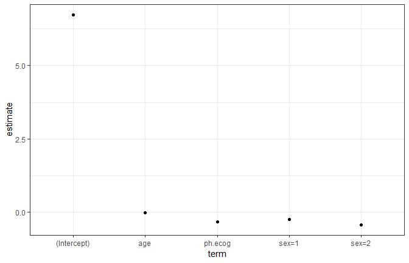

Note that the stratification on gender only affects the scale parameter:
the estimates above are from a log-linear model for the scale parameter
even though they are listed with the regression variables for the other
parameter. `coef` gives results that are more clear:

``` r
coef(lung_mod) %>% broom::tidy()
## # A tibble: 3 x 2
##   names              x
##   <chr>          <dbl>
## 1 (Intercept)  6.73   
## 2 ph.ecog     -0.324  
## 3 age         -0.00581
# coefplot::coefplot(lung_mod)
```

To resample these data, it would a good idea to try to maintain the same
censoring rate across the splits. To do this, stratified resampling can
be used where each analysis/assessment split is conducted within each
value of the status indicator. To demonstrate, Monte CArol resampling is
used where 75% of the data are in the analysis set. A total of 100
splits are created.

``` r

library(rsample)
set.seed(9666)
mc_samp <- mc_cv(lung, strata="status", times=100)

library(purrr)
cens_rate <- function(x) mean(analysis(x)$status==1)

map_dbl(mc_samp$splits, cens_rate) %>% 
  summary()
##    Min. 1st Qu.  Median    Mean 3rd Qu.    Max. 
##   0.279   0.279   0.279   0.279   0.279   0.279
```

To demonstrate the use of resampling with censored data, the parametric
model shown above will be fit with different variable
sets:

``` r
three_fact <- as.formula(Surv(time, status) ~ ph.ecog + age + strata(sex))
rm_ph.ecog <- as.formula(Surv(time, status) ~           age + strata(sex))
rm_age     <- as.formula(Surv(time, status) ~ ph.ecog +       strata(sex))
rm_sex     <- as.formula(Surv(time, status) ~ ph.ecog + age              )
```

The model fitting function will take the formula as an argument:

``` r
mod_fit <- function(x, form, ...){
  survreg(form, data = analysis(x), ...)
}
```

To calculate the efficacy of the model, the concordance statistic is
used (see `?survconcordance`):

``` r
get_concord <- function(split, mod, ...){
  pred_dat <- assessment(split)
  pred_dat$pred <- predict(mod, newdata = pred_dat)
  survConcordance(Surv(time, status) ~ pred, pred_dat, ...)$concordance
}
```

With these functions, a series of models are created for each variable
set.

``` r
mc_samp$mod_full <- purrr::map(mc_samp$splits, mod_fit, form = three_fact)
mc_samp$mod_ph.ecog <- purrr::map(mc_samp$splits, mod_fit, form = rm_ph.ecog)
mc_samp$mod_age <- purrr::map(mc_samp$splits, mod_fit, form = rm_age)
mc_samp$mod_sex <- purrr::map(mc_samp$splits, mod_fit, form = rm_sex)
```

Simiarly, the concordance values are computed for each model:

``` r
mc_samp$full <- map2_dbl(mc_samp$splits, mc_samp$mod_full, get_concord)
mc_samp$ph.ecog <- map2_dbl(mc_samp$splits, mc_samp$mod_ph.ecog, get_concord)
mc_samp$age <- map2_dbl(mc_samp$splits, mc_samp$mod_age, get_concord)
mc_samp$sex <- map2_dbl(mc_samp$splits, mc_samp$mod_sex, get_concord)

# lets extract a sample model results
mc_samp$mod_full[[1]] %>% broom::tidy()
## # A tibble: 5 x 7
##   term        estimate std.error statistic  p.value conf.low conf.high
##   <chr>          <dbl>     <dbl>     <dbl>    <dbl>    <dbl>     <dbl>
## 1 (Intercept)  6.55      0.498      13.2   1.65e-39   5.57      7.52  
## 2 ph.ecog     -0.331     0.0948     -3.49  4.78e- 4  -0.517    -0.145 
## 3 age         -0.00305   0.00808    -0.378 7.06e- 1  -0.0189    0.0128
## 4 sex=1       -0.276     0.0910     -3.04  2.39e- 3  NA        NA     
## 5 sex=2       -0.443     0.130      -3.42  6.32e- 4  NA        NA
```

The distirubitions of the resampling estimates

``` r
library(dplyr)
# select variables
concord_est <- mc_samp %>% 
  select(-matches("^mod"))

concord_est %>% colnames()
## [1] "splits"  "id"      "full"    "ph.ecog" "age"     "sex"
concord_est %>% head()
## # A tibble: 6 x 6
##   splits           id           full ph.ecog   age   sex
## * <list>           <chr>       <dbl>   <dbl> <dbl> <dbl>
## 1 <split [172/56]> Resample001 0.388   0.424 0.405 0.388
## 2 <split [172/56]> Resample002 0.429   0.529 0.400 0.425
## 3 <split [172/56]> Resample003 0.389   0.441 0.400 0.389
## 4 <split [172/56]> Resample004 0.424   0.554 0.392 0.427
## 5 <split [172/56]> Resample005 0.396   0.355 0.381 0.396
## 6 <split [172/56]> Resample006 0.368   0.404 0.389 0.368

concord_est %>%
  select(-splits) %>%
  gather()
##              id   model statistic
## 1   Resample001    full     0.388
## 2   Resample002    full     0.429
## 3   Resample003    full     0.389
## 4   Resample004    full     0.424
## 5   Resample005    full     0.396
## 6   Resample006    full     0.368
## 7   Resample007    full     0.381
## 8   Resample008    full     0.353
## 9   Resample009    full     0.361
## 10  Resample010    full     0.491
## 11  Resample011    full     0.339
## 12  Resample012    full     0.331
## 13  Resample013    full     0.367
## 14  Resample014    full     0.354
## 15  Resample015    full     0.466
## 16  Resample016    full     0.303
## 17  Resample017    full     0.462
## 18  Resample018    full     0.441
## 19  Resample019    full     0.468
## 20  Resample020    full     0.370
## 21  Resample021    full     0.364
## 22  Resample022    full     0.449
## 23  Resample023    full     0.457
## 24  Resample024    full     0.477
## 25  Resample025    full     0.384
## 26  Resample026    full     0.406
## 27  Resample027    full     0.299
## 28  Resample028    full     0.367
## 29  Resample029    full     0.294
## 30  Resample030    full     0.398
## 31  Resample031    full     0.347
## 32  Resample032    full     0.334
## 33  Resample033    full     0.399
## 34  Resample034    full     0.403
## 35  Resample035    full     0.405
## 36  Resample036    full     0.361
## 37  Resample037    full     0.339
## 38  Resample038    full     0.433
## 39  Resample039    full     0.408
## 40  Resample040    full     0.383
## 41  Resample041    full     0.363
## 42  Resample042    full     0.424
## 43  Resample043    full     0.349
## 44  Resample044    full     0.486
## 45  Resample045    full     0.314
## 46  Resample046    full     0.406
## 47  Resample047    full     0.374
## 48  Resample048    full     0.423
## 49  Resample049    full     0.448
## 50  Resample050    full     0.446
## 51  Resample051    full     0.369
## 52  Resample052    full     0.436
## 53  Resample053    full     0.423
## 54  Resample054    full     0.458
## 55  Resample055    full     0.408
## 56  Resample056    full     0.467
## 57  Resample057    full     0.433
## 58  Resample058    full     0.319
## 59  Resample059    full     0.345
## 60  Resample060    full     0.366
## 61  Resample061    full     0.419
## 62  Resample062    full     0.444
## 63  Resample063    full     0.413
## 64  Resample064    full     0.376
## 65  Resample065    full     0.502
## 66  Resample066    full     0.385
## 67  Resample067    full     0.476
## 68  Resample068    full     0.428
## 69  Resample069    full     0.499
## 70  Resample070    full     0.410
## 71  Resample071    full     0.394
## 72  Resample072    full     0.479
## 73  Resample073    full     0.341
## 74  Resample074    full     0.314
## 75  Resample075    full     0.335
## 76  Resample076    full     0.397
## 77  Resample077    full     0.443
## 78  Resample078    full     0.445
## 79  Resample079    full     0.354
## 80  Resample080    full     0.448
## 81  Resample081    full     0.321
## 82  Resample082    full     0.463
## 83  Resample083    full     0.345
## 84  Resample084    full     0.437
## 85  Resample085    full     0.433
## 86  Resample086    full     0.391
## 87  Resample087    full     0.370
## 88  Resample088    full     0.398
## 89  Resample089    full     0.418
## 90  Resample090    full     0.390
## 91  Resample091    full     0.430
## 92  Resample092    full     0.345
## 93  Resample093    full     0.371
## 94  Resample094    full     0.484
## 95  Resample095    full     0.491
## 96  Resample096    full     0.438
## 97  Resample097    full     0.392
## 98  Resample098    full     0.382
## 99  Resample099    full     0.441
## 100 Resample100    full     0.378
## 101 Resample001 ph.ecog     0.424
## 102 Resample002 ph.ecog     0.529
## 103 Resample003 ph.ecog     0.441
## 104 Resample004 ph.ecog     0.554
## 105 Resample005 ph.ecog     0.355
## 106 Resample006 ph.ecog     0.404
## 107 Resample007 ph.ecog     0.407
## 108 Resample008 ph.ecog     0.393
## 109 Resample009 ph.ecog     0.411
## 110 Resample010 ph.ecog     0.433
## 111 Resample011 ph.ecog     0.410
## 112 Resample012 ph.ecog     0.464
## 113 Resample013 ph.ecog     0.454
## 114 Resample014 ph.ecog     0.493
## 115 Resample015 ph.ecog     0.361
## 116 Resample016 ph.ecog     0.432
## 117 Resample017 ph.ecog     0.409
## 118 Resample018 ph.ecog     0.387
## 119 Resample019 ph.ecog     0.466
## 120 Resample020 ph.ecog     0.403
## 121 Resample021 ph.ecog     0.362
## 122 Resample022 ph.ecog     0.445
## 123 Resample023 ph.ecog     0.451
## 124 Resample024 ph.ecog     0.446
## 125 Resample025 ph.ecog     0.463
## 126 Resample026 ph.ecog     0.466
## 127 Resample027 ph.ecog     0.384
## 128 Resample028 ph.ecog     0.394
## 129 Resample029 ph.ecog     0.345
## 130 Resample030 ph.ecog     0.510
## 131 Resample031 ph.ecog     0.447
## 132 Resample032 ph.ecog     0.391
## 133 Resample033 ph.ecog     0.444
## 134 Resample034 ph.ecog     0.488
## 135 Resample035 ph.ecog     0.403
## 136 Resample036 ph.ecog     0.453
## 137 Resample037 ph.ecog     0.430
## 138 Resample038 ph.ecog     0.432
## 139 Resample039 ph.ecog     0.429
## 140 Resample040 ph.ecog     0.457
## 141 Resample041 ph.ecog     0.438
## 142 Resample042 ph.ecog     0.449
## 143 Resample043 ph.ecog     0.512
## 144 Resample044 ph.ecog     0.543
## 145 Resample045 ph.ecog     0.415
## 146 Resample046 ph.ecog     0.447
## 147 Resample047 ph.ecog     0.423
## 148 Resample048 ph.ecog     0.438
## 149 Resample049 ph.ecog     0.520
## 150 Resample050 ph.ecog     0.479
## 151 Resample051 ph.ecog     0.449
## 152 Resample052 ph.ecog     0.397
## 153 Resample053 ph.ecog     0.430
## 154 Resample054 ph.ecog     0.446
## 155 Resample055 ph.ecog     0.458
## 156 Resample056 ph.ecog     0.499
## 157 Resample057 ph.ecog     0.463
## 158 Resample058 ph.ecog     0.432
## 159 Resample059 ph.ecog     0.349
## 160 Resample060 ph.ecog     0.389
## 161 Resample061 ph.ecog     0.421
## 162 Resample062 ph.ecog     0.401
## 163 Resample063 ph.ecog     0.450
## 164 Resample064 ph.ecog     0.420
## 165 Resample065 ph.ecog     0.687
## 166 Resample066 ph.ecog     0.430
## 167 Resample067 ph.ecog     0.442
## 168 Resample068 ph.ecog     0.508
## 169 Resample069 ph.ecog     0.532
## 170 Resample070 ph.ecog     0.525
## 171 Resample071 ph.ecog     0.453
## 172 Resample072 ph.ecog     0.384
## 173 Resample073 ph.ecog     0.394
## 174 Resample074 ph.ecog     0.386
## 175 Resample075 ph.ecog     0.443
## 176 Resample076 ph.ecog     0.397
## 177 Resample077 ph.ecog     0.432
## 178 Resample078 ph.ecog     0.423
## 179 Resample079 ph.ecog     0.458
## 180 Resample080 ph.ecog     0.463
## 181 Resample081 ph.ecog     0.384
## 182 Resample082 ph.ecog     0.483
## 183 Resample083 ph.ecog     0.418
## 184 Resample084 ph.ecog     0.455
## 185 Resample085 ph.ecog     0.411
## 186 Resample086 ph.ecog     0.470
## 187 Resample087 ph.ecog     0.419
## 188 Resample088 ph.ecog     0.466
## 189 Resample089 ph.ecog     0.454
## 190 Resample090 ph.ecog     0.436
## 191 Resample091 ph.ecog     0.439
## 192 Resample092 ph.ecog     0.453
## 193 Resample093 ph.ecog     0.408
## 194 Resample094 ph.ecog     0.462
## 195 Resample095 ph.ecog     0.341
## 196 Resample096 ph.ecog     0.485
## 197 Resample097 ph.ecog     0.454
## 198 Resample098 ph.ecog     0.438
## 199 Resample099 ph.ecog     0.459
## 200 Resample100 ph.ecog     0.443
## 201 Resample001     age     0.405
## 202 Resample002     age     0.400
## 203 Resample003     age     0.400
## 204 Resample004     age     0.392
## 205 Resample005     age     0.381
## 206 Resample006     age     0.389
## 207 Resample007     age     0.405
## 208 Resample008     age     0.365
## 209 Resample009     age     0.371
## 210 Resample010     age     0.499
## 211 Resample011     age     0.344
## 212 Resample012     age     0.325
## 213 Resample013     age     0.375
## 214 Resample014     age     0.348
## 215 Resample015     age     0.431
## 216 Resample016     age     0.302
## 217 Resample017     age     0.426
## 218 Resample018     age     0.464
## 219 Resample019     age     0.462
## 220 Resample020     age     0.390
## 221 Resample021     age     0.407
## 222 Resample022     age     0.456
## 223 Resample023     age     0.460
## 224 Resample024     age     0.489
## 225 Resample025     age     0.381
## 226 Resample026     age     0.411
## 227 Resample027     age     0.308
## 228 Resample028     age     0.392
## 229 Resample029     age     0.313
## 230 Resample030     age     0.369
## 231 Resample031     age     0.351
## 232 Resample032     age     0.373
## 233 Resample033     age     0.407
## 234 Resample034     age     0.398
## 235 Resample035     age     0.427
## 236 Resample036     age     0.372
## 237 Resample037     age     0.342
## 238 Resample038     age     0.420
## 239 Resample039     age     0.420
## 240 Resample040     age     0.398
## 241 Resample041     age     0.379
## 242 Resample042     age     0.423
## 243 Resample043     age     0.346
## 244 Resample044     age     0.458
## 245 Resample045     age     0.328
## 246 Resample046     age     0.414
## 247 Resample047     age     0.376
## 248 Resample048     age     0.434
## 249 Resample049     age     0.426
## 250 Resample050     age     0.438
## 251 Resample051     age     0.373
## 252 Resample052     age     0.409
## 253 Resample053     age     0.434
## 254 Resample054     age     0.455
## 255 Resample055     age     0.432
## 256 Resample056     age     0.447
## 257 Resample057     age     0.418
## 258 Resample058     age     0.338
## 259 Resample059     age     0.372
## 260 Resample060     age     0.355
## 261 Resample061     age     0.421
## 262 Resample062     age     0.416
## 263 Resample063     age     0.423
## 264 Resample064     age     0.396
## 265 Resample065     age     0.439
## 266 Resample066     age     0.369
## 267 Resample067     age     0.475
## 268 Resample068     age     0.413
## 269 Resample069     age     0.464
## 270 Resample070     age     0.387
## 271 Resample071     age     0.409
## 272 Resample072     age     0.442
## 273 Resample073     age     0.380
## 274 Resample074     age     0.342
## 275 Resample075     age     0.342
## 276 Resample076     age     0.412
## 277 Resample077     age     0.428
## 278 Resample078     age     0.440
## 279 Resample079     age     0.351
## 280 Resample080     age     0.458
## 281 Resample081     age     0.344
## 282 Resample082     age     0.432
## 283 Resample083     age     0.352
## 284 Resample084     age     0.440
## 285 Resample085     age     0.410
## 286 Resample086     age     0.401
## 287 Resample087     age     0.385
## 288 Resample088     age     0.411
## 289 Resample089     age     0.423
## 290 Resample090     age     0.393
## 291 Resample091     age     0.456
## 292 Resample092     age     0.334
## 293 Resample093     age     0.391
## 294 Resample094     age     0.499
## 295 Resample095     age     0.439
## 296 Resample096     age     0.424
## 297 Resample097     age     0.397
## 298 Resample098     age     0.383
## 299 Resample099     age     0.452
## 300 Resample100     age     0.384
## 301 Resample001     sex     0.388
## 302 Resample002     sex     0.425
## 303 Resample003     sex     0.389
## 304 Resample004     sex     0.427
## 305 Resample005     sex     0.396
## 306 Resample006     sex     0.368
## 307 Resample007     sex     0.381
## 308 Resample008     sex     0.353
## 309 Resample009     sex     0.361
## 310 Resample010     sex     0.491
## 311 Resample011     sex     0.340
## 312 Resample012     sex     0.331
## 313 Resample013     sex     0.367
## 314 Resample014     sex     0.354
## 315 Resample015     sex     0.466
## 316 Resample016     sex     0.303
## 317 Resample017     sex     0.390
## 318 Resample018     sex     0.441
## 319 Resample019     sex     0.468
## 320 Resample020     sex     0.370
## 321 Resample021     sex     0.364
## 322 Resample022     sex     0.449
## 323 Resample023     sex     0.457
## 324 Resample024     sex     0.477
## 325 Resample025     sex     0.385
## 326 Resample026     sex     0.406
## 327 Resample027     sex     0.299
## 328 Resample028     sex     0.367
## 329 Resample029     sex     0.294
## 330 Resample030     sex     0.404
## 331 Resample031     sex     0.346
## 332 Resample032     sex     0.334
## 333 Resample033     sex     0.399
## 334 Resample034     sex     0.403
## 335 Resample035     sex     0.405
## 336 Resample036     sex     0.361
## 337 Resample037     sex     0.339
## 338 Resample038     sex     0.408
## 339 Resample039     sex     0.408
## 340 Resample040     sex     0.383
## 341 Resample041     sex     0.362
## 342 Resample042     sex     0.423
## 343 Resample043     sex     0.352
## 344 Resample044     sex     0.486
## 345 Resample045     sex     0.314
## 346 Resample046     sex     0.407
## 347 Resample047     sex     0.374
## 348 Resample048     sex     0.423
## 349 Resample049     sex     0.449
## 350 Resample050     sex     0.444
## 351 Resample051     sex     0.369
## 352 Resample052     sex     0.382
## 353 Resample053     sex     0.423
## 354 Resample054     sex     0.458
## 355 Resample055     sex     0.408
## 356 Resample056     sex     0.467
## 357 Resample057     sex     0.433
## 358 Resample058     sex     0.319
## 359 Resample059     sex     0.345
## 360 Resample060     sex     0.344
## 361 Resample061     sex     0.419
## 362 Resample062     sex     0.387
## 363 Resample063     sex     0.413
## 364 Resample064     sex     0.376
## 365 Resample065     sex     0.501
## 366 Resample066     sex     0.353
## 367 Resample067     sex     0.476
## 368 Resample068     sex     0.428
## 369 Resample069     sex     0.493
## 370 Resample070     sex     0.410
## 371 Resample071     sex     0.394
## 372 Resample072     sex     0.479
## 373 Resample073     sex     0.341
## 374 Resample074     sex     0.314
## 375 Resample075     sex     0.335
## 376 Resample076     sex     0.397
## 377 Resample077     sex     0.443
## 378 Resample078     sex     0.445
## 379 Resample079     sex     0.354
## 380 Resample080     sex     0.448
## 381 Resample081     sex     0.321
## 382 Resample082     sex     0.464
## 383 Resample083     sex     0.345
## 384 Resample084     sex     0.437
## 385 Resample085     sex     0.387
## 386 Resample086     sex     0.391
## 387 Resample087     sex     0.370
## 388 Resample088     sex     0.398
## 389 Resample089     sex     0.417
## 390 Resample090     sex     0.390
## 391 Resample091     sex     0.430
## 392 Resample092     sex     0.349
## 393 Resample093     sex     0.371
## 394 Resample094     sex     0.484
## 395 Resample095     sex     0.491
## 396 Resample096     sex     0.438
## 397 Resample097     sex     0.392
## 398 Resample098     sex     0.382
## 399 Resample099     sex     0.441
## 400 Resample100     sex     0.376

library(tidyr)
library(ggplot2)
concord_est %>% 
  select(-splits) %>% 
  gather() %>% 
  ggplot(aes(x = statistic, col = model))+
  geom_line(stat = "density")+
  theme_bw()+
  theme(legend.position = "top")
```

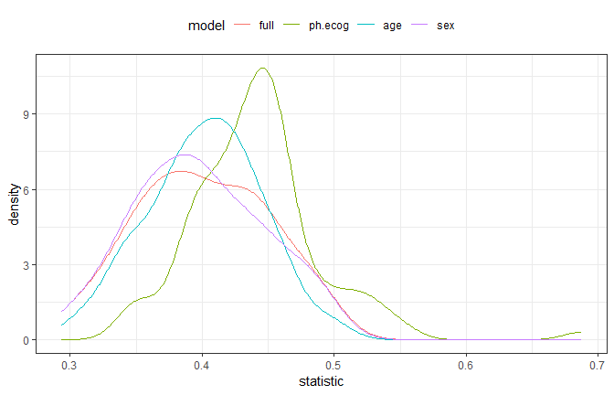

It looks as though the model missing `ph.ecog` has large concordance
values than the other models. as one might expect, the full model and
the model absent `sex` are very similar: the difference in these models
should only be the scale parameters estimates.

To more formally test this, the `tidyposterior` package to create a
Bayesian model for the concordance statsitics.

``` r
library(tidyposterior)
concord_est <- perf_mod(concord_est, seed=6507, iter=5000)
## 
## SAMPLING FOR MODEL 'continuous' NOW (CHAIN 1).
## Chain 1: 
## Chain 1: Gradient evaluation took 0.002 seconds
## Chain 1: 1000 transitions using 10 leapfrog steps per transition would take 20 seconds.
## Chain 1: Adjust your expectations accordingly!
## Chain 1: 
## Chain 1: 
## Chain 1: Iteration:    1 / 5000 [  0%]  (Warmup)
## Chain 1: Iteration:  500 / 5000 [ 10%]  (Warmup)
## Chain 1: Iteration: 1000 / 5000 [ 20%]  (Warmup)
## Chain 1: Iteration: 1500 / 5000 [ 30%]  (Warmup)
## Chain 1: Iteration: 2000 / 5000 [ 40%]  (Warmup)
## Chain 1: Iteration: 2500 / 5000 [ 50%]  (Warmup)
## Chain 1: Iteration: 2501 / 5000 [ 50%]  (Sampling)
## Chain 1: Iteration: 3000 / 5000 [ 60%]  (Sampling)
## Chain 1: Iteration: 3500 / 5000 [ 70%]  (Sampling)
## Chain 1: Iteration: 4000 / 5000 [ 80%]  (Sampling)
## Chain 1: Iteration: 4500 / 5000 [ 90%]  (Sampling)
## Chain 1: Iteration: 5000 / 5000 [100%]  (Sampling)
## Chain 1: 
## Chain 1:  Elapsed Time: 16.111 seconds (Warm-up)
## Chain 1:                12.16 seconds (Sampling)
## Chain 1:                28.271 seconds (Total)
## Chain 1: 
## 
## SAMPLING FOR MODEL 'continuous' NOW (CHAIN 2).
## Chain 2: 
## Chain 2: Gradient evaluation took 0 seconds
## Chain 2: 1000 transitions using 10 leapfrog steps per transition would take 0 seconds.
## Chain 2: Adjust your expectations accordingly!
## Chain 2: 
## Chain 2: 
## Chain 2: Iteration:    1 / 5000 [  0%]  (Warmup)
## Chain 2: Iteration:  500 / 5000 [ 10%]  (Warmup)
## Chain 2: Iteration: 1000 / 5000 [ 20%]  (Warmup)
## Chain 2: Iteration: 1500 / 5000 [ 30%]  (Warmup)
## Chain 2: Iteration: 2000 / 5000 [ 40%]  (Warmup)
## Chain 2: Iteration: 2500 / 5000 [ 50%]  (Warmup)
## Chain 2: Iteration: 2501 / 5000 [ 50%]  (Sampling)
## Chain 2: Iteration: 3000 / 5000 [ 60%]  (Sampling)
## Chain 2: Iteration: 3500 / 5000 [ 70%]  (Sampling)
## Chain 2: Iteration: 4000 / 5000 [ 80%]  (Sampling)
## Chain 2: Iteration: 4500 / 5000 [ 90%]  (Sampling)
## Chain 2: Iteration: 5000 / 5000 [100%]  (Sampling)
## Chain 2: 
## Chain 2:  Elapsed Time: 31.477 seconds (Warm-up)
## Chain 2:                5.435 seconds (Sampling)
## Chain 2:                36.912 seconds (Total)
## Chain 2: 
## 
## SAMPLING FOR MODEL 'continuous' NOW (CHAIN 3).
## Chain 3: 
## Chain 3: Gradient evaluation took 0 seconds
## Chain 3: 1000 transitions using 10 leapfrog steps per transition would take 0 seconds.
## Chain 3: Adjust your expectations accordingly!
## Chain 3: 
## Chain 3: 
## Chain 3: Iteration:    1 / 5000 [  0%]  (Warmup)
## Chain 3: Iteration:  500 / 5000 [ 10%]  (Warmup)
## Chain 3: Iteration: 1000 / 5000 [ 20%]  (Warmup)
## Chain 3: Iteration: 1500 / 5000 [ 30%]  (Warmup)
## Chain 3: Iteration: 2000 / 5000 [ 40%]  (Warmup)
## Chain 3: Iteration: 2500 / 5000 [ 50%]  (Warmup)
## Chain 3: Iteration: 2501 / 5000 [ 50%]  (Sampling)
## Chain 3: Iteration: 3000 / 5000 [ 60%]  (Sampling)
## Chain 3: Iteration: 3500 / 5000 [ 70%]  (Sampling)
## Chain 3: Iteration: 4000 / 5000 [ 80%]  (Sampling)
## Chain 3: Iteration: 4500 / 5000 [ 90%]  (Sampling)
## Chain 3: Iteration: 5000 / 5000 [100%]  (Sampling)
## Chain 3: 
## Chain 3:  Elapsed Time: 25.087 seconds (Warm-up)
## Chain 3:                7.378 seconds (Sampling)
## Chain 3:                32.465 seconds (Total)
## Chain 3: 
## 
## SAMPLING FOR MODEL 'continuous' NOW (CHAIN 4).
## Chain 4: 
## Chain 4: Gradient evaluation took 0 seconds
## Chain 4: 1000 transitions using 10 leapfrog steps per transition would take 0 seconds.
## Chain 4: Adjust your expectations accordingly!
## Chain 4: 
## Chain 4: 
## Chain 4: Iteration:    1 / 5000 [  0%]  (Warmup)
## Chain 4: Iteration:  500 / 5000 [ 10%]  (Warmup)
## Chain 4: Iteration: 1000 / 5000 [ 20%]  (Warmup)
## Chain 4: Iteration: 1500 / 5000 [ 30%]  (Warmup)
## Chain 4: Iteration: 2000 / 5000 [ 40%]  (Warmup)
## Chain 4: Iteration: 2500 / 5000 [ 50%]  (Warmup)
## Chain 4: Iteration: 2501 / 5000 [ 50%]  (Sampling)
## Chain 4: Iteration: 3000 / 5000 [ 60%]  (Sampling)
## Chain 4: Iteration: 3500 / 5000 [ 70%]  (Sampling)
## Chain 4: Iteration: 4000 / 5000 [ 80%]  (Sampling)
## Chain 4: Iteration: 4500 / 5000 [ 90%]  (Sampling)
## Chain 4: Iteration: 5000 / 5000 [100%]  (Sampling)
## Chain 4: 
## Chain 4:  Elapsed Time: 27.234 seconds (Warm-up)
## Chain 4:                5.781 seconds (Sampling)
## Chain 4:                33.015 seconds (Total)
## Chain 4:
concord_est$stan
## stan_glmer
##  family:       gaussian [identity]
##  formula:      statistic ~ model + (1 | id)
##  observations: 400
## ------
##              Median MAD_SD
## (Intercept)  0.4    0.0   
## modelph.ecog 0.0    0.0   
## modelage     0.0    0.0   
## modelsex     0.0    0.0   
## 
## Auxiliary parameter(s):
##       Median MAD_SD
## sigma 0.0    0.0   
## 
## Error terms:
##  Groups   Name        Std.Dev.
##  id       (Intercept) 0.038   
##  Residual             0.029   
## Num. levels: id 100 
## 
## Sample avg. posterior predictive distribution of y:
##          Median MAD_SD
## mean_PPD 0.4    0.0   
## 
## ------
## * For help interpreting the printed output see ?print.stanreg
## * For info on the priors used see ?prior_summary.stanreg
```

To summarize the posteriors for each model:

``` r
ggplot(broom::tidy(concord_est))+
  theme_bw()
```


While this seems clear-cut, let’s assume that a difference in the
concordance statistic of 0.1 is a real effect. To compute the posteriors
for the difference in models, the full model will be contrasted with the
others:

``` r
comparisons <- contrast_models(
  concord_est,
  list_1 = rep("full",3),
  list_2 = c("ph.ecog", "age", "sex"),
  seed = 4654
)
```

The posterior distributions show that, statistically, `ph.ecog` has real
importance ot the model. However, since these distributions are mostly
with +/- 0.05, they are unlikely to be real differences.

``` r
ggplot(comparisons, size = 0.05) + 
  theme_bw()
```

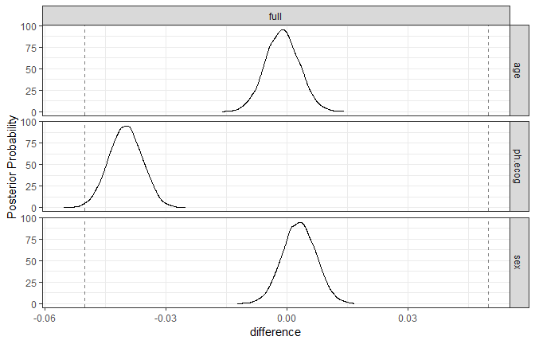

The ROPE statistics quantify the practical effects:

``` r
summary(comparisons, size = 0.05) %>%
  select(contrast, starts_with("pract"))
## # A tibble: 3 x 4
##   contrast        pract_neg pract_equiv pract_pos
##   <chr>               <dbl>       <dbl>     <dbl>
## 1 full vs age        0            1             0
## 2 full vs ph.ecog    0.0068       0.993         0
## 3 full vs sex        0            1             0
```

## Reference

[Vignettes](https://github.com/tidymodels/rsample/tree/master/vignettes)

# [`recipes`](https://github.com/tidymodels/recipes)

## Introduction

The `recipes` package is an alternative method for creating and
preprocessing design matrics that can be used for modeling or
visualization.

> In statistics, a **desgin matrix** (also known as regressor matrix or
> model matrix) is a matrix of values of explnatory variables of a set
> of objects, often denoted by X. Each row represents and individual
> object, with the successive columns corresponding to the variables and
> their specifc values for that object.

While R already has long-standing methods for creating these matrices
(e.g. [formulas](https://www.rstudio.com/rviews/2017/02/01/the-r-formula-method-the-good-parts)
and `model.matrix`), there are some [limitations to what the existing
infrastructure can
do](https://rviews.rstudio.com/2017/03/01/the-r-formula-method-the-bad-parts/).

The idea of the `recipes` package is to define a recipe or blue print
that can be used to sequentially define the encodings and preprocessing
of the data (i.e., “feature engineering”). For example to create a
simple recipe containing only an outcome and predictors and have the
predictors centered and scaled:

``` r
library(recipes)
library(mlbench)
data(Sonar)

Sonar %>% head()
##       V1     V2     V3     V4     V5     V6    V7    V8     V9   V10
## 1 0.0200 0.0371 0.0428 0.0207 0.0954 0.0986 0.154 0.160 0.3109 0.211
## 2 0.0453 0.0523 0.0843 0.0689 0.1183 0.2583 0.216 0.348 0.3337 0.287
## 3 0.0262 0.0582 0.1099 0.1083 0.0974 0.2280 0.243 0.377 0.5598 0.619
## 4 0.0100 0.0171 0.0623 0.0205 0.0205 0.0368 0.110 0.128 0.0598 0.126
## 5 0.0762 0.0666 0.0481 0.0394 0.0590 0.0649 0.121 0.247 0.3564 0.446
## 6 0.0286 0.0453 0.0277 0.0174 0.0384 0.0990 0.120 0.183 0.2105 0.304
##      V11   V12    V13    V14   V15   V16    V17   V18   V19   V20   V21
## 1 0.1609 0.158 0.2238 0.0645 0.066 0.227 0.3100 0.300 0.508 0.480 0.578
## 2 0.4918 0.655 0.6919 0.7797 0.746 0.944 1.0000 0.887 0.802 0.782 0.521
## 3 0.6333 0.706 0.5544 0.5320 0.648 0.693 0.6759 0.755 0.893 0.862 0.797
## 4 0.0881 0.199 0.0184 0.2261 0.173 0.213 0.0693 0.228 0.406 0.397 0.274
## 5 0.4152 0.395 0.4256 0.4135 0.453 0.533 0.7306 0.619 0.203 0.464 0.415
## 6 0.2988 0.425 0.6343 0.8198 1.000 0.999 0.9508 0.902 0.723 0.512 0.207
##     V22   V23   V24   V25   V26   V27   V28   V29   V30   V31   V32   V33
## 1 0.507 0.433 0.555 0.671 0.641 0.710 0.808 0.679 0.386 0.131 0.260 0.512
## 2 0.405 0.396 0.391 0.325 0.320 0.327 0.277 0.442 0.203 0.379 0.295 0.198
## 3 0.674 0.429 0.365 0.533 0.241 0.507 0.853 0.604 0.851 0.851 0.504 0.186
## 4 0.369 0.556 0.485 0.314 0.533 0.526 0.252 0.209 0.356 0.626 0.734 0.612
## 5 0.429 0.573 0.540 0.316 0.229 0.700 1.000 0.726 0.472 0.510 0.546 0.288
## 6 0.399 0.589 0.287 0.204 0.578 0.539 0.375 0.341 0.507 0.558 0.478 0.330
##      V34   V35   V36   V37   V38   V39   V40   V41    V42    V43    V44
## 1 0.7547 0.854 0.851 0.669 0.610 0.494 0.274 0.051 0.2834 0.2825 0.4256
## 2 0.2341 0.131 0.418 0.384 0.106 0.184 0.197 0.167 0.0583 0.1401 0.1628
## 3 0.2709 0.423 0.304 0.612 0.676 0.537 0.472 0.465 0.2587 0.2129 0.2222
## 4 0.3497 0.395 0.301 0.541 0.881 0.986 0.917 0.612 0.5006 0.3210 0.3202
## 5 0.0981 0.195 0.418 0.460 0.322 0.283 0.243 0.198 0.2444 0.1847 0.0841
## 6 0.2198 0.141 0.286 0.381 0.416 0.405 0.330 0.271 0.2650 0.0723 0.1238
##      V45    V46    V47    V48    V49    V50    V51    V52    V53    V54
## 1 0.2641 0.1386 0.1051 0.1343 0.0383 0.0324 0.0232 0.0027 0.0065 0.0159
## 2 0.0621 0.0203 0.0530 0.0742 0.0409 0.0061 0.0125 0.0084 0.0089 0.0048
## 3 0.2111 0.0176 0.1348 0.0744 0.0130 0.0106 0.0033 0.0232 0.0166 0.0095
## 4 0.4295 0.3654 0.2655 0.1576 0.0681 0.0294 0.0241 0.0121 0.0036 0.0150
## 5 0.0692 0.0528 0.0357 0.0085 0.0230 0.0046 0.0156 0.0031 0.0054 0.0105
## 6 0.1192 0.1089 0.0623 0.0494 0.0264 0.0081 0.0104 0.0045 0.0014 0.0038
##      V55    V56    V57    V58    V59    V60 Class
## 1 0.0072 0.0167 0.0180 0.0084 0.0090 0.0032     R
## 2 0.0094 0.0191 0.0140 0.0049 0.0052 0.0044     R
## 3 0.0180 0.0244 0.0316 0.0164 0.0095 0.0078     R
## 4 0.0085 0.0073 0.0050 0.0044 0.0040 0.0117     R
## 5 0.0110 0.0015 0.0072 0.0048 0.0107 0.0094     R
## 6 0.0013 0.0089 0.0057 0.0027 0.0051 0.0062     R
Sonar %>% dim()
## [1] 208  61

sonar_rec <- recipe(Class ~., data = Sonar) %>% 
  step_center(all_predictors()) %>% 
  step_scale(all_predictors)
```

To install it, use:

``` r
install.packages("recipes")

## for development version:
require("devtools")
install_github("tidymodels/recipes")
```

## [Simple example](https://github.com/tidymodels/recipes/blob/master/vignettes/Simple_Example.Rmd)

This demonstrates some basic uses of recipes

  - **variables** are the original (raw) data columns in a data frame or
    tibble. For example, in a traditional formula `Y ~ A + B + A:B`, the
    variables are `A`, `B`, and `Y`.
  - **roles** define how variables will be used in the model. Examples
    are: `predictor` (independent variables), `response`, and `case
    weight`. This is meant to be open-ended and extensible.
  - **terms** are columns in a design matrix such as `A`, `B`, and
    `A:B`. These can be other derived entities that are grouped such a a
    set of principal components or a set of columns that define a basis
    function for a variable. These are synonymous with features in
    machine learnin

### An example

The package contains a dataset that used to predict whether a person
will pay back a bank loan. It has 13 predictor columns and a factor
variable `Status` (the outcome). We will first separate the data into a
training and test set:

``` r
library(recipes)
library(rsample)

data("credit_data")

set.seed(55)
train_test_split <- initial_split(credit_data)

credit_train <- rsample::training(train_test_split)
credit_test <- testing(train_test_split)
```

Note that there are some missing values in these data:

``` r
vapply(credit_train, function(x) mean(!is.na(x)), numeric(1))
##    Status Seniority      Home      Time       Age   Marital   Records 
##     1.000     1.000     0.999     1.000     1.000     1.000     1.000 
##       Job  Expenses    Income    Assets      Debt    Amount     Price 
##     0.999     1.000     0.914     0.991     0.996     1.000     1.000
skimr::skim(credit_train)
## Skim summary statistics
##  n obs: 3341 
##  n variables: 14 
## 
## -- Variable type:factor ---------------------
##  variable missing complete    n n_unique
##      Home       4     3337 3341        6
##       Job       2     3339 3341        4
##   Marital       1     3340 3341        5
##   Records       0     3341 3341        2
##    Status       0     3341 3341        2
##                               top_counts ordered
##  own: 1572, ren: 741, par: 580, oth: 239   FALSE
##  fix: 2112, fre: 765, par: 332, oth: 130   FALSE
##    mar: 2433, sin: 731, sep: 96, wid: 51   FALSE
##                no: 2743, yes: 598, NA: 0   FALSE
##               goo: 2387, bad: 954, NA: 0   FALSE
## 
## -- Variable type:integer --------------------
##   variable missing complete    n    mean       sd  p0  p25  p50  p75  p100
##        Age       0     3341 3341   37.07    10.95  18   28   36   45    68
##     Amount       0     3341 3341 1039.68   481.56 100  700 1000 1300  5000
##     Assets      31     3310 3341 5305.75 11713.98   0    0 3000 6000 3e+05
##       Debt      13     3328 3341  355.25  1292.35   0    0    0    0 30000
##   Expenses       0     3341 3341   55.69    19.44  35   35   52   73   168
##     Income     288     3053 3341  142.1     81.67   6   90  125  170   959
##      Price       0     3341 3341 1465.76   630.46 125 1116 1404 1695  8800
##  Seniority       0     3341 3341    7.99     8.09   0    2    5   12    47
##       Time       0     3341 3341   46.46    14.44   6   36   48   60    72
##      hist
##  <U+2585><U+2587><U+2587><U+2587><U+2585><U+2583><U+2582><U+2581>
##  <U+2585><U+2587><U+2583><U+2581><U+2581><U+2581><U+2581><U+2581>
##  <U+2587><U+2581><U+2581><U+2581><U+2581><U+2581><U+2581><U+2581>
##  <U+2587><U+2581><U+2581><U+2581><U+2581><U+2581><U+2581><U+2581>
##  <U+2587><U+2583><U+2583><U+2581><U+2581><U+2581><U+2581><U+2581>
##  <U+2587><U+2586><U+2581><U+2581><U+2581><U+2581><U+2581><U+2581>
##  <U+2585><U+2587><U+2581><U+2581><U+2581><U+2581><U+2581><U+2581>
##  <U+2587><U+2583><U+2582><U+2581><U+2581><U+2581><U+2581><U+2581>
##  <U+2581><U+2581><U+2582><U+2585><U+2581><U+2583><U+2587><U+2581>
```

Rather than revmoing these, their values will be imputed. The idea is
that preprocessing operations will all be created using the training set
and then these steps will be applied to both the training and test sets.

### An initial recipe

First, we will create a recipe object from the original data and then
specify the processing steps. Recipes can be created manually by
sequentially adding roles to variables in a data set.

If the analysis only required **outcomes** and **predictors**, the
easiest way to create the initial recipe is to use the standard formula
method:

``` r
rec_obj <- recipe(Status~., data = credit_train)
rec_obj
## Data Recipe
## 
## Inputs:
## 
##       role #variables
##    outcome          1
##  predictor         13
```

The data contained in the `data` argument need not be traininig set;
this data is only used to catalog the names of the variables and their
types (e.g., numeric, etc.).

Note that the formula method here is used to declare the variables and
their role nad nothing else. If you use inline functions (e.g., `log`)
it will complain. These types of operations can be added later.

### Preprocessing steps

From here, preprocessing steps for some step X can be added sequentially
in one of two ways:

``` r
rec_obj <- step_{X}(rec_obj, arguments) ## or
rec_obj <- rec_obj %>% step_{X}(arguments)
```

`step_dummy` and the other functions will always return updated recipes.

One other important facet of the code is the method for specifying which
variables should be used in different steps. The manual page
[?selection](https://tidymodels.github.io/recipes/reference/selections.html)
has more details but `dplyr-`like selector functions can be used:

  - use basic variable names (e.g., `x1`, `x2`),
  - `dplyr` functions for selecting variables: `contains`, `ends_with`,
    `everything`, `matches`, `num_range`
  - functions that subset on the role of the variables that have been
    specfied so far: `all_outcomes`, `all_predictors`, `has_role`, or
  - similar functions for the type of data: `all_nominal`,
    `all_numeric`, and `has_type`.

Note that the methods listed above are the only ones that can be used to
select variables inside the steps. Also, minus signs can be used to
deselect variables.

For our data, we can add an operation to impute the predictors. There
are many ways to do this and `recipes` includes a few steps for this
purpose:

``` r
grep("impute$", ls("package:recipes"), value=TRUE)
## [1] "step_bagimpute"    "step_knnimpute"    "step_lowerimpute" 
## [4] "step_meanimpute"   "step_medianimpute" "step_modeimpute"  
## [7] "step_rollimpute"
```

Here, K-nearest neghbor imputation will be used. This works for both
numeric and non-numeric predictors and defaults `K` to five. To di this,
it selects all predictors then removes that are numeric:

``` r
imputed <- rec_obj %>% 
  step_knnimpute(all_predictors())
imputed
## Data Recipe
## 
## Inputs:
## 
##       role #variables
##    outcome          1
##  predictor         13
## 
## Operations:
## 
## 5-nearest neighbor imputation for all_predictors()
```

It is important to realize that the specifc variables have not been
declared yet (as shown when the recipe is printed above). In some
preprocessing steps, variables will be added or removed from the current
list of possible variables.

Since some predictors are categorical in nature (i.e., nominal), it
would make sense to convert these factor predictors into numeric dummy
variables (aka indicator variables) using `step_dummy`. To do this, the
step selects all predictors then removes those that are numeric.

``` r
ind_vars <- imputed %>% 
  step_dummy(all_predictors(), - all_numeric())
ind_vars
## Data Recipe
## 
## Inputs:
## 
##       role #variables
##    outcome          1
##  predictor         13
## 
## Operations:
## 
## 5-nearest neighbor imputation for all_predictors()
## Dummy variables from all_predictors(), -all_numeric()
```

At this point in the recipe, all of the predictor should be encoded as
numeric, we can further add more steps to center and scale them:

``` r
standardized <- ind_vars %>% 
  step_center(all_predictors()) %>% 
  step_scale(all_predictors())
standardized
## Data Recipe
## 
## Inputs:
## 
##       role #variables
##    outcome          1
##  predictor         13
## 
## Operations:
## 
## 5-nearest neighbor imputation for all_predictors()
## Dummy variables from all_predictors(), -all_numeric()
## Centering for all_predictors()
## Scaling for all_predictors()
```

If there are the only preprocessing steps for the predictors, we can now
estimate the means and standard deviations from the training set. The
`prep` function is used with a recipe and a data set:

``` r
trained_rec <- prep(standardized, training = credit_train)
trained_rec 
## Data Recipe
## 
## Inputs:
## 
##       role #variables
##    outcome          1
##  predictor         13
## 
## Training data contained 3341 data points and 309 incomplete rows. 
## 
## Operations:
## 
## 5-nearest neighbor imputation for Home, Time, Age, Marital, Records, ... [trained]
## Dummy variables from Home, Marital, Records, Job [trained]
## Centering for Seniority, Time, Age, Expenses, ... [trained]
## Scaling for Seniority, Time, Age, Expenses, ... [trained]
```

Note that the real variables are listed (e.g., `Home` etc.) insted of
the selectors (`all_predictors()`). Now that the statistics have been
estimated, the preprocessing can be *applied* to the training and test
set:

``` r
train_data <- bake(trained_rec, new_data = credit_train)
test_data <- bake(trained_rec, new_data = credit_test)
```

`bake` returns a tible that, by default, includes all of the variables:

``` r
class(test_data)
## [1] "tbl_df"     "tbl"        "data.frame"
test_data
## # A tibble: 1,113 x 23
##    Status Seniority   Time      Age Expenses   Income  Assets    Debt
##    <fct>      <dbl>  <dbl>    <dbl>    <dbl>    <dbl>   <dbl>   <dbl>
##  1 good      -0.987  0.938 -1.19       0.376  0.497   -0.243  -0.275 
##  2 good      -0.987 -0.724 -1.01      -0.499 -0.447   -0.457  -0.275 
##  3 good      -0.987  0.938 -0.464      1.76  -0.447    0.827  -0.275 
##  4 good       1.36  -0.724 -0.00678    0.993  0.346   -0.157  -0.0739
##  5 bad       -0.740  0.938 -1.10      -0.499 -0.447   -0.457  -0.275 
##  6 bad       -0.864  0.938  0.724      2.54  -0.384   -0.285   0.112 
##  7 good       2.23   0.938  1.27      -0.550  0.00644 -0.157  -0.275 
##  8 good       1.36   0.938  0.541      0.993  0.472   -0.114  -0.275 
##  9 bad       -0.616 -1.56  -1.29       0.993 -0.723   -0.0287 -0.275 
## 10 good       2.97  -1.56   2.28      -0.550 -0.296    0.271  -0.275 
## # ... with 1,103 more rows, and 15 more variables: Amount <dbl>,
## #   Price <dbl>, Home_other <dbl>, Home_owner <dbl>, Home_parents <dbl>,
## #   Home_priv <dbl>, Home_rent <dbl>, Marital_married <dbl>,
## #   Marital_separated <dbl>, Marital_single <dbl>, Marital_widow <dbl>,
## #   Records_yes <dbl>, Job_freelance <dbl>, Job_others <dbl>,
## #   Job_partime <dbl>

vapply(test_data, function(x) mean(!is.na(x)), numeric(1))
##            Status         Seniority              Time               Age 
##                 1                 1                 1                 1 
##          Expenses            Income            Assets              Debt 
##                 1                 1                 1                 1 
##            Amount             Price        Home_other        Home_owner 
##                 1                 1                 1                 1 
##      Home_parents         Home_priv         Home_rent   Marital_married 
##                 1                 1                 1                 1 
## Marital_separated    Marital_single     Marital_widow       Records_yes 
##                 1                 1                 1                 1 
##     Job_freelance        Job_others       Job_partime 
##                 1                 1                 1
```

Selectors can also be used. For example, if only the predictors are
needed, you can use `bake(object, new_data, all_predictors())`. There
are number of other steps oncluded in the package.

``` r
grep("^step", ls("package:recipes"), value=TRUE)
##  [1] "step"               "step_arrange"       "step_bagimpute"    
##  [4] "step_bin2factor"    "step_BoxCox"        "step_bs"           
##  [7] "step_center"        "step_classdist"     "step_corr"         
## [10] "step_count"         "step_date"          "step_depth"        
## [13] "step_discretize"    "step_downsample"    "step_dummy"        
## [16] "step_factor2string" "step_filter"        "step_geodist"      
## [19] "step_holiday"       "step_hyperbolic"    "step_ica"          
## [22] "step_integer"       "step_interact"      "step_intercept"    
## [25] "step_inverse"       "step_invlogit"      "step_isomap"       
## [28] "step_knnimpute"     "step_kpca"          "step_lag"          
## [31] "step_lincomb"       "step_log"           "step_logit"        
## [34] "step_lowerimpute"   "step_meanimpute"    "step_medianimpute" 
## [37] "step_modeimpute"    "step_mutate"        "step_naomit"       
## [40] "step_nnmf"          "step_novel"         "step_ns"           
## [43] "step_num2factor"    "step_nzv"           "step_ordinalscore" 
## [46] "step_other"         "step_pca"           "step_pls"          
## [49] "step_poly"          "step_profile"       "step_range"        
## [52] "step_ratio"         "step_regex"         "step_relu"         
## [55] "step_rm"            "step_rollimpute"    "step_sample"       
## [58] "step_scale"         "step_shuffle"       "step_slice"        
## [61] "step_spatialsign"   "step_sqrt"          "step_string2factor"
## [64] "step_unorder"       "step_upsample"      "step_window"       
## [67] "step_YeoJohnson"    "step_zv"
```

### Checks

Another type of operation that can be added to a recipes is a *check*.
Checks conduct some sort of data validation, and if no issue is found,
returns the data as-is; otherwise, an error is thrown.

For example, `check_missing` will fail if any of the variables selected
for validation have missing values. This check is done when the recipe
is prepared as well as when any data are baked. Checks are added in the
same way as steps:

``` r
trained_rec <- trained_rec %>% 
  check_missing(contains("Marital"))
```

Currently, `recipes` includes:

``` r
grep("check_", ls("package:recipes"), value=TRUE)
## [1] "check_cols"    "check_missing" "check_name"    "check_range"  
## [5] "check_type"
```

## [Selecting variables](https://github.com/tidymodels/recipes/blob/master/vignettes/Selecting_Variables.Rmd)

When recipe steps are used, there are different approches that can be
used to select which variables or features should be used.

The three main characteristics of variables that can be queried:

  - the name of the variable
  - the data type (e.g., numeric or nominal)
  - the role that was declated by the recipe

The manual pages for
[?selection](https://tidymodels.github.io/recipes/reference/selections.html)
and
[?has\_role](https://tidymodels.github.io/recipes/reference/has_role.html)
have details about the available selection methods.

To illustrate this, the credit data will be used.

``` r
library(recipes)
data("credit_data")
str(credit_data)
## 'data.frame':    4454 obs. of  14 variables:
##  $ Status   : Factor w/ 2 levels "bad","good": 2 2 1 2 2 2 2 2 2 1 ...
##  $ Seniority: int  9 17 10 0 0 1 29 9 0 0 ...
##  $ Home     : Factor w/ 6 levels "ignore","other",..: 6 6 3 6 6 3 3 4 3 4 ...
##  $ Time     : int  60 60 36 60 36 60 60 12 60 48 ...
##  $ Age      : int  30 58 46 24 26 36 44 27 32 41 ...
##  $ Marital  : Factor w/ 5 levels "divorced","married",..: 2 5 2 4 4 2 2 4 2 2 ...
##  $ Records  : Factor w/ 2 levels "no","yes": 1 1 2 1 1 1 1 1 1 1 ...
##  $ Job      : Factor w/ 4 levels "fixed","freelance",..: 2 1 2 1 1 1 1 1 2 4 ...
##  $ Expenses : int  73 48 90 63 46 75 75 35 90 90 ...
##  $ Income   : int  129 131 200 182 107 214 125 80 107 80 ...
##  $ Assets   : int  0 0 3000 2500 0 3500 10000 0 15000 0 ...
##  $ Debt     : int  0 0 0 0 0 0 0 0 0 0 ...
##  $ Amount   : int  800 1000 2000 900 310 650 1600 200 1200 1200 ...
##  $ Price    : int  846 1658 2985 1325 910 1645 1800 1093 1957 1468 ...

rec <- recipe(Status ~ Seniority + Time + Age + Records, data = credit_data)
rec
## Data Recipe
## 
## Inputs:
## 
##       role #variables
##    outcome          1
##  predictor          4
```

Before any steps are used the information on the original variables is

``` r
summary(rec, original=TRUE)
## # A tibble: 5 x 4
##   variable  type    role      source  
##   <chr>     <chr>   <chr>     <chr>   
## 1 Seniority numeric predictor original
## 2 Time      numeric predictor original
## 3 Age       numeric predictor original
## 4 Records   nominal predictor original
## 5 Status    nominal outcome   original
```

We can add a step compute dummy variables on the non-numeric data after
we impute any missing data:

``` r
dummied <- rec %>% step_dummy(all_nominal())
dummied
## Data Recipe
## 
## Inputs:
## 
##       role #variables
##    outcome          1
##  predictor          4
## 
## Operations:
## 
## Dummy variables from all_nominal()
```

This will capture any variables that are either character strings or
factors: `Status` and `Records`. However, since `Status` is our outcome,
we might want to kepp it as a factor so we can *subtract* that variable
out either by name or by role:

``` r
dummied <- rec %>% step_dummy(Records) # or
dummied <- rec %>% step_dummy(all_nominal(), -Status) #or
dummied <- rec %>% step_dummy(all_nominal(), - all_outcomes())
```

Using the last deficition:

``` r
dummied <- prep(dummied, training = credit_data)
with_dummy <- bake(dummied, new_data = credit_data)
with_dummy
## # A tibble: 4,454 x 5
##    Seniority  Time   Age Records_yes Status_good
##        <int> <int> <int>       <dbl>       <dbl>
##  1         9    60    30           0           1
##  2        17    60    58           0           1
##  3        10    36    46           1           0
##  4         0    60    24           0           1
##  5         0    36    26           0           1
##  6         1    60    36           0           1
##  7        29    60    44           0           1
##  8         9    12    27           0           1
##  9         0    60    32           0           1
## 10         0    48    41           0           0
## # ... with 4,444 more rows
```

`Status` is unaffected.

One important aspect about selecting variables in steps is that the
variable names and types may change as steps are being executed. In the
above example, `Records` is a factor variable before the step is
executed. Afterwards, `Records` is gone and the binary variable
`Records_yes` is in its place. One reason to have general selection
routines like `all_predictors` or `contains` is to be able to select
variables that have not be created
yet.

## Custom steps

## [Dummy steps](https://github.com/tidymodels/recipes/blob/master/vignettes/Custom_Steps.Rmd)

The `recipes` package contains a number of different operations:

``` r
library(recipes)
ls("package:recipes", pattern="^step_")
##  [1] "step_arrange"       "step_bagimpute"     "step_bin2factor"   
##  [4] "step_BoxCox"        "step_bs"            "step_center"       
##  [7] "step_classdist"     "step_corr"          "step_count"        
## [10] "step_date"          "step_depth"         "step_discretize"   
## [13] "step_downsample"    "step_dummy"         "step_factor2string"
## [16] "step_filter"        "step_geodist"       "step_holiday"      
## [19] "step_hyperbolic"    "step_ica"           "step_integer"      
## [22] "step_interact"      "step_intercept"     "step_inverse"      
## [25] "step_invlogit"      "step_isomap"        "step_knnimpute"    
## [28] "step_kpca"          "step_lag"           "step_lincomb"      
## [31] "step_log"           "step_logit"         "step_lowerimpute"  
## [34] "step_meanimpute"    "step_medianimpute"  "step_modeimpute"   
## [37] "step_mutate"        "step_naomit"        "step_nnmf"         
## [40] "step_novel"         "step_ns"            "step_num2factor"   
## [43] "step_nzv"           "step_ordinalscore"  "step_other"        
## [46] "step_pca"           "step_pls"           "step_poly"         
## [49] "step_profile"       "step_range"         "step_ratio"        
## [52] "step_regex"         "step_relu"          "step_rm"           
## [55] "step_rollimpute"    "step_sample"        "step_scale"        
## [58] "step_shuffle"       "step_slice"         "step_spatialsign"  
## [61] "step_sqrt"          "step_string2factor" "step_unorder"      
## [64] "step_upsample"      "step_window"        "step_YeoJohnson"   
## [67] "step_zv"
```

You might need to define your own operations, this page describes how to
do that. I f you are looking for good examples of existing steps, I
would suggest looking at the code for
[centering](https://github.com/tidymodels/recipes/blob/master/R/center.R)
or [PCA](https://github.com/tidymodels/recipes/blob/master/R/pca.R) to
start.

For checks, the process is very similar. notes on this are given at the
end of this document.

### A new step definition

As an example, let’s create a step that replaces the value of a viable
with its percentile from the training set. The data that I will use is
from the `recipes` package:

``` r
data(biomass)
str(biomass)
## 'data.frame':    536 obs. of  8 variables:
##  $ sample  : chr  "Akhrot Shell" "Alabama Oak Wood Waste" "Alder" "Alfalfa" ...
##  $ dataset : chr  "Training" "Training" "Training" "Training" ...
##  $ carbon  : num  49.8 49.5 47.8 45.1 46.8 ...
##  $ hydrogen: num  5.64 5.7 5.8 4.97 5.4 5.75 5.99 5.7 5.5 5.9 ...
##  $ oxygen  : num  42.9 41.3 46.2 35.6 40.7 ...
##  $ nitrogen: num  0.41 0.2 0.11 3.3 1 2.04 2.68 1.7 0.8 1.2 ...
##  $ sulfur  : num  0 0 0.02 0.16 0.02 0.1 0.2 0.2 0 0.1 ...
##  $ HHV     : num  20 19.2 18.3 18.2 18.4 ...

biomass_tr <- biomass[biomass$dataset == "Training",]
biomass_te <- biomass[biomass$dataset == "Testing",]
```

To illustrate the transformation with the `carbon` variable, the
training set distribution of that variables is shown below with a
vertical line for the first value of the test set.

``` r

library(ggplot2)
theme_set(theme_bw())

ggplot(biomass_tr, aes(x=carbon))+
  geom_histogram(binwidth = 5, col = "blue", fill = "blue", alpha = .5)+
  geom_vline(xintercept = biomass_te$carbon[1], lty = 2)
```

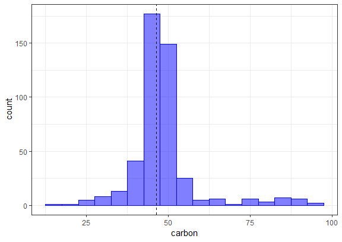

Based on the training set, 42.1% of the data are less than a value of
46.35. There are some applications where it might be advantageous to
represent the predictor values as pecentiles rather than their original
values.

Our new step will do this computation for any numeric variables of
interest. We will call this `step_percentile`. The code below is
designed for illustration and not speed or best practices. I have left
out a lot of error trapping that we would want in a real implementation.

### Create the initial function

The user-exposed function `step_percentile` is just a single wrapper
around an internal function called `add_step`. This function takes the
same arguments as your function and simply adds it to a new recipe. The
`...` signifies the variable selectors that can be used.

``` r

step_percentile <- function(
  recipe,...,
  role = NA,
  trained =FALSE,
  ref_dist = NULL,
  approx = FALSE,
  options = list(probs = (0:100)/100, names = TRUE),
  skip = FALSE,
  id = rand_id("percentile")
){
  ## The variable selectors are not immediately evaluated by using
  ## the `quos` function in `rlang`. `ellipse_check` captures the
  ## values and also checks to make sure that they are not empty.
  terms <- ellipse_check(...)
  
  add_step(
    recipe,
    step_percentile_new(
      terms = terms,
      trained = trained,
      role = role,
      ref_dist = ref_dist,
      approx = approx,
      options = options,
      skip = skip,
      id = id
    )
  )
  
}
```

You should always keep the first four arguments (`recipe` through
`trained`) the same as listed above. Some notes:

  - the `role` argument is used when you either 1) create new variables
    and want their role to be pre-set or 2) replace the existing
    variables with new values. The latter is what we will be doing and
    using `role=NA` will leave the existing role intact.
  - `trained` is set by the package when the estimation step has been
    run. You should default your function definitions’s argument to
    `FALSE`.
  - `skip` is logical. Whenever a recipe is preped, each step is trained
    and then baked. However, there are some steps that should not be
    applied to the variables with roles of “outocmmes”, these data would
    not be available for new samples.
  - `id` is a character string that can be used to identify steps in
    package code.

I’ve added extra arguments specific to this step. In order to calculate
the percentile, the training data fro the relevant columns need to be
saved. This data will be saved in the `ref_dist` object. However, this
might be problematic if the data set is large. `approx` would be used
when you want to save a grid of pre-computed percentiles from the
training set and use these to estimate the percentile for a new data
point. If approx = TRUE, the argument `ref_dist` will contain the grid
for each variable.

We will use the `stats::quantile` to compute the grid. However, we might
also want to have control over the granularity of this grid, so the
options argument will be used to define how that calculations is done.
We could just use the ellipses (aka `...`) so that any options passed to
`step_percentile` that are not one of its arguments will then be passed
to `stats::quantile`. We recommend making a separate list object with
the options and use these inside the function.

### Initialization of new objects

NExt, you can utilize the internal function `step` that sets the class
of new objects. Using `subclass = "percentile` will set the class of new
objects to `step_percentile`.

``` r
step_percentile_new <- 
  function(terms, role, trained, ref_dist, approx, options, skip, id) {
    step(
      subclass = "percentile", 
      terms = terms,
      role = role,
      trained = trained,
      ref_dist = ref_dist,
      approx = approx,
      options = options,
      skip = skip,
      id = id
    )
  }
```

This constructor function should have no default argument values.

### Define the estimation procedure

You will need to create a new `prep` method for your step’s class. To do
this, three arguments that the method should have:

``` r
function(x, training, info = NULL)
```

where - `x` will be the `step_percentile` object - `training` will be a
*tibble* that has the training set data - `info` will also be a tibble
that has information on the current of data available. . This
information is updated as each step is evaluated by its specific prep
method so it may not have the variables from the original data. The
columns in this tibble are variable (the variable name), `type`
(currently either “numeric” or “nominal”), `role` (defining the
variable’s role), and source (either “original” or “derived” depending
on where it originated).

You can define other options.

The first thing that you might want do do in the `prep` function is to
translate the specification listed in the `terms` argument to column
names in the current data. There is an internal function called
`terms_select` that can be used to obtain this.

``` r
prep.step_percentile <- function(x, training, info = NULL, ...){
  col_names <- terms_select(terms = .x$terms, info = info)
}
```

Once we have this, we can either save the original data columns or
estimate the approximation grid. For the grid, we will use a helper
function that enables us to run `do.call` on a list of arguments that
include the `options` list.

``` r
get_pctl <- function(x, args){
  args$x <- x
  do.call("quantile", args)
}

prep.step_percentile <- function(x, training, info = NULL, ...) {
  col_names <- terms_select(terms = x$terms, info = info) 
  ## You can add error trapping for non-numeric data here and so on. See the
  ## `check_type` function to do this for basic types. 
  
  ## We'll use the names later so
  if (x$options$names == FALSE)
    stop("`names` should be set to TRUE", call. = FALSE)
  
  if (!x$approx) {
    ref_dist <- training[, col_names]
  } else {
    ref_dist <- purrr::map(training[, col_names],  get_pctl, args = x$options)
  }

  ## Use the constructor function to return the updated object. 
  ## Note that `trained` is set to TRUE
  
  step_percentile_new(
    terms = x$terms, 
    trained = TRUE,
    role = x$role, 
    ref_dist = ref_dist,
    approx = x$approx,
    options = x$options,
    skip = x$skip,
    id = x$id
  )
}
```

### Create the bake method

Remember that the `prep` function does not `apply` the step to the data;
it only estimates any required values such as `ref_dist`. We will need
to create a new method for our `step_percentile` class. The minimum
arguments for this are

``` r
function(object, new_data, ...)
```

where `object` is the updated step function that has been through the
corresponding prep code and `new_data` is a tibble of data to be
processed.

Here is the code to convert the new data to percentiles. Two initial
helper functions handle the two cases (approximation or not). We always
return a tibble as the output.

``` r
## Two helper functions
pctl_by_mean <- function(x, ref) mean(ref <= x)

pctl_by_approx <- function(x, ref) {
  ## go from 1 column tibble to vector
  x <- getElement(x, names(x))
  ## get the percentiles values from the names (e.g. "10%")
  p_grid <- as.numeric(gsub("%$", "", names(ref))) 
  approx(x = ref, y = p_grid, xout = x)$y/100
}

bake.step_percentile <- function(object, new_data, ...) {
  require(tibble)
  ## For illustration (and not speed), we will loop through the affected variables
  ## and do the computations
  vars <- names(object$ref_dist)
  
  for (i in vars) {
    if (!object$approx) {
      ## We can use `apply` since tibbles do not drop dimensions:
      new_data[, i] <- apply(new_data[, i], 1, pctl_by_mean, 
                            ref = object$ref_dist[, i])
    } else 
      new_data[, i] <- pctl_by_approx(new_data[, i], object$ref_dist[[i]])
  }
  ## Always convert to tibbles on the way out
  as_tibble(new_data)
}
```

### Running the example

Let’s use the example data to make sure that itworks:

``` r
library(purrr)
rec_obj <- 
  recipe(HHV~., data = biomass_tr[,-(1:2)]) %>% 
  step_percentile(all_predictors(), approx = TRUE) %>% 
  prep(training = biomass_tr)

percentiles <- bake(rec_obj, biomass_te)
percentiles
## # A tibble: 80 x 6
##    carbon hydrogen oxygen nitrogen sulfur   HHV
##     <dbl>    <dbl>  <dbl>    <dbl>  <dbl> <dbl>
##  1 0.421    0.45   0.903     0.215  0.735  18.3
##  2 0.18     0.385  0.922     0.928  0.839  17.6
##  3 0.156    0.385  0.945     0.9    0.805  17.2
##  4 0.423    0.775  0.28      0.845  0.902  18.9
##  5 0.666    0.867  0.631     0.155  0.09   20.5
##  6 0.218    0.385  0.536     0.495  0.7    18.5
##  7 0.0803   0.271  0.986     0.695  0.903  15.1
##  8 0.139    0.126  0.160     0.606  0.7    16.2
##  9 0.0226   0.103  0.131     0.126  0.996  11.1
## 10 0.0178   0.0821 0.0987    0.972  0.974  10.8
## # ... with 70 more rows
```

The plot below shos how the original data line up with the percentiles
for each split of the data for one of the predictors:

``` r
percentiles %>% colnames()
## [1] "carbon"   "hydrogen" "oxygen"   "nitrogen" "sulfur"   "HHV"
ggplot(data=percentiles, aes(x=carbon))+
  stat_bin(aes(y=cumsum(..count..)),geom="step")
```

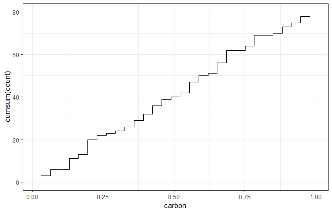

### Custom check operations

The process here is exactly the same as steps; the internal functions
have a similar naming convention:

  - `add_check` instead of `add_step`
  - `check` instead of `step` and so on.

It is strongly recommended that: 1. The operation start with `check_`
(i.e., `check_range` and `check_range_new`) 2. The check uses `stop(...,
call.=FALSE)` when the conditions are not met 3. The original data are
returned (unaltered) by the check when the conditions are satisfied.

## Subsampling for class imbalance

Subsampling can be a helpful approach to dealing with classification
data where one or more classes occur very infrequently. Often, most
models will overfit to the majority class and produce very good
statistics for the class containing the frequently occuring classes
while the minority classes have poor performance.

Consider two-class problem where the first class has a very low rate of
occurence. The `caret` package has a function that can simulate such
data:

``` r
library(caret)

set.seed(244)
imbal_data <- twoClassSim(1000, intercept = 10)
table(imbal_data$Class)
## 
## Class1 Class2 
##     47    953
```

If “Class 1” is the event of interest, it is very likely that
classification model would be able to achieve very good specificty since
almost all of the data are the second class. *Sensitivity* will often be
poor since the models will optimize accuracy (or other loss functions)
by predicting everything to be the majority class.

When there are two claases, the results is that the default probability
cutoff of 50% is inappropriate: a different cutoff that is more extreme
might be able to achieve good performance.

One way to alleviate this issue is to *subsample* the data. There are a
number of ways to do this but the most simple one is to *sample down*
the majority class data until it occurs with the same frequency as the
minority class. While conterintutive, throwing out a large percentage of
the data can be effective at producing a results. In some cases, this
means that the overall performance of the model is better (e.g.,
improved area under the ROC curve). However, subsampling almost always
produces models that are *better calibrated*. As a result, the default
50% cutoff is much model likely to produce better sensitivity and
specificity values than they would otherwise.

To demostrate this, `step_downsample` will be used in a recipe for the
simulated data. In terms of workflow:

  - It is extremely important that subsampling occurs \_\_inside of
    resampling\_. Otherwise, the resampling process can produce [porr
    estimate of model
    performance](https://topepo.github.io/caret/subsampling-for-class-imbalances.html#resampling).
  - The subsampling process should only be applied to the analysis set.
    The assessment set should reflect the event rates seen in the wild
    and, for this reason, the `skip` argument to `step_downsample` is
    defaulted to `TRUE`.

Here is a simple recipe:

``` r
library(recipes)
imbal_rec <- 
  recipe(Class ~., data = imbal_data) %>% 
  step_downsample(Class)
```

Basic cross-validation is used to resample the model:

``` r
library(rsample)
set.seed(5732)
cv_folds <- vfold_cv(imbal_data, strata="Class", repeats=5)
```

An additional column is added to the data that contains the trained
recipes for each resample:

``` r
library(purrr)
cv_folds <- 
  cv_folds %>% 
  mutate(recipes = map(splits, prepper, recipe = imbal_rec, retain=TRUE))

cv_folds$recipes[[1]]
## Data Recipe
## 
## Inputs:
## 
##       role #variables
##    outcome          1
##  predictor         15
## 
## Training data contained 900 data points and no missing data.
## 
## Operations:
## 
## Down-sampling based on Class [trained]
```

The model that will be used to demonstrate subsampling is [quadratic
discriminant
analysis](https://en.wikipedia.org/wiki/Quadratic_classifier#Quadratic_discriminant_analysis)
via the `MASS` package. A function will be used to train the model and
to produce class probabilities as well as hard class predictions using
the default 50% cutoff. When a recipe is passed to the function,
down-sampling will be applied. If no recipe is give, the data are used
to fit the model as-is:

``` r
library(MASS)

assess_res <- function(split, rec=NULL,...){
  if (!is.null(rec))
    mod_data <- juice(rec)
  else
    mod_data <- analysis(split)
  
  mod_fit <- qda(Class~., data = mod_data)
  
  if(!is.null(rec))
    eval_data <- bake(rec, assessment(split))
  else 
    eval_data <- assessment(split)
  
  eval_data <- eval_data 
  predictions <- predict(mod_fit, eval_data)
  eval_data %>%
    mutate(
      pred = predictions$class,
      prob = predictions$posterior[,1]
    ) %>%
    dplyr::select(Class, pred, prob)
}
```

For example:

``` r
# No subsampling
assess_res(cv_folds$splits[[1]]) %>% head
##    Class   pred     prob
## 1 Class2 Class2 2.36e-07
## 2 Class2 Class2 4.69e-06
## 3 Class2 Class2 2.21e-04
## 4 Class2 Class2 1.20e-03
## 5 Class1 Class2 2.78e-01
## 6 Class2 Class2 6.13e-11

# With Subsampling
assess_res(cv_folds$splits[[1]], cv_folds$recipes[[1]]) %>% head
## # A tibble: 6 x 3
##   Class  pred           prob
##   <fct>  <fct>         <dbl>
## 1 Class2 Class2 0.00235     
## 2 Class2 Class2 0.0160      
## 3 Class2 Class2 0.0178      
## 4 Class2 Class2 0.0144      
## 5 Class1 Class1 0.999       
## 6 Class2 Class2 0.0000000319
```

To measure model effectiveness, two metrics are used:

  - The area under the [ROC
    curve](https://en.wikipedia.org/wiki/Receiver_operating_characteristic)
    is an overall assessment of performance across *all* cutoffs. Values
    near one indicate very good results while values near 0.05 would
    imply that the model is very poor.
  - The *J* index (a.k.a. [Youden’s
    *J*](https://en.wikipedia.org/wiki/Youden%27s_J_statistic)
    statistic) is `sensitivity + specificity - 1`. Values near one are
    once again best.

If a model is poorly calibrated, the ROC curve value might not show
diminished performance. However, the *J* index would be lower for models
with pathological distributions for the class probabilities. The
`yardstick` package will be used to compute these metrics.

Now, we train the models and generate the predictions. These are stored
in list columns where each list element is a data frame of the
predictions on the assessment data:

``` r
cv_folds <- 
  cv_folds %>% 
  mutate(
    sampled_pred = map2(splits, recipes, assess_res),
    normal_pred = map(splits, assess_res)
  )
```

Now the performance metrics are computed:

``` r

library(yardstick)
cv_folds <- 
  cv_folds %>% 
  mutate(
    sampled_roc = map_dfr(sampled_pred, roc_auc, Class, prob) %>% 
      pull(".estimate"),
    normal_roc = map_dfr(normal_pred, roc_auc, Class, prob) %>% 
      pull(".estimate"),
    sampled_J = map_dfr(sampled_pred, j_index, Class, pred) %>% 
      pull(".estimate"),
    normal_J = map_dfr(normal_pred, j_index, Class, pred) %>% 
      pull(".estimate")
  )
```

What do the ROC values look like? A [Black-Altman
plot](https://en.wikipedia.org/wiki/Bland%E2%80%93Altman_plot) can be
used to show the differences in the results over the range of results:

``` r

ggplot(cv_folds,
        aes(x = (sampled_roc + normal_roc)/2,
            y = sampled_roc - normal_roc)) +
  geom_point()+
  geom_hline(yintercept = 0, col = "green")
```

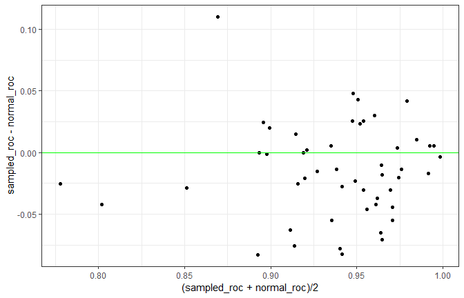

There doesn’t appear that subsampling had much of an effect on this
metric. The average difference is -0.015, which is fairly small.

For the *J* statistic, the results show a different story:

``` r
ggplot(cv_folds,
       aes(x = (sampled_J + normal_J)/2,
           y = sampled_J - normal_J))+
  geom_point()+
  geom_hline(yintercept = 0, col = "green")
```

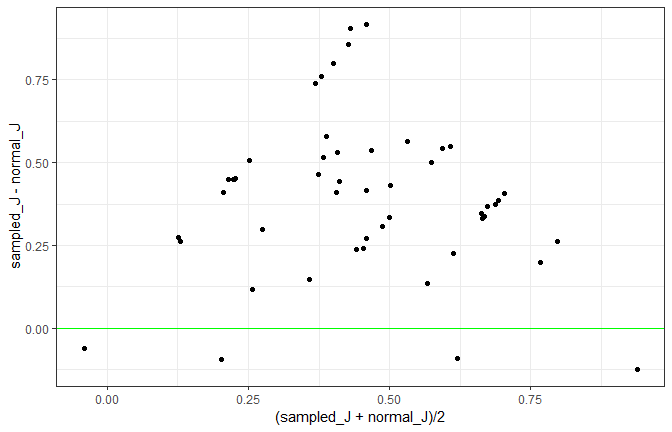

Almost all of the differences area greater than zero. We can use
`tidyposterior` to do a more formal analyis:

``` r

library(tidyposterior)

# Remove all columns except the resample info and the J indices,
# then fit the Bayesian model

cv_folds %>% 
  dplyr::select(-recipes, -matches("pred$"), -matches("roc$"))
## #  10-fold cross-validation repeated 5 times using stratification 
## # A tibble: 50 x 5
##    splits            id      id2    sampled_J normal_J
##  * <list>            <chr>   <chr>      <dbl>    <dbl>
##  1 <split [900/100]> Repeat1 Fold01     0.928   0.667 
##  2 <split [900/100]> Repeat1 Fold02     0.411   0     
##  3 <split [900/100]> Repeat1 Fold03     0.857   0.490 
##  4 <split [900/100]> Repeat1 Fold04     0.678   0.1   
##  5 <split [900/100]> Repeat1 Fold05     0.439  -0.0102
##  6 <split [900/100]> Repeat1 Fold06     0.642   0.333 
##  7 <split [900/100]> Repeat1 Fold07     0.917   0     
##  8 <split [900/100]> Repeat1 Fold08     0.574   0.333 
##  9 <split [900/100]> Repeat1 Fold09     0.866   0.323 
## 10 <split [900/100]> Repeat1 Fold10     0.668   0.333 
## # ... with 40 more rows

j_mod <- 
  cv_folds %>% 
  dplyr::select(-recipes, -matches("pred$"), -matches("roc$")) %>% 
  perf_mod(seed = 62378, iter = 5000)
## 
## SAMPLING FOR MODEL 'continuous' NOW (CHAIN 1).
## Chain 1: 
## Chain 1: Gradient evaluation took 0 seconds
## Chain 1: 1000 transitions using 10 leapfrog steps per transition would take 0 seconds.
## Chain 1: Adjust your expectations accordingly!
## Chain 1: 
## Chain 1: 
## Chain 1: Iteration:    1 / 5000 [  0%]  (Warmup)
## Chain 1: Iteration:  500 / 5000 [ 10%]  (Warmup)
## Chain 1: Iteration: 1000 / 5000 [ 20%]  (Warmup)
## Chain 1: Iteration: 1500 / 5000 [ 30%]  (Warmup)
## Chain 1: Iteration: 2000 / 5000 [ 40%]  (Warmup)
## Chain 1: Iteration: 2500 / 5000 [ 50%]  (Warmup)
## Chain 1: Iteration: 2501 / 5000 [ 50%]  (Sampling)
## Chain 1: Iteration: 3000 / 5000 [ 60%]  (Sampling)
## Chain 1: Iteration: 3500 / 5000 [ 70%]  (Sampling)
## Chain 1: Iteration: 4000 / 5000 [ 80%]  (Sampling)
## Chain 1: Iteration: 4500 / 5000 [ 90%]  (Sampling)
## Chain 1: Iteration: 5000 / 5000 [100%]  (Sampling)
## Chain 1: 
## Chain 1:  Elapsed Time: 2.816 seconds (Warm-up)
## Chain 1:                4.176 seconds (Sampling)
## Chain 1:                6.992 seconds (Total)
## Chain 1: 
## 
## SAMPLING FOR MODEL 'continuous' NOW (CHAIN 2).
## Chain 2: 
## Chain 2: Gradient evaluation took 0 seconds
## Chain 2: 1000 transitions using 10 leapfrog steps per transition would take 0 seconds.
## Chain 2: Adjust your expectations accordingly!
## Chain 2: 
## Chain 2: 
## Chain 2: Iteration:    1 / 5000 [  0%]  (Warmup)
## Chain 2: Iteration:  500 / 5000 [ 10%]  (Warmup)
## Chain 2: Iteration: 1000 / 5000 [ 20%]  (Warmup)
## Chain 2: Iteration: 1500 / 5000 [ 30%]  (Warmup)
## Chain 2: Iteration: 2000 / 5000 [ 40%]  (Warmup)
## Chain 2: Iteration: 2500 / 5000 [ 50%]  (Warmup)
## Chain 2: Iteration: 2501 / 5000 [ 50%]  (Sampling)
## Chain 2: Iteration: 3000 / 5000 [ 60%]  (Sampling)
## Chain 2: Iteration: 3500 / 5000 [ 70%]  (Sampling)
## Chain 2: Iteration: 4000 / 5000 [ 80%]  (Sampling)
## Chain 2: Iteration: 4500 / 5000 [ 90%]  (Sampling)
## Chain 2: Iteration: 5000 / 5000 [100%]  (Sampling)
## Chain 2: 
## Chain 2:  Elapsed Time: 11.198 seconds (Warm-up)
## Chain 2:                5.627 seconds (Sampling)
## Chain 2:                16.825 seconds (Total)
## Chain 2: 
## 
## SAMPLING FOR MODEL 'continuous' NOW (CHAIN 3).
## Chain 3: 
## Chain 3: Gradient evaluation took 0 seconds
## Chain 3: 1000 transitions using 10 leapfrog steps per transition would take 0 seconds.
## Chain 3: Adjust your expectations accordingly!
## Chain 3: 
## Chain 3: 
## Chain 3: Iteration:    1 / 5000 [  0%]  (Warmup)
## Chain 3: Iteration:  500 / 5000 [ 10%]  (Warmup)
## Chain 3: Iteration: 1000 / 5000 [ 20%]  (Warmup)
## Chain 3: Iteration: 1500 / 5000 [ 30%]  (Warmup)
## Chain 3: Iteration: 2000 / 5000 [ 40%]  (Warmup)
## Chain 3: Iteration: 2500 / 5000 [ 50%]  (Warmup)
## Chain 3: Iteration: 2501 / 5000 [ 50%]  (Sampling)
## Chain 3: Iteration: 3000 / 5000 [ 60%]  (Sampling)
## Chain 3: Iteration: 3500 / 5000 [ 70%]  (Sampling)
## Chain 3: Iteration: 4000 / 5000 [ 80%]  (Sampling)
## Chain 3: Iteration: 4500 / 5000 [ 90%]  (Sampling)
## Chain 3: Iteration: 5000 / 5000 [100%]  (Sampling)
## Chain 3: 
## Chain 3:  Elapsed Time: 6.331 seconds (Warm-up)
## Chain 3:                8.386 seconds (Sampling)
## Chain 3:                14.717 seconds (Total)
## Chain 3: 
## 
## SAMPLING FOR MODEL 'continuous' NOW (CHAIN 4).
## Chain 4: 
## Chain 4: Gradient evaluation took 0 seconds
## Chain 4: 1000 transitions using 10 leapfrog steps per transition would take 0 seconds.
## Chain 4: Adjust your expectations accordingly!
## Chain 4: 
## Chain 4: 
## Chain 4: Iteration:    1 / 5000 [  0%]  (Warmup)
## Chain 4: Iteration:  500 / 5000 [ 10%]  (Warmup)
## Chain 4: Iteration: 1000 / 5000 [ 20%]  (Warmup)
## Chain 4: Iteration: 1500 / 5000 [ 30%]  (Warmup)
## Chain 4: Iteration: 2000 / 5000 [ 40%]  (Warmup)
## Chain 4: Iteration: 2500 / 5000 [ 50%]  (Warmup)
## Chain 4: Iteration: 2501 / 5000 [ 50%]  (Sampling)
## Chain 4: Iteration: 3000 / 5000 [ 60%]  (Sampling)
## Chain 4: Iteration: 3500 / 5000 [ 70%]  (Sampling)
## Chain 4: Iteration: 4000 / 5000 [ 80%]  (Sampling)
## Chain 4: Iteration: 4500 / 5000 [ 90%]  (Sampling)
## Chain 4: Iteration: 5000 / 5000 [100%]  (Sampling)
## Chain 4: 
## Chain 4:  Elapsed Time: 9.64 seconds (Warm-up)
## Chain 4:                5.315 seconds (Sampling)
## Chain 4:                14.955 seconds (Total)
## Chain 4:
```

A simple plot of the posterior distributions of the *J* indices for each
model shows that there is a real difference; subsampling the data prior
to modeling produced better calibrated models:

``` r
j_mod %>%
  tidyposterior:::tidy.perf_mod(seed = 234) %>%
  ggplot()
```

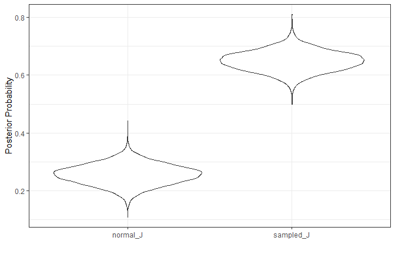

## Multivariate analysis using Partial Least Squares

Multivariate analysis usually refers to the situation where multple
*outcomes* are being modeled, analyzed, and/or predicted. There are
multivariate versions of many common statistical tools. For
example,suppose there was a data set with columns `y1` and `y2`
containing two outcomes to be predicted. The `lm` function would look
something like:

``` r
lm(cbind(y1, y2)~ data =dat)
```

The `cbind` is pretty awkward and is a consequence of how the
traditional formula infrastructure works. `recipes` is a lot easter to
work with and this document shows an example to illustrate how to use
multiple outcomes.

The data that we will use has three outcomes. From `?tecator`:

> "These data are recorded on a Tecator Infratec Food and Feed Analyzer
> working in the wavelength range 850 - 1050 nm by the Near Infrared
> Transmission (NIT) principle. Each sample contains finely chopped pure
> meat with different moisture, fat and protein contents.

> “For each meat sample the data consists of a 100 channel spectrum of
> absorbances and the contents of moisture (water), fat and protein. The
> absorbance is `-log10` of the transmittance measured by the
> spectrometer. The three contents, measured in percent, are determined
> by analytic chemistry.”

The goal would be to be able to predict the proportion of the three
substances using the chemistry test. For the predictors, there is
usually a very high degree of between-variable correlations in the data
and that is certainly the case here.

To start, let’s take the two data matrices (called `endpoints` and
`absorp`) and bind them together in a data frame:

``` r
library(caret)
data(tecator)

dim(endpoints)
## [1] 215   3
dim(absorp)
## [1] 215 100

colnames(endpoints) <- c("water", "fat", "protein")
colnames(absorp) <- names0(ncol(absorp))

tecator <- cbind(endpoints, absorp) %>%
  as.data.frame()

tecator %>% 
  dplyr::select(water, fat, protein) %>% 
  cor()
##          water    fat protein
## water    1.000 -0.988   0.815
## fat     -0.988  1.000  -0.861
## protein  0.815 -0.861   1.000
```

The three outcomes have fairly high correlations also. If the outcomes
can be predicted using a linear model, **partial least squares (PLS)**
is an idea method.

PLS, unlike PCA, also incorporate the outcome data when creating the PLS
components, Like PCA, it tries to maximize the variance of the
predictors that are explained by the components but also tries to
simulataneously maximize the correlation between those components and
the outcomes. In this way, PLS *chases* variation of the predictors and
outcomes.

Since we are working with variances and covariances, it makes sense to
standardize the data. The recipe will cener and scale all of the
variables.

Many base R functions that deal with multivariate outcomes using the
formula require the use of `cbind` on the left-hand side of the formula
to work with the traditional formula methods. `recipes` do not; the
outcome can be symbolically “added” together on the left-hand side:

``` r
library(recipes)
norm_rec <- recipe(
  water + fat + protein ~., data = tecator) %>% 
  step_center(everything()) %>% 
  step_scale(everything())
```

Before we can finalize the PLS model, the number of PLS components to
retain must be determined. This can be done using performance metrics
such as root mean squared error (RMSE). However, we can also calculate
the proprotion of variance explained by components for the *predictors
and each of the outcomes*. This allows an informed choice to be made
based on the level of evidence that the situation requires.

Since the data set isn’t large, resampling will be used to measure these
proportions. Ten repeats of 10-fold cross-validation will be used to
build the PLS model on 90% of the data. For each of the 100 models, the
proportions will be extracted and saved.

The folds can be created using the [`rsample`
package](https://tidymodels.github.io/rsample/) and the recipe can be
estimated for each resample using the [`prepper`
function](https://tidymodels.github.io/rsample/reference/prepper.html):

``` r
library(rsample)
set.seed(57343)

folds <- vfold_cv(tecator, repeats = 10)
folds <- folds %>% 
  mutate(recipes = map(splits, prepper, recipe=norm_rec, retain=TRUE))
folds
## #  10-fold cross-validation repeated 10 times 
## # A tibble: 100 x 4
##    splits           id       id2    recipes     
##  * <list>           <chr>    <chr>  <list>      
##  1 <split [193/22]> Repeat01 Fold01 <S3: recipe>
##  2 <split [193/22]> Repeat01 Fold02 <S3: recipe>
##  3 <split [193/22]> Repeat01 Fold03 <S3: recipe>
##  4 <split [193/22]> Repeat01 Fold04 <S3: recipe>
##  5 <split [193/22]> Repeat01 Fold05 <S3: recipe>
##  6 <split [194/21]> Repeat01 Fold06 <S3: recipe>
##  7 <split [194/21]> Repeat01 Fold07 <S3: recipe>
##  8 <split [194/21]> Repeat01 Fold08 <S3: recipe>
##  9 <split [194/21]> Repeat01 Fold09 <S3: recipe>
## 10 <split [194/21]> Repeat01 Fold10 <S3: recipe>
## # ... with 90 more rows
```

The complicated part here is:

1.  Formatting the predictors and outcomes into the format that `pls`
    package requires, and
2.  Estimating the proportions

For the first part, the standardized outcomes and predictors will need
to be formatted into two separate matrices.Since we used `retain=TRUE`
when prepping the recipes, the `juice` function can be used. To save the
data as a matrix, the option `composition="matrix"` will avoild saving
the data as tibbles and use the required format.

The `pls` wants to use a simple formula to specify the model but each
side of the formula should *represent matrix*. In other words, we need a
data from with two columns and each column is a matrix. The secret to
doing this is to protect the two matrices using `I()` when adding them
to the data frame.

The calculation for the proportion of variance explained is simple for
the predictors: the function `pls:explvar` will compute that. For the
outcomes, the process is more complicated. I didn’t see a ready-made
function to compute these but there is some code inside of the summary
function to do the computation (see below).

The function `get_var_explained` will do these computations and return a
data frame with columns `components`, `source` (for the predictors,
water, etc.) and the `proportion` of variance that is explained by
components.

``` r
library(pls)
library(tidyverse)
get_var_explained <- function(recipe, ...) {
  
  # Extract the predictors and outcomes into their own matrices
  y_mat <- juice(recipe, composition = "matrix", all_outcomes())
  x_mat <- juice(recipe, composition = "matrix", all_predictors())
  
  # The pls package prefers the data in a data frame where the outcome
  # and predictors are in _matrices_. To make sure this is formatted
  # properly, use the `I` function to inhibit `data.frame` from making
  # all the individual columns. `pls_format` should have two columns.
  pls_format <- data.frame(
    endpoints = I(y_mat),
    measurements = I(x_mat)
  )
  # Fit the model
  mod <- plsr(endpoints ~ measurements, data = pls_format)
  
  # Get the proportion of the predictor variance that is explained
  # by the model for different number of components. 
  xve <- explvar(mod)/100 
  
  # To do the same for the outcome, it is more complex. This code 
  # was extracted from pls:::summary.mvr. 
  explained <- drop(pls::R2(mod, estimate = "train", intercept = FALSE)$val) %>% 
    # transpose so that components are in rows
    t() %>% 
    as.data.frame() %>%
    # Add the predictor proportions
    mutate(predictors = cumsum(xve) %>% as.vector(),
           components = seq_along(xve)) %>%
    # Put into a tidy format that is tall
    gather(source, proportion, -components)
}
```

We compute this data frame for each resample and save the results in
different columns.

``` r
library(recipes)
folds <- folds %>% 
  mutate(var = map(recipes, get_var_explained))
```

To extract and aggregate these data, simple row binding can be used to
stack the data vertically. Most of the action happens in the first 15
components so the data are filtered and the *average* proportion is
computed.

``` r
variance_data <- bind_rows(folds[["var"]]) %>% 
  filter(components <=15) %>% 
  group_by(components, source) %>% 
  summarise(proportion = mean(proportion))
```

The plot below shows that if the protein measurement is important, you
might require 10 or so components to achieve a good representation of
that outcome. Note that the predictor variance is captured extremely
well using a single component. This is due to the high degree of
correlation in those
data.

``` r
ggplot(variance_data, aes(x = components, y = proportion, col = source)) + 
  geom_line() + 
  geom_point() + 
  theme_bw() + 
  theme(legend.position = "top")
```

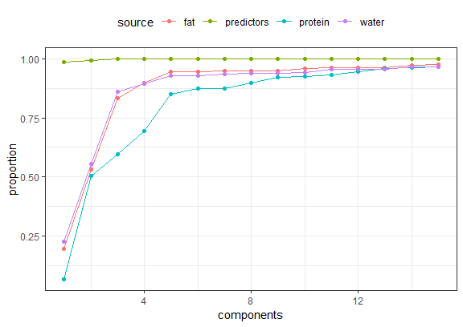

# [Parsnip](https://tidymodels.github.io/parsnip/)

## introduction

One issue with different functions available in R that *do the same
thing* is that they can have different interfaces and arguments. For
example, to fit a random forest classification model, we might have:

``` r
# From random forest
rf_1 <- randomForest::randomForest(x,y,mtry=12, ntrees=2000, importance=TRUE)

# From ranger
library(ranger)
rf_2 <- ranger(
  y~., 
  data = dat, 
  mtry = !2,
  num.trees = 2000,
  importance = "impurity"
)

# From sparklyr
rf_3 <- ml_random_forest(
  dat,
  intercept = FALSE,
  response = "y",
  features = names(dat)[names(dat) 1= "y"],
  col.sample.rate =12,
  num.trees = 2000
)
```

Note that the model syntax is very different and that the argument names
(and formals) are also different. This is pain if you go between
implementations.

In this example: - the **type** of model is “random forest” - the
**mode** of the model is “classification” (as opposed to regression,
etc) - the computational **engine** is the name of the R package

The idea of `parsnip` is to: - separate the definition of a model from
its evaluation. - Decouple the model specification from the
implementation (whether the implementation is in R, `spark` or something
else). For example, the user would call `rand_forest` instead of
`ranger::ranger` or other specific packages. - Harmonize the argument
names (e.g., `n.trees`, `ntrees`, `trees`) so that users can remember a
single name. This will help across model types too so that `trees` will
be the same argument across random forest as well as boosting or
bagging.

Using the example above, the parsnip approach would be:

``` r
library(parsnip)
parsnip::rand_forest(
  mtry = 12,
  trees = 2000
) %>% 
  set_engine("ranger", importance = "impurity") %>% 
  fit (y ~., data=dat)
```

The engine can be easily changed and the mode can be determined when
`fit` is called. to use Spark, the change is simple:

``` r
rand_forest(
  mtry = 12,
  trees = 2000
) %>% 
  set_engine("spark") %>% 
  fit(y ~ ., data = dat)
```

### Model list

parsnip contains wrappers for a number of models. For example, the
`parsnip` function `rand_forest()` can be used to create a random forest
model. The **mode** of a model is realted to its goal. Examples would be
regression and classification.

[Ths list of
models](https://tidymodels.github.io/parsnip/articles/articles/Models.html)
accessible via `parsnip` is :

  - classification: `boost_tree()`, `decision_tree()`, `logistic_reg()`,
    `mars()`, `mlp()`, `multinomial_reg()`, `nearest_neighbor()`,
    `rand_forest()`, `svm_poly()`, `svm_rbf()`
  - regression: `boost_tree()`, `decision_tree()`, `linear_reg()`,
    `mars()`, `mlp()`, `nerarest_neighbor()`, `rand_forest()`,
    `surv_reg()`, `svm_reg()`, `svm_poly()`, `svm_rbf()`.

How the model is created is related to the *engine*. In many cases, this
is an R modeling package. In others, it may be a connection to an
externam system (such as
`Spark`or`Tensorflow`).

## [Regression example](https://github.com/tidymodels/parsnip/blob/master/vignettes/articles/Regression.Rmd)

The Ames housing data will be used to demonstrate how regression models
can e made using `parsnip`. We will create the data set and create
asimple training/test set split:

``` r
library(AmesHousing)
ames <- make_ames()

set.seed(4595)
data_split <- initial_split(ames, strata = "Sale_Price", p = .75)
ames_train <- training(data_split)
ames_test <- testing(data_split)

ames_test %>% dim()
#> [1] 731  81
ames_train %>% dim()
#> [1] 2199   81

ggplot()+
  geom_freqpoly(aes(Sale_Price), data=ames_test, col="light blue")+
  geom_freqpoly(aes(Sale_Price), data = ames_train, col="red")
```

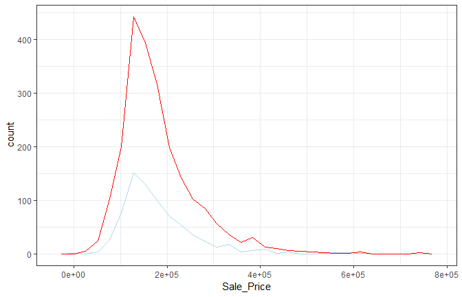

### Random Forests

We’ll start by fitting a random forest model to a small set of
parameters. Let’s say that the model would include predictors:
`Longitude`, `Latitude`, `Lot_Area`, `Neighborhood` and `Year_Sold`. A
simple random forest model can be specified via:

``` r
library(parsnip)

rf_defaults <- parsnip::rand_forest(mode = "regression")
rf_defaults
#> Random Forest Model Specification (regression)
```

The model will be fit with the `ranger` package. Since we didn’t add any
extra arguments to `fit`, *many* of the arguments will be set to their
defaults from the specific function that is used by `ranger::ranger`.
The helper page for the model function describes the changes to the
default parameters that are made and the `translate` function can also
be used.

`parsnip` gives two different interfaces to the models: the formula and
non-formula interfaces. Let’s start with the non-formula
interface:

``` r
preds <- c("Longitude", "Latitude", "Lot_Area", "Neighborhood", "Year_Sold")

pred_map <- function(dataset, outcome, pred){
  outcome <- enquo(outcome)
  pred <- enquo(pred)
  ggplot(data = dataset, aes(x = !!pred, y = !!outcome))+
    geom_point()+
    stat_smooth(method = "loess")}

pred_map(ames_train, Sale_Price, Longitude)
```

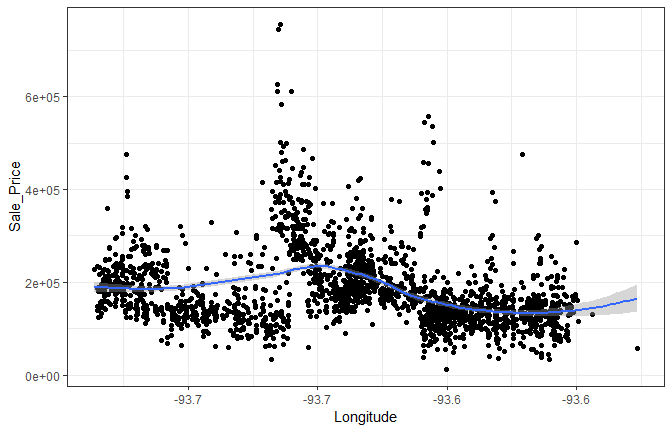

``` r

rf_xy_fit <- 
  rf_defaults %>% 
  set_engine("ranger") %>% 
  fit_xy(
    x = ames_train[,preds],
    y = log10(ames_train$Sale_Price)
  )

rf_xy_fit
#> parsnip model object
#> 
#> Ranger result
#> 
#> Call:
#>  ranger::ranger(formula = formula, data = data, num.threads = 1,      verbose = FALSE, seed = sample.int(10^5, 1)) 
#> 
#> Type:                             Regression 
#> Number of trees:                  500 
#> Sample size:                      2199 
#> Number of independent variables:  5 
#> Mtry:                             2 
#> Target node size:                 5 
#> Variable importance mode:         none 
#> Splitrule:                        variance 
#> OOB prediction error (MSE):       0.00861 
#> R squared (OOB):                  0.729
```

The non-fomula interface doesn’t do anything to the predictors before
giving it to the underlying model function. This particular does not
require indicator variables to be create prior to the model (note that
the output shows “Number of independent variables: 5”).

For regression models, the basic `predict` method can be used and
returns a tibble with a column named `.pred`:

``` r
test_results <- ames_test %>% 
  select(Sale_Price) %>% 
  mutate(Sale_Price = log10(Sale_Price)) %>% 
  bind_cols(
    predict(rf_xy_fit, new_data = ames_test[,preds])
  )

test_results
```

``` r
test_results %>% 
  ggplot(aes(Sale_Price, .pred))+
  geom_point()


# summarize performance
test_results %>% metrics(truth = Sale_Price,
                         estimate = .pred)
```

Note that:

  - if the model required indicator variables, we would have to create
    them manually prior to using `fit` (perhaps using the `recipes`
    package).
  - we had to manually log the outcome prior to modeling.

Now, for illustration, let’s use the formula method using some new
parameter values:

``` r

rand_forest(mode = "regression", mtry = 3, trees = 1000) %>%
  set_engine("ranger") %>%
  fit(
    log10(Sale_Price) ~ Longitude + Latitude + Lot_Area + Neighborhood + Year_Sold,
    data = ames_train
  )

#> parsnip model object
#> 
#> Ranger result
#> 
#> Call:
#>  ranger::ranger(formula = formula, data = data, mtry = ~3, num.trees = ~1000,      num.threads = 1, verbose = FALSE, seed = sample.int(10^5,          1)) 
#> 
#> Type:                             Regression 
#> Number of trees:                  1000 
#> Sample size:                      2199 
#> Number of independent variables:  5 
#> Mtry:                             3 
#> Target node size:                 5 
#> Variable importance mode:         none 
#> Splitrule:                        variance 
#> OOB prediction error (MSE):       0.00858 
#> R squared (OOB):                  0.73
```

Suppose that there was some feature in the `randomForest` package that
we would like to evaluate. To do so, the only part of the syntax that
needs to change is the `set_engine` argument:

``` r
rand_forest(mode = "regression", mtry = 3, trees = 1000) %>%
  set_engine("randomForest") %>%
  fit(
    log10(Sale_Price) ~ Longitude + Latitude + Lot_Area + Neighborhood + Year_Sold,
    data = ames_train
  )

#> parsnip model object
#> 
#> 
#> Call:
#>  randomForest(x = as.data.frame(x), y = y, ntree = ~1000, mtry = ~3) 
#>                Type of random forest: regression
#>                      Number of trees: 1000
#> No. of variables tried at each split: 3
#> 
#>           Mean of squared residuals: 0.0128
#>                     % Var explained: 59.8
```

Look at the formula code that was printed out, one function uses the
argument name `ntree` and the other uses `num.trees`, `parsnip` doesn’t
require you to know the specific names of the main arguments.

Now suppose we want to modify the value of `mtry` based on the number of
predictors in the data. Usually, the default value would be
`floor(sqrt(num_predictors))`. To use a pure bagging model would require
`mtry` value equal to the total number of parameters. Thre many be cases
where you may not know how many predictors are going to be present
(perhaps due to he generation of indicator variables or a variable
filter) so that might be difficult to know exactly.

When the model is being fit by `pasrnip`, [data
descriptors](https://topepo.github.io/parsnip/reference/descriptors.html)
are made availabe. These attempt to let you know what you will have
available when the model is fit. When a model object is created (say
using `rand_forest`),, the values of the arguments that you give it ar
*immediately evaluated*.. unless you delay them. To delay the
evalulation of any argument, you can used `rlang::expr` to make an
expression.

Two relevant descriptors for what we are about to do are:

  - `.preds()`: the number of predictor *variables* in the dataset that
    are associated with the predictors **prior to dummy variable
    creation**
  - `.cols()`: the number of predictor *columns* after dummy variables
    (or other encodings) are created.
